# Power Platform Developer Guide
## Kompletny poradnik dla deweloperów Microsoft Dynamics 365 i Power Platform

**Wersja:** 1.0.0
**Data:** Styczeń 2026
**Autor:** Claude (ClaudeDynamicsBrain)
**Źródło:** https://github.com/macjoc96/ClaudeDynamicsBrain

---

## O tym poradniku

Ten kompleksowy przewodnik został stworzony dla deweloperów na wszystkich poziomach zaawansowania - od juniorów rozpoczynających swoją przygodę z Power Platform, przez developerów mid-level rozwijających swoje umiejętności, po seniorów i architektów projektujących rozwiązania enterprise.

### Dla kogo jest ten poradnik?

- **Junior Developers** - Część I zapewnia solidne fundamenty programistyczne
- **Mid-Level Developers** - Część II pokrywa core development w Dynamics 365
- **Senior Developers** - Część III zawiera zaawansowane tematy i optymalizacje
- **Tech Leads & Architects** - Część IV skupia się na architekturze i leadership

### Struktura poradnika

**CZĘŚĆ I: FUNDAMENTY PROGRAMISTYCZNE (Junior)**
1. C# dla Power Platform
2. TypeScript/JavaScript dla Power Platform
3. SQL i zapytania w Dynamics
4. Narzędzia deweloperskie

**CZĘŚĆ II: CORE DYNAMICS 365 DEVELOPMENT (Mid)**
5. Plugin Development
6. Custom Actions & Workflows
7. Web Resources
8. Dataverse API
9. Power Automate (Cloud Flows)

**CZĘŚĆ III: ZAAWANSOWANE TEMATY (Senior)**
10. Architektura rozwiązań
11. Performance & Optimization
12. Security Architecture
13. Integracje
14. Testing & Quality

**CZĘŚĆ IV: TECH LEAD & ARCHITECT (Expert)**
15. Enterprise Architecture
16. Team Leadership
17. Governance & Standards
18. Strategic Planning

### Konwencje używane w tym dokumencie

> 💡 **TIP** - Pomocne wskazówki i best practices

> ⚠️ **WARNING** - Ostrzeżenia o potencjalnych problemach

> 📌 **NOTE** - Ważne informacje do zapamiętania

> ✅ **DO** - Zalecane praktyki

> ❌ **DON'T** - Praktyki do unikania

### Wymagania wstępne

Aby maksymalnie wykorzystać ten poradnik, powinieneś mieć:
- Podstawową znajomość programowania (dowolny język)
- Dostęp do środowiska Power Platform (trial wystarczy)
- Visual Studio lub Visual Studio Code
- Chęć nauki i eksperymentowania

---

# CZĘŚĆ I: FUNDAMENTY PROGRAMISTYCZNE

> 💡 **TIP**: Ta część jest kluczowa dla wszystkich, którzy dopiero zaczynają z Power Platform. Nawet jeśli znasz podstawy C# lub JavaScript, zalecamy przejrzenie tych rozdziałów - znajdziesz tu kontekst specyficzny dla Dynamics 365.

---

# Rozdział 1: C# dla Power Platform

## Wprowadzenie

C# jest podstawowym językiem programowania dla rozwoju server-side w ekosystemie Dynamics 365. Wszystkie pluginy, custom workflow activities oraz wiele innych rozszerzeń jest pisanych w C#. Ten rozdział wprowadzi Cię w fundament języka C# z perspektywą wykorzystania w Power Platform.

### Czego się nauczysz?

W tym rozdziale poznasz:
- Podstawowe typy danych i ich zastosowanie w Dynamics
- Koncepcje programowania obiektowego w kontekście pluginów
- LINQ do efektywnego przetwarzania danych
- Asynchroniczne programowanie dla długotrwałych operacji
- Dependency Injection dla testowania i maintainability

### Dlaczego C# w Power Platform?

C# jest językiem wyboru dla Dynamics 365 z kilku kluczowych powodów:
- **Silne typowanie** - wyłapuje błędy na etapie kompilacji
- **Wydajność** - skompilowany kod działa szybko
- **Ekosystem** - bogaty zbiór bibliotek i narzędzi
- **Wsparcie Microsoft** - pełna integracja z platformą

---

## 1.1 Podstawy języka C#

### Typy wartościowe vs referencyjne

W C# rozróżniamy dwa fundamentalne rodzaje typów danych:

**Typy wartościowe (Value Types)**
- Przechowywane na stosie (stack)
- Kopiowane przez wartość
- Przykłady: `int`, `bool`, `decimal`, `DateTime`, `struct`

**Typy referencyjne (Reference Types)**
- Przechowywane na stercie (heap)
- Kopiowane przez referencję
- Przykłady: `string`, `class`, `interface`, `array`

#### Przykład praktyczny w kontekście Dynamics

```csharp
using Microsoft.Xrm.Sdk;
using System;

namespace DynamicsExamples
{
    public class TypesExample
    {
        public void DemonstrateTypes(IOrganizationService service)
        {
            // Typy wartościowe
            int recordCount = 100;              // int - typ wartościowy
            decimal totalRevenue = 50000.50m;   // decimal - typ wartościowy
            bool isActive = true;               // bool - typ wartościowy
            DateTime createdDate = DateTime.Now; // struct - typ wartościowy

            // Typy referencyjne
            string accountName = "Contoso Ltd";  // string - typ referencyjny
            Entity account = new Entity("account"); // class - typ referencyjny

            // Demonstracja kopiowania wartościowego
            int count1 = 10;
            int count2 = count1; // Kopiowanie wartości
            count2 = 20;
            // count1 nadal wynosi 10, count2 wynosi 20

            // Demonstracja kopiowania referencyjnego
            Entity entity1 = new Entity("contact");
            entity1["firstname"] = "John";

            Entity entity2 = entity1; // Kopiowanie referencji!
            entity2["firstname"] = "Jane";

            // Oba wskazują na ten sam obiekt - entity1["firstname"] też wynosi "Jane"
            Console.WriteLine(entity1["firstname"]); // Output: Jane
        }
    }
}
```

> ⚠️ **WARNING**: Najczęstszy błąd początkujących to myślenie że `Entity entity2 = entity1` tworzy kopię encji. W rzeczywistości oba wskazują na ten sam obiekt w pamięci!

### Nullable types i null safety

W Dynamics 365 często spotykamy się z wartościami null (np. puste pola w rekordach). C# oferuje nullable types do bezpiecznej obsługi takich sytuacji.

```csharp
using Microsoft.Xrm.Sdk;
using System;

namespace DynamicsExamples
{
    public class NullableExample
    {
        public void SafelyHandleNullableValues(Entity account)
        {
            // ❌ ŹLE - może rzucić NullReferenceException
            DateTime createdOn = (DateTime)account["createdon"];

            // ✅ DOBRZE - bezpieczne sprawdzenie
            if (account.Contains("createdon") && account["createdon"] != null)
            {
                DateTime createdOn = (DateTime)account["createdon"];
                Console.WriteLine($"Created: {createdOn:yyyy-MM-dd}");
            }

            // ✅ JESZCZE LEPIEJ - użycie GetAttributeValue
            DateTime? createdOn = account.GetAttributeValue<DateTime?>("createdon");
            if (createdOn.HasValue)
            {
                Console.WriteLine($"Created: {createdOn.Value:yyyy-MM-dd}");
            }

            // ✅ NAJLEPIEJ - null coalescing operator
            DateTime effectiveDate = account.GetAttributeValue<DateTime?>("createdon")
                                   ?? DateTime.Now;

            // Nullable value types
            int? numberOfEmployees = account.GetAttributeValue<int?>("numberofemployees");
            decimal? revenue = account.GetAttributeValue<Money>("revenue")?.Value;

            // Null-conditional operator (?.)
            string primaryContactName = account.GetAttributeValue<EntityReference>("primarycontactid")?.Name;

            // Null coalescing assignment (C# 8.0+)
            string accountName = account.GetAttributeValue<string>("name");
            accountName ??= "Unknown Account"; // Przypisz jeśli null
        }

        public decimal CalculateDiscount(Entity opportunity)
        {
            // Bezpieczne obliczenia z nullable
            decimal? estimatedValue = opportunity.GetAttributeValue<Money>("estimatedvalue")?.Value;
            int? discountPercent = opportunity.GetAttributeValue<int?>("discountpercentage");

            if (estimatedValue.HasValue && discountPercent.HasValue)
            {
                return estimatedValue.Value * (discountPercent.Value / 100m);
            }

            return 0m; // Domyślna wartość jeśli brak danych
        }
    }
}
```

> 💡 **TIP**: Zawsze używaj `GetAttributeValue<T>()` zamiast bezpośredniego rzutowania. Jest to bezpieczniejsze i czytelniejsze.

### Collections (List, Dictionary, HashSet)

W Dynamics 365 często pracujemy z kolekcjami encji, atrybutów czy relacji. Poznanie kolekcji C# jest kluczowe.

```csharp
using Microsoft.Xrm.Sdk;
using Microsoft.Xrm.Sdk.Query;
using System;
using System.Collections.Generic;
using System.Linq;

namespace DynamicsExamples
{
    public class CollectionsExample
    {
        private IOrganizationService _service;

        public CollectionsExample(IOrganizationService service)
        {
            _service = service;
        }

        public void DemonstrateList()
        {
            // List<T> - najczęściej używana kolekcja
            List<Entity> accounts = new List<Entity>();

            // Dodawanie elementów
            Entity account1 = new Entity("account");
            account1["name"] = "Contoso";
            accounts.Add(account1);

            Entity account2 = new Entity("account");
            account2["name"] = "Fabrikam";
            accounts.Add(account2);

            // Iteracja przez listę
            foreach (Entity account in accounts)
            {
                Console.WriteLine(account.GetAttributeValue<string>("name"));
            }

            // Inicjalizacja kolekcji
            List<string> statuses = new List<string> { "Active", "Inactive", "Pending" };

            // Operacje na liście
            int count = accounts.Count;
            Entity firstAccount = accounts[0]; // Dostęp przez indeks
            bool containsContoso = accounts.Any(a =>
                a.GetAttributeValue<string>("name") == "Contoso");
        }

        public void DemonstrateDictionary()
        {
            // Dictionary<TKey, TValue> - szybkie wyszukiwanie po kluczu
            Dictionary<Guid, Entity> accountsById = new Dictionary<Guid, Entity>();

            // Dodawanie elementów
            Entity account = new Entity("account", Guid.NewGuid());
            account["name"] = "Contoso";
            accountsById.Add(account.Id, account);

            // Bezpieczne dodawanie (nie rzuca wyjątku jeśli klucz istnieje)
            accountsById[account.Id] = account;

            // Sprawdzanie czy klucz istnieje
            Guid searchId = Guid.NewGuid();
            if (accountsById.ContainsKey(searchId))
            {
                Entity foundAccount = accountsById[searchId];
            }

            // TryGetValue - bezpieczniejszy sposób
            if (accountsById.TryGetValue(searchId, out Entity result))
            {
                Console.WriteLine(result.GetAttributeValue<string>("name"));
            }

            // Iteracja przez słownik
            foreach (KeyValuePair<Guid, Entity> kvp in accountsById)
            {
                Guid id = kvp.Key;
                Entity acc = kvp.Value;
                Console.WriteLine($"{id}: {acc.GetAttributeValue<string>("name")}");
            }

            // Praktyczny przykład: cache encji
            Dictionary<string, Entity> entityCache = new Dictionary<string, Entity>();
            string cacheKey = "account_" + account.Id;
            entityCache[cacheKey] = account;
        }

        public void DemonstrateHashSet()
        {
            // HashSet<T> - unikalne wartości, szybkie sprawdzanie membership
            HashSet<Guid> processedIds = new HashSet<Guid>();

            // Dodawanie (ignoruje duplikaty)
            Guid id1 = Guid.NewGuid();
            processedIds.Add(id1);
            processedIds.Add(id1); // Nie doda duplikatu

            // Sprawdzanie czy element istnieje (O(1) - bardzo szybkie!)
            if (processedIds.Contains(id1))
            {
                Console.WriteLine("Already processed");
            }

            // Praktyczny przykład: unikanie infinite loop w pluginie
            public void PreventInfiniteLoop(Entity target, HashSet<Guid> processedEntities)
            {
                if (processedEntities.Contains(target.Id))
                {
                    return; // Już przetwarzaliśmy tę encję
                }

                processedEntities.Add(target.Id);

                // Wykonaj logikę...
                ProcessEntity(target);
            }

            // Operacje na zbiorach
            HashSet<string> set1 = new HashSet<string> { "A", "B", "C" };
            HashSet<string> set2 = new HashSet<string> { "B", "C", "D" };

            // Union (suma zbiorów)
            set1.UnionWith(set2); // set1 = { "A", "B", "C", "D" }

            // Intersection (część wspólna)
            set1.IntersectWith(set2); // set1 = { "B", "C" }
        }

        private void ProcessEntity(Entity entity)
        {
            // Implementation
        }
    }
}
```

> 💡 **TIP**:
> - Użyj `List<T>` gdy potrzebujesz uporządkowanej kolekcji
> - Użyj `Dictionary<TKey, TValue>` gdy potrzebujesz szybkiego wyszukiwania po kluczu
> - Użyj `HashSet<T>` gdy potrzebujesz unikalnych wartości lub szybkiego sprawdzania czy element istnieje

### Anti-patterns do unikania

```csharp
// ❌ ŹLE: Używanie ArrayList zamiast List<T>
ArrayList accounts = new ArrayList(); // Brak type safety!
accounts.Add(new Entity("account"));
accounts.Add("string"); // Kompilator nie wyłapie błędu!
Entity account = (Entity)accounts[0]; // Konieczne rzutowanie

// ✅ DOBRZE: Używanie generycznej List<T>
List<Entity> accountsList = new List<Entity>();
accountsList.Add(new Entity("account"));
// accountsList.Add("string"); // Błąd kompilacji!
Entity firstAccount = accountsList[0]; // Brak konieczności rzutowania

// ❌ ŹLE: Ignorowanie null bez sprawdzenia
string accountName = entity["name"].ToString(); // NullReferenceException!

// ✅ DOBRZE: Bezpieczna obsługa null
string accountName = entity.GetAttributeValue<string>("name") ?? "Unknown";

// ❌ ŹLE: Modyfikowanie kolekcji podczas iteracji
foreach (Entity account in accounts)
{
    if (account.GetAttributeValue<bool>("isdeleted"))
    {
        accounts.Remove(account); // InvalidOperationException!
    }
}

// ✅ DOBRZE: Użycie LINQ lub oddzielnej listy
List<Entity> accountsToRemove = accounts
    .Where(a => a.GetAttributeValue<bool>("isdeleted"))
    .ToList();
foreach (Entity account in accountsToRemove)
{
    accounts.Remove(account);
}

// LUB jeszcze lepiej:
accounts = accounts.Where(a => !a.GetAttributeValue<bool>("isdeleted")).ToList();
```

---

## 1.2 Programowanie obiektowe

### Klasy, interfejsy, dziedziczenie

Programowanie obiektowe (OOP) jest fundamentem architektury pluginów i rozszerzeń w Dynamics 365. Zrozumienie tych koncepcji jest kluczowe.

#### Klasy w kontekście Dynamics

```csharp
using Microsoft.Xrm.Sdk;
using System;

namespace DynamicsExamples
{
    // Podstawowa klasa reprezentująca logikę biznesową
    public class AccountManager
    {
        // Pola (fields) - prywatne dane klasy
        private readonly IOrganizationService _service;
        private readonly ITracingService _tracing;

        // Właściwości (properties) - kontrolowany dostęp do danych
        public string DefaultAccountCategory { get; set; }
        public int MaxAccountsPerBatch { get; private set; }

        // Konstruktor - inicjalizacja obiektu
        public AccountManager(IOrganizationService service, ITracingService tracing)
        {
            _service = service ?? throw new ArgumentNullException(nameof(service));
            _tracing = tracing ?? throw new ArgumentNullException(nameof(tracing));

            // Domyślne wartości
            DefaultAccountCategory = "Standard";
            MaxAccountsPerBatch = 100;
        }

        // Metody - zachowania klasy
        public Guid CreateAccount(string name, string category = null)
        {
            _tracing.Trace($"Creating account: {name}");

            Entity account = new Entity("account");
            account["name"] = name;
            account["accountcategorycode"] = new OptionSetValue(
                GetCategoryCode(category ?? DefaultAccountCategory)
            );

            Guid accountId = _service.Create(account);
            _tracing.Trace($"Account created with ID: {accountId}");

            return accountId;
        }

        public void UpdateAccountStatus(Guid accountId, bool isActive)
        {
            Entity account = new Entity("account", accountId);
            account["statecode"] = new OptionSetValue(isActive ? 0 : 1);

            _service.Update(account);
            _tracing.Trace($"Account {accountId} status updated to {(isActive ? "Active" : "Inactive")}");
        }

        // Private helper method
        private int GetCategoryCode(string category)
        {
            switch (category.ToLower())
            {
                case "preferred": return 1;
                case "standard": return 2;
                default: return 2;
            }
        }
    }
}
```

#### Interfejsy - kontrakty dla klas

```csharp
using Microsoft.Xrm.Sdk;
using System;
using System.Collections.Generic;

namespace DynamicsExamples
{
    // Interface definiuje kontrakt - co klasa musi implementować
    public interface IEntityValidator
    {
        bool Validate(Entity entity);
        List<string> GetValidationErrors(Entity entity);
    }

    // Interface dla operacji CRUD
    public interface IEntityRepository
    {
        Guid Create(Entity entity);
        Entity Retrieve(string entityName, Guid id);
        void Update(Entity entity);
        void Delete(string entityName, Guid id);
    }

    // Implementacja interfejsu walidatora dla Account
    public class AccountValidator : IEntityValidator
    {
        public bool Validate(Entity entity)
        {
            if (entity.LogicalName != "account")
                return false;

            // Nazwa jest wymagana
            if (!entity.Contains("name") || string.IsNullOrWhiteSpace(entity.GetAttributeValue<string>("name")))
                return false;

            // Nazwa nie może być dłuższa niż 160 znaków
            string name = entity.GetAttributeValue<string>("name");
            if (name.Length > 160)
                return false;

            return true;
        }

        public List<string> GetValidationErrors(Entity entity)
        {
            List<string> errors = new List<string>();

            if (entity.LogicalName != "account")
            {
                errors.Add("Entity must be of type 'account'");
            }

            if (!entity.Contains("name") || string.IsNullOrWhiteSpace(entity.GetAttributeValue<string>("name")))
            {
                errors.Add("Account name is required");
            }
            else
            {
                string name = entity.GetAttributeValue<string>("name");
                if (name.Length > 160)
                {
                    errors.Add($"Account name exceeds maximum length of 160 characters (current: {name.Length})");
                }
            }

            return errors;
        }
    }

    // Implementacja repository pattern
    public class EntityRepository : IEntityRepository
    {
        private readonly IOrganizationService _service;

        public EntityRepository(IOrganizationService service)
        {
            _service = service;
        }

        public Guid Create(Entity entity)
        {
            return _service.Create(entity);
        }

        public Entity Retrieve(string entityName, Guid id)
        {
            return _service.Retrieve(entityName, id, new Microsoft.Xrm.Sdk.Query.ColumnSet(true));
        }

        public void Update(Entity entity)
        {
            _service.Update(entity);
        }

        public void Delete(string entityName, Guid id)
        {
            _service.Delete(entityName, id);
        }
    }
}
```

> 💡 **TIP**: Interfejsy są kluczowe dla testowania. Pozwalają na tworzenie mock'ów i stub'ów w unit testach.

#### Dziedziczenie

```csharp
using Microsoft.Xrm.Sdk;
using System;

namespace DynamicsExamples
{
    // Bazowa klasa dla wszystkich walidatorów
    public abstract class BaseEntityValidator
    {
        protected ITracingService Tracing { get; }

        protected BaseEntityValidator(ITracingService tracing)
        {
            Tracing = tracing;
        }

        // Template Method Pattern
        public bool ValidateEntity(Entity entity)
        {
            Tracing.Trace($"Starting validation for {entity.LogicalName}");

            // Wspólna walidacja dla wszystkich encji
            if (entity == null)
            {
                Tracing.Trace("Entity is null");
                return false;
            }

            if (entity.Id == Guid.Empty && !entity.Contains("id"))
            {
                Tracing.Trace("Warning: Entity has no ID");
            }

            // Wywołanie specyficznej walidacji (implementowanej przez klasy pochodne)
            bool isValid = ValidateSpecific(entity);

            Tracing.Trace($"Validation result: {isValid}");
            return isValid;
        }

        // Abstract method - musi być implementowana przez klasy pochodne
        protected abstract bool ValidateSpecific(Entity entity);

        // Virtual method - może być nadpisana, ale nie musi
        protected virtual void LogValidationError(string message)
        {
            Tracing.Trace($"Validation Error: {message}");
        }
    }

    // Klasa pochodna dla Account
    public class AccountValidator : BaseEntityValidator
    {
        public AccountValidator(ITracingService tracing) : base(tracing)
        {
        }

        protected override bool ValidateSpecific(Entity entity)
        {
            if (entity.LogicalName != "account")
            {
                LogValidationError("Entity is not an account");
                return false;
            }

            string name = entity.GetAttributeValue<string>("name");
            if (string.IsNullOrWhiteSpace(name))
            {
                LogValidationError("Account name is required");
                return false;
            }

            return true;
        }

        // Override virtual method
        protected override void LogValidationError(string message)
        {
            base.LogValidationError(message); // Wywołaj bazową implementację
            // Dodatkowa logika specyficzna dla Account
            Tracing.Trace("Consider checking account creation template");
        }
    }

    // Klasa pochodna dla Contact
    public class ContactValidator : BaseEntityValidator
    {
        public ContactValidator(ITracingService tracing) : base(tracing)
        {
        }

        protected override bool ValidateSpecific(Entity entity)
        {
            if (entity.LogicalName != "contact")
            {
                LogValidationError("Entity is not a contact");
                return false;
            }

            // Contact musi mieć albo firstname albo lastname
            string firstName = entity.GetAttributeValue<string>("firstname");
            string lastName = entity.GetAttributeValue<string>("lastname");

            if (string.IsNullOrWhiteSpace(firstName) && string.IsNullOrWhiteSpace(lastName))
            {
                LogValidationError("Contact must have either first name or last name");
                return false;
            }

            return true;
        }
    }
}
```

### Polimorfizm i enkapsulacja

```csharp
using Microsoft.Xrm.Sdk;
using System;
using System.Collections.Generic;

namespace DynamicsExamples
{
    // Polimorfizm - różne implementacje tego samego interfejsu
    public interface INotificationSender
    {
        void Send(string recipient, string message);
    }

    public class EmailNotificationSender : INotificationSender
    {
        private readonly IOrganizationService _service;

        public EmailNotificationSender(IOrganizationService service)
        {
            _service = service;
        }

        public void Send(string recipient, string message)
        {
            Entity email = new Entity("email");
            email["to"] = new Entity[] { new Entity("contact") { ["emailaddress1"] = recipient } };
            email["subject"] = "Notification";
            email["description"] = message;

            _service.Create(email);
        }
    }

    public class SMSNotificationSender : INotificationSender
    {
        private readonly IOrganizationService _service;

        public SMSNotificationSender(IOrganizationService service)
        {
            _service = service;
        }

        public void Send(string recipient, string message)
        {
            // Logika wysyłania SMS (np. przez custom entity lub external API)
            Entity sms = new Entity("cr9e5_sms");
            sms["cr9e5_phonenumber"] = recipient;
            sms["cr9e5_message"] = message;

            _service.Create(sms);
        }
    }

    // Użycie polimorfizmu
    public class NotificationManager
    {
        private readonly List<INotificationSender> _senders;

        public NotificationManager()
        {
            _senders = new List<INotificationSender>();
        }

        public void AddSender(INotificationSender sender)
        {
            _senders.Add(sender);
        }

        public void NotifyAll(string recipient, string message)
        {
            // Polimorfizm w akcji - każdy sender ma swoją implementację
            foreach (INotificationSender sender in _senders)
            {
                sender.Send(recipient, message);
            }
        }
    }

    // Enkapsulacja - ukrywanie szczegółów implementacji
    public class SecureConnectionStringManager
    {
        // Prywatne pole - niedostępne z zewnątrz
        private string _connectionString;

        // Właściwość tylko do odczytu
        public bool IsConnected { get; private set; }

        // Publiczny konstruktor
        public SecureConnectionStringManager()
        {
            _connectionString = string.Empty;
            IsConnected = false;
        }

        // Publiczna metoda do ustawiania connection string z walidacją
        public void SetConnectionString(string connectionString)
        {
            if (string.IsNullOrWhiteSpace(connectionString))
            {
                throw new ArgumentException("Connection string cannot be empty", nameof(connectionString));
            }

            if (!connectionString.Contains("Url="))
            {
                throw new ArgumentException("Invalid connection string format", nameof(connectionString));
            }

            _connectionString = connectionString;
            IsConnected = true;
        }

        // Metoda zwraca zamaskowany connection string (bezpieczeństwo)
        public string GetMaskedConnectionString()
        {
            if (string.IsNullOrEmpty(_connectionString))
                return "Not configured";

            // Zwróć tylko URL, ukryj credentials
            int urlIndex = _connectionString.IndexOf("Url=");
            if (urlIndex >= 0)
            {
                int endIndex = _connectionString.IndexOf(";", urlIndex);
                if (endIndex > urlIndex)
                {
                    return _connectionString.Substring(urlIndex, endIndex - urlIndex);
                }
            }

            return "Configured (credentials hidden)";
        }

        // Prywatna metoda pomocnicza - niedostępna z zewnątrz
        private void ValidateConnection()
        {
            // Logika walidacji połączenia
        }
    }
}
```

### Abstract classes vs interfaces

```csharp
using Microsoft.Xrm.Sdk;
using System;

namespace DynamicsExamples
{
    // INTERFACE - kontrakt bez implementacji
    public interface IPluginLogger
    {
        void LogInfo(string message);
        void LogError(string message, Exception ex);
    }

    // ABSTRACT CLASS - częściowa implementacja
    public abstract class BasePlugin : IPlugin
    {
        // Może mieć pola i właściwości
        protected string PluginName { get; }

        // Konstruktor
        protected BasePlugin(string pluginName)
        {
            PluginName = pluginName;
        }

        // Implementacja IPlugin.Execute z wspólną logiką
        public void Execute(IServiceProvider serviceProvider)
        {
            // Pobierz kontekst (wspólne dla wszystkich pluginów)
            IPluginExecutionContext context = (IPluginExecutionContext)serviceProvider.GetService(typeof(IPluginExecutionContext));
            IOrganizationServiceFactory factory = (IOrganizationServiceFactory)serviceProvider.GetService(typeof(IOrganizationServiceFactory));
            IOrganizationService service = factory.CreateOrganizationService(context.UserId);
            ITracingService tracing = (ITracingService)serviceProvider.GetService(typeof(ITracingService));

            try
            {
                tracing.Trace($"{PluginName} started");

                // Wywołaj specyficzną logikę (abstract method)
                ExecutePlugin(context, service, tracing);

                tracing.Trace($"{PluginName} completed successfully");
            }
            catch (Exception ex)
            {
                tracing.Trace($"{PluginName} error: {ex.Message}");
                throw new InvalidPluginExecutionException($"Error in {PluginName}: {ex.Message}", ex);
            }
        }

        // Abstract method - każdy plugin musi to zaimplementować
        protected abstract void ExecutePlugin(
            IPluginExecutionContext context,
            IOrganizationService service,
            ITracingService tracing);

        // Virtual method - może być nadpisana, ale nie musi
        protected virtual bool ShouldExecute(IPluginExecutionContext context)
        {
            // Domyślnie wykonaj plugin
            return true;
        }

        // Helper method dostępna dla wszystkich klas pochodnych
        protected Entity GetTargetEntity(IPluginExecutionContext context)
        {
            if (context.InputParameters.Contains("Target") && context.InputParameters["Target"] is Entity)
            {
                return (Entity)context.InputParameters["Target"];
            }
            return null;
        }
    }

    // Konkretna implementacja pluginu
    public class AccountCreatePlugin : BasePlugin
    {
        public AccountCreatePlugin() : base("AccountCreatePlugin")
        {
        }

        protected override void ExecutePlugin(
            IPluginExecutionContext context,
            IOrganizationService service,
            ITracingService tracing)
        {
            // Sprawdź czy plugin powinien być wykonany
            if (!ShouldExecute(context))
            {
                tracing.Trace("Plugin execution skipped");
                return;
            }

            Entity target = GetTargetEntity(context);
            if (target == null || target.LogicalName != "account")
            {
                return;
            }

            // Specyficzna logika dla tworzenia Account
            if (!target.Contains("accountcategorycode"))
            {
                target["accountcategorycode"] = new OptionSetValue(1); // Default category
                tracing.Trace("Set default account category");
            }
        }

        protected override bool ShouldExecute(IPluginExecutionContext context)
        {
            // Wykonaj tylko na Create message
            return context.MessageName.Equals("Create", StringComparison.OrdinalIgnoreCase);
        }
    }
}
```

**Kiedy używać Interface vs Abstract Class?**

| Aspekt | Interface | Abstract Class |
|--------|-----------|----------------|
| Wielodziedziczenie | ✅ Klasa może implementować wiele interfejsów | ❌ Klasa może dziedziczyć tylko z jednej klasy |
| Implementacja | ❌ Tylko deklaracje metod (C# 8.0+ pozwala na default implementation) | ✅ Może zawierać implementację |
| Pola | ❌ Nie może mieć pól | ✅ Może mieć pola |
| Konstruktory | ❌ Nie może mieć konstruktorów | ✅ Może mieć konstruktory |
| Access modifiers | ❌ Wszystko public | ✅ Różne modyfikatory dostępu |
| Kiedy używać | Definiowanie kontraktu, który różne klasy mogą implementować | Dzielenie wspólnej funkcjonalności między powiązane klasy |

> 💡 **TIP**: W Dynamics 365 pluginach używaj abstract class jako bazy dla wszystkich pluginów (wspólna logika), a interface dla serwisów (dependency injection, testowanie).

### Praktyczny przykład: Plugin z OOP

```csharp
using Microsoft.Xrm.Sdk;
using System;

namespace DynamicsExamples.Plugins
{
    // Interface dla walidacji
    public interface IEntityValidator
    {
        bool Validate(Entity entity);
        string GetValidationMessage();
    }

    // Interface dla business logic
    public interface IAccountBusinessLogic
    {
        void SetDefaultValues(Entity account);
        void CalculateAccountRating(Entity account, IOrganizationService service);
    }

    // Implementacja walidatora
    public class AccountValidator : IEntityValidator
    {
        private string _validationMessage;

        public bool Validate(Entity entity)
        {
            if (entity.LogicalName != "account")
            {
                _validationMessage = "Entity must be an account";
                return false;
            }

            string name = entity.GetAttributeValue<string>("name");
            if (string.IsNullOrWhiteSpace(name))
            {
                _validationMessage = "Account name is required";
                return false;
            }

            if (name.Length > 160)
            {
                _validationMessage = "Account name exceeds maximum length of 160 characters";
                return false;
            }

            return true;
        }

        public string GetValidationMessage()
        {
            return _validationMessage ?? "Validation passed";
        }
    }

    // Implementacja business logic
    public class AccountBusinessLogic : IAccountBusinessLogic
    {
        private readonly ITracingService _tracing;

        public AccountBusinessLogic(ITracingService tracing)
        {
            _tracing = tracing;
        }

        public void SetDefaultValues(Entity account)
        {
            // Ustaw domyślną kategorię jeśli nie podano
            if (!account.Contains("accountcategorycode"))
            {
                account["accountcategorycode"] = new OptionSetValue(1);
                _tracing.Trace("Set default account category to Preferred Customer");
            }

            // Ustaw domyślny status jeśli nie podano
            if (!account.Contains("statecode"))
            {
                account["statecode"] = new OptionSetValue(0); // Active
                _tracing.Trace("Set default state to Active");
            }
        }

        public void CalculateAccountRating(Entity account, IOrganizationService service)
        {
            // Pobierz powiązane opportunities
            decimal? totalRevenue = account.GetAttributeValue<Money>("revenue")?.Value;

            int rating;
            if (totalRevenue.HasValue)
            {
                if (totalRevenue.Value >= 1000000)
                    rating = 1; // Hot
                else if (totalRevenue.Value >= 500000)
                    rating = 2; // Warm
                else
                    rating = 3; // Cold
            }
            else
            {
                rating = 3; // Cold by default
            }

            account["accountratingcode"] = new OptionSetValue(rating);
            _tracing.Trace($"Calculated account rating: {rating}");
        }
    }

    // Abstract base plugin
    public abstract class BasePlugin : IPlugin
    {
        protected string PluginName { get; }

        protected BasePlugin(string pluginName)
        {
            PluginName = pluginName;
        }

        public void Execute(IServiceProvider serviceProvider)
        {
            IPluginExecutionContext context = (IPluginExecutionContext)serviceProvider.GetService(typeof(IPluginExecutionContext));
            IOrganizationServiceFactory factory = (IOrganizationServiceFactory)serviceProvider.GetService(typeof(IOrganizationServiceFactory));
            IOrganizationService service = factory.CreateOrganizationService(context.UserId);
            ITracingService tracing = (ITracingService)serviceProvider.GetService(typeof(ITracingService));

            try
            {
                tracing.Trace($"{PluginName} execution started");
                ExecutePlugin(context, service, tracing);
                tracing.Trace($"{PluginName} execution completed");
            }
            catch (Exception ex)
            {
                tracing.Trace($"Error in {PluginName}: {ex.Message}");
                throw new InvalidPluginExecutionException($"Error in {PluginName}", ex);
            }
        }

        protected abstract void ExecutePlugin(IPluginExecutionContext context, IOrganizationService service, ITracingService tracing);

        protected Entity GetTargetEntity(IPluginExecutionContext context)
        {
            if (context.InputParameters.Contains("Target") && context.InputParameters["Target"] is Entity)
            {
                return (Entity)context.InputParameters["Target"];
            }
            return null;
        }
    }

    // Konkretny plugin używający dependency injection pattern
    public class AccountPreCreatePlugin : BasePlugin
    {
        private readonly IEntityValidator _validator;
        private readonly IAccountBusinessLogic _businessLogic;

        // Konstruktor bezparametrowy wymagany przez Dynamics 365
        public AccountPreCreatePlugin() : this(null, null)
        {
        }

        // Konstruktor z dependency injection (używany w testach)
        public AccountPreCreatePlugin(IEntityValidator validator, IAccountBusinessLogic businessLogic)
            : base("AccountPreCreatePlugin")
        {
            // Użyj przekazanych dependencies lub stwórz domyślne
            _validator = validator;
            _businessLogic = businessLogic;
        }

        protected override void ExecutePlugin(IPluginExecutionContext context, IOrganizationService service, ITracingService tracing)
        {
            Entity target = GetTargetEntity(context);
            if (target == null || target.LogicalName != "account")
            {
                return;
            }

            // Inicjalizuj dependencies jeśli nie zostały przekazane (production scenario)
            IEntityValidator validator = _validator ?? new AccountValidator();
            IAccountBusinessLogic businessLogic = _businessLogic ?? new AccountBusinessLogic(tracing);

            // Walidacja
            if (!validator.Validate(target))
            {
                string message = validator.GetValidationMessage();
                tracing.Trace($"Validation failed: {message}");
                throw new InvalidPluginExecutionException(message);
            }

            // Business logic
            businessLogic.SetDefaultValues(target);
            businessLogic.CalculateAccountRating(target, service);
        }
    }
}
```

> 💡 **TIP**: Ten wzorzec (abstract base + interfaces + dependency injection) pozwala na:
> - Łatwe testowanie (mock interfaces)
> - Reużywalność kodu (wspólna logika w base class)
> - Separację odpowiedzialności (validator, business logic)
> - Maintainability (łatwe dodawanie nowych walidacji/logiki)

---

## 1.3 LINQ i zapytania

LINQ (Language Integrated Query) to jedna z najpotężniejszych funkcji C# do przetwarzania kolekcji danych. W Dynamics 365 używamy LINQ zarówno do przetwarzania wyników zapytań jak i do budowania zapytań do bazy danych.

### Query syntax vs method syntax

LINQ oferuje dwie składnie: query syntax (podobny do SQL) i method syntax (łańcuchy metod).

```csharp
using Microsoft.Xrm.Sdk;
using Microsoft.Xrm.Sdk.Query;
using System;
using System.Collections.Generic;
using System.Linq;

namespace DynamicsExamples
{
    public class LinqExamples
    {
        public void CompareSyntaxes(List<Entity> accounts)
        {
            // QUERY SYNTAX (SQL-like)
            var activeAccountsQuery = from account in accounts
                                     where account.GetAttributeValue<OptionSetValue>("statecode")?.Value == 0
                                     orderby account.GetAttributeValue<string>("name")
                                     select account;

            // METHOD SYNTAX (fluent API)
            var activeAccountsMethod = accounts
                .Where(a => a.GetAttributeValue<OptionSetValue>("statecode")?.Value == 0)
                .OrderBy(a => a.GetAttributeValue<string>("name"));

            // Oba dają ten sam rezultat!

            // QUERY SYNTAX z projekcją
            var accountNamesQuery = from account in accounts
                                   where account.GetAttributeValue<OptionSetValue>("statecode")?.Value == 0
                                   select new
                                   {
                                       Name = account.GetAttributeValue<string>("name"),
                                       Revenue = account.GetAttributeValue<Money>("revenue")?.Value ?? 0
                                   };

            // METHOD SYNTAX z projekcją
            var accountNamesMethod = accounts
                .Where(a => a.GetAttributeValue<OptionSetValue>("statecode")?.Value == 0)
                .Select(a => new
                {
                    Name = a.GetAttributeValue<string>("name"),
                    Revenue = a.GetAttributeValue<Money>("revenue")?.Value ?? 0
                });
        }
    }
}
```

> 💡 **TIP**: Method syntax jest bardziej popularny w społeczności .NET i oferuje więcej możliwości. W tym poradniku będziemy używać głównie method syntax.

### Where, Select, GroupBy, Join

```csharp
using Microsoft.Xrm.Sdk;
using System;
using System.Collections.Generic;
using System.Linq;

namespace DynamicsExamples
{
    public class LinqOperations
    {
        // WHERE - filtrowanie
        public void DemonstrateWhere(List<Entity> accounts)
        {
            // Prosty where
            var activeAccounts = accounts.Where(a =>
                a.GetAttributeValue<OptionSetValue>("statecode")?.Value == 0);

            // Multiple conditions
            var premiumActiveAccounts = accounts.Where(a =>
                a.GetAttributeValue<OptionSetValue>("statecode")?.Value == 0 &&
                a.GetAttributeValue<Money>("revenue")?.Value > 1000000);

            // Złożone warunki
            var filteredAccounts = accounts.Where(a =>
            {
                decimal? revenue = a.GetAttributeValue<Money>("revenue")?.Value;
                int? category = a.GetAttributeValue<OptionSetValue>("accountcategorycode")?.Value;

                return revenue.HasValue && revenue.Value > 500000 && category == 1;
            });

            // Where z indexem
            var firstFiveAccounts = accounts.Where((a, index) => index < 5);
        }

        // SELECT - projekcja/transformacja
        public void DemonstrateSelect(List<Entity> accounts)
        {
            // Select pojedynczej właściwości
            List<string> accountNames = accounts
                .Select(a => a.GetAttributeValue<string>("name"))
                .ToList();

            // Select do anonymous type
            var accountSummaries = accounts.Select(a => new
            {
                Id = a.Id,
                Name = a.GetAttributeValue<string>("name"),
                Revenue = a.GetAttributeValue<Money>("revenue")?.Value ?? 0,
                IsActive = a.GetAttributeValue<OptionSetValue>("statecode")?.Value == 0
            }).ToList();

            // Select do konkretnego typu
            List<AccountDTO> accountDTOs = accounts.Select(a => new AccountDTO
            {
                AccountId = a.Id,
                AccountName = a.GetAttributeValue<string>("name"),
                TotalRevenue = a.GetAttributeValue<Money>("revenue")?.Value ?? 0
            }).ToList();

            // SelectMany - spłaszczanie kolekcji zagnieżdżonych
            // Przykład: wszystkie kontakty ze wszystkich accounts
            var allContacts = accounts.SelectMany(a => GetContactsForAccount(a));
        }

        // GROUP BY - grupowanie
        public void DemonstrateGroupBy(List<Entity> accounts)
        {
            // Grupowanie po kategorii
            var accountsByCategory = accounts
                .GroupBy(a => a.GetAttributeValue<OptionSetValue>("accountcategorycode")?.Value ?? 0)
                .ToList();

            foreach (var group in accountsByCategory)
            {
                Console.WriteLine($"Category {group.Key}: {group.Count()} accounts");
            }

            // Grupowanie z agregacją
            var categoryStats = accounts
                .GroupBy(a => a.GetAttributeValue<OptionSetValue>("accountcategorycode")?.Value ?? 0)
                .Select(g => new
                {
                    Category = g.Key,
                    Count = g.Count(),
                    TotalRevenue = g.Sum(a => a.GetAttributeValue<Money>("revenue")?.Value ?? 0),
                    AverageRevenue = g.Average(a => a.GetAttributeValue<Money>("revenue")?.Value ?? 0)
                })
                .ToList();

            // Grupowanie po wielu kluczach
            var accountsByStateAndCategory = accounts
                .GroupBy(a => new
                {
                    State = a.GetAttributeValue<OptionSetValue>("statecode")?.Value ?? 0,
                    Category = a.GetAttributeValue<OptionSetValue>("accountcategorycode")?.Value ?? 0
                })
                .Select(g => new
                {
                    g.Key.State,
                    g.Key.Category,
                    Count = g.Count()
                })
                .ToList();
        }

        // JOIN - łączenie kolekcji
        public void DemonstrateJoin(List<Entity> accounts, List<Entity> contacts)
        {
            // Inner join
            var accountsWithContacts = accounts.Join(
                contacts,
                account => account.Id,
                contact => contact.GetAttributeValue<EntityReference>("parentcustomerid")?.Id,
                (account, contact) => new
                {
                    AccountName = account.GetAttributeValue<string>("name"),
                    ContactName = contact.GetAttributeValue<string>("fullname"),
                    ContactEmail = contact.GetAttributeValue<string>("emailaddress1")
                }
            ).ToList();

            // Group join (left join)
            var accountsWithAllContacts = accounts.GroupJoin(
                contacts,
                account => account.Id,
                contact => contact.GetAttributeValue<EntityReference>("parentcustomerid")?.Id,
                (account, contactGroup) => new
                {
                    AccountName = account.GetAttributeValue<string>("name"),
                    ContactCount = contactGroup.Count(),
                    Contacts = contactGroup.Select(c => c.GetAttributeValue<string>("fullname")).ToList()
                }
            ).ToList();
        }

        // Helper methods
        private List<Entity> GetContactsForAccount(Entity account)
        {
            // Implementacja pobierania kontaktów
            return new List<Entity>();
        }
    }

    // DTO class
    public class AccountDTO
    {
        public Guid AccountId { get; set; }
        public string AccountName { get; set; }
        public decimal TotalRevenue { get; set; }
    }
}
```

### Deferred vs immediate execution

Zrozumienie różnicy między deferred (odroczone) i immediate (natychmiastowe) wykonanie jest kluczowe dla wydajności.

```csharp
using Microsoft.Xrm.Sdk;
using System;
using System.Collections.Generic;
using System.Linq;

namespace DynamicsExamples
{
    public class ExecutionTiming
    {
        public void DemonstrateDeferredExecution()
        {
            List<Entity> accounts = GetAccounts();

            // DEFERRED EXECUTION - zapytanie nie jest wykonane!
            var query = accounts.Where(a =>
                a.GetAttributeValue<Money>("revenue")?.Value > 100000);

            Console.WriteLine("Query created but not executed yet");

            // Modyfikacja źródłowej kolekcji
            Entity newAccount = new Entity("account");
            newAccount["revenue"] = new Money(200000);
            accounts.Add(newAccount);

            // TERAZ zapytanie jest wykonane (materialization)
            List<Entity> results = query.ToList();
            // results będzie zawierać nowego account'a!

            // Inne operacje powodujące immediate execution:
            int count = query.Count();           // Wykonuje zapytanie
            Entity first = query.FirstOrDefault(); // Wykonuje zapytanie
            bool any = query.Any();              // Wykonuje zapytanie
            decimal sum = query.Sum(a => a.GetAttributeValue<Money>("revenue")?.Value ?? 0); // Wykonuje
        }

        public void DemonstrateImmediateExecution()
        {
            List<Entity> accounts = GetAccounts();

            // IMMEDIATE EXECUTION - zapytanie wykonane natychmiast
            List<Entity> results = accounts
                .Where(a => a.GetAttributeValue<Money>("revenue")?.Value > 100000)
                .ToList(); // ToList() powoduje immediate execution

            // Modyfikacja źródłowej kolekcji NIE wpłynie na results
            Entity newAccount = new Entity("account");
            newAccount["revenue"] = new Money(200000);
            accounts.Add(newAccount);

            // results nadal ma stare dane
            Console.WriteLine($"Results count: {results.Count}"); // Nie zmieni się
        }

        public void PerformanceConsiderations(IOrganizationService service)
        {
            // ❌ ŹLE - Multiple executions!
            var query = GetAllAccounts(service)
                .Where(a => a.GetAttributeValue<Money>("revenue")?.Value > 100000);

            int count = query.Count();      // Wykonuje GetAllAccounts() + Where
            var first = query.First();       // Wykonuje GetAllAccounts() + Where PONOWNIE!
            var last = query.Last();         // Wykonuje GetAllAccounts() + Where JESZCZE RAZ!

            // ✅ DOBRZE - Single execution
            List<Entity> results = GetAllAccounts(service)
                .Where(a => a.GetAttributeValue<Money>("revenue")?.Value > 100000)
                .ToList(); // Wykonaj raz

            int count2 = results.Count;      // Z pamięci
            var first2 = results.First();     // Z pamięci
            var last2 = results.Last();       // Z pamięci
        }

        private List<Entity> GetAccounts()
        {
            return new List<Entity>();
        }

        private IEnumerable<Entity> GetAllAccounts(IOrganizationService service)
        {
            // Symulacja kosztownej operacji
            Console.WriteLine("Executing expensive query...");
            return new List<Entity>();
        }
    }
}
```

> ⚠️ **WARNING**: Deferred execution może prowadzić do wielokrotnego wykonywania kosztownych operacji. Użyj `.ToList()`, `.ToArray()` lub `.ToDictionary()` aby wykonać zapytanie raz i przechować wyniki w pamięci.

### Praktyczne przykłady w kontekście Dynamics

```csharp
using Microsoft.Xrm.Sdk;
using Microsoft.Xrm.Sdk.Query;
using System;
using System.Collections.Generic;
using System.Linq;

namespace DynamicsExamples
{
    public class DynamicsLinqExamples
    {
        private IOrganizationService _service;

        public DynamicsLinqExamples(IOrganizationService service)
        {
            _service = service;
        }

        // Przykład 1: Filtrowanie i sortowanie wyników zapytania
        public List<Entity> GetTopRevenueAccounts(int topCount)
        {
            // Pobierz wszystkie aktywne accounts
            QueryExpression query = new QueryExpression("account")
            {
                ColumnSet = new ColumnSet("name", "revenue", "accountcategorycode"),
                Criteria = new FilterExpression
                {
                    Conditions =
                    {
                        new ConditionExpression("statecode", ConditionOperator.Equal, 0)
                    }
                }
            };

            EntityCollection results = _service.RetrieveMultiple(query);

            // Użyj LINQ do przetworzenia wyników
            return results.Entities
                .Where(a => a.GetAttributeValue<Money>("revenue")?.Value > 0)
                .OrderByDescending(a => a.GetAttributeValue<Money>("revenue")?.Value)
                .Take(topCount)
                .ToList();
        }

        // Przykład 2: Agregacje
        public Dictionary<int, decimal> GetRevenueByCategory()
        {
            QueryExpression query = new QueryExpression("account")
            {
                ColumnSet = new ColumnSet("revenue", "accountcategorycode"),
                Criteria = new FilterExpression
                {
                    Conditions =
                    {
                        new ConditionExpression("statecode", ConditionOperator.Equal, 0)
                    }
                }
            };

            EntityCollection results = _service.RetrieveMultiple(query);

            // Grupowanie i sumowanie
            return results.Entities
                .Where(a => a.Contains("accountcategorycode") && a.Contains("revenue"))
                .GroupBy(a => a.GetAttributeValue<OptionSetValue>("accountcategorycode").Value)
                .ToDictionary(
                    g => g.Key,
                    g => g.Sum(a => a.GetAttributeValue<Money>("revenue")?.Value ?? 0)
                );
        }

        // Przykład 3: Transformacja do DTO
        public List<AccountSummaryDTO> GetAccountSummaries()
        {
            QueryExpression query = new QueryExpression("account")
            {
                ColumnSet = new ColumnSet("name", "revenue", "numberofemployees", "createdon")
            };

            EntityCollection results = _service.RetrieveMultiple(query);

            return results.Entities
                .Select(a => new AccountSummaryDTO
                {
                    Id = a.Id,
                    Name = a.GetAttributeValue<string>("name"),
                    Revenue = a.GetAttributeValue<Money>("revenue")?.Value ?? 0,
                    EmployeeCount = a.GetAttributeValue<int?>("numberofemployees") ?? 0,
                    CreatedDate = a.GetAttributeValue<DateTime>("createdon"),
                    Category = DetermineCategory(a.GetAttributeValue<Money>("revenue")?.Value ?? 0)
                })
                .OrderByDescending(dto => dto.Revenue)
                .ToList();
        }

        // Przykład 4: Złożone filtrowanie z multiple conditions
        public List<Entity> FindMatchingAccounts(AccountSearchCriteria criteria)
        {
            QueryExpression query = new QueryExpression("account")
            {
                ColumnSet = new ColumnSet(true)
            };

            EntityCollection results = _service.RetrieveMultiple(query);

            return results.Entities
                .Where(a =>
                {
                    // Name filter
                    if (!string.IsNullOrEmpty(criteria.NameContains))
                    {
                        string name = a.GetAttributeValue<string>("name");
                        if (string.IsNullOrEmpty(name) || !name.Contains(criteria.NameContains, StringComparison.OrdinalIgnoreCase))
                            return false;
                    }

                    // Revenue range filter
                    decimal? revenue = a.GetAttributeValue<Money>("revenue")?.Value;
                    if (criteria.MinRevenue.HasValue && (!revenue.HasValue || revenue.Value < criteria.MinRevenue.Value))
                        return false;
                    if (criteria.MaxRevenue.HasValue && (!revenue.HasValue || revenue.Value > criteria.MaxRevenue.Value))
                        return false;

                    // Category filter
                    if (criteria.Categories != null && criteria.Categories.Any())
                    {
                        int? category = a.GetAttributeValue<OptionSetValue>("accountcategorycode")?.Value;
                        if (!category.HasValue || !criteria.Categories.Contains(category.Value))
                            return false;
                    }

                    return true;
                })
                .ToList();
        }

        // Przykład 5: Distinct values
        public List<string> GetUniqueIndustries()
        {
            QueryExpression query = new QueryExpression("account")
            {
                ColumnSet = new ColumnSet("industrycode")
            };

            EntityCollection results = _service.RetrieveMultiple(query);

            return results.Entities
                .Where(a => a.Contains("industrycode"))
                .Select(a => a.FormattedValues["industrycode"])
                .Distinct()
                .OrderBy(industry => industry)
                .ToList();
        }

        // Przykład 6: Paging z LINQ
        public List<Entity> GetAccountsPage(int pageNumber, int pageSize)
        {
            QueryExpression query = new QueryExpression("account")
            {
                ColumnSet = new ColumnSet("name", "revenue", "createdon")
            };

            EntityCollection results = _service.RetrieveMultiple(query);

            return results.Entities
                .OrderBy(a => a.GetAttributeValue<string>("name"))
                .Skip((pageNumber - 1) * pageSize)
                .Take(pageSize)
                .ToList();
        }

        // Helper methods
        private string DetermineCategory(decimal revenue)
        {
            if (revenue >= 1000000) return "Enterprise";
            if (revenue >= 100000) return "Medium";
            return "Small";
        }
    }

    // DTO classes
    public class AccountSummaryDTO
    {
        public Guid Id { get; set; }
        public string Name { get; set; }
        public decimal Revenue { get; set; }
        public int EmployeeCount { get; set; }
        public DateTime CreatedDate { get; set; }
        public string Category { get; set; }
    }

    public class AccountSearchCriteria
    {
        public string NameContains { get; set; }
        public decimal? MinRevenue { get; set; }
        public decimal? MaxRevenue { get; set; }
        public List<int> Categories { get; set; }
    }
}
```

### Anti-patterns z LINQ

```csharp
using Microsoft.Xrm.Sdk;
using System.Collections.Generic;
using System.Linq;

namespace DynamicsExamples
{
    public class LinqAntiPatterns
    {
        // ❌ ŹLE: Wielokrotne iteracje przez tę samą kolekcję
        public void BadMultipleIterations(List<Entity> accounts)
        {
            int totalCount = accounts.Count();
            int activeCount = accounts.Count(a => a.GetAttributeValue<OptionSetValue>("statecode")?.Value == 0);
            int inactiveCount = accounts.Count(a => a.GetAttributeValue<OptionSetValue>("statecode")?.Value == 1);
            decimal totalRevenue = accounts.Sum(a => a.GetAttributeValue<Money>("revenue")?.Value ?? 0);
            // 4 iteracje przez całą kolekcję!
        }

        // ✅ DOBRZE: Jedna iteracja
        public void GoodSingleIteration(List<Entity> accounts)
        {
            var stats = accounts.Aggregate(
                new { TotalCount = 0, ActiveCount = 0, InactiveCount = 0, TotalRevenue = 0m },
                (acc, account) => new
                {
                    TotalCount = acc.TotalCount + 1,
                    ActiveCount = acc.ActiveCount + (account.GetAttributeValue<OptionSetValue>("statecode")?.Value == 0 ? 1 : 0),
                    InactiveCount = acc.InactiveCount + (account.GetAttributeValue<OptionSetValue>("statecode")?.Value == 1 ? 1 : 0),
                    TotalRevenue = acc.TotalRevenue + (account.GetAttributeValue<Money>("revenue")?.Value ?? 0)
                }
            );
            // Tylko 1 iteracja!
        }

        // ❌ ŹLE: Używanie ToList() zbyt wcześnie
        public List<string> BadEarlyMaterialization(List<Entity> accounts)
        {
            return accounts
                .ToList()                    // Niepotrzebne ToList()
                .Where(a => a.GetAttributeValue<OptionSetValue>("statecode")?.Value == 0)
                .ToList()                    // Niepotrzebne ToList()
                .Select(a => a.GetAttributeValue<string>("name"))
                .ToList();
        }

        // ✅ DOBRZE: Materialization na końcu
        public List<string> GoodLateMaterialization(List<Entity> accounts)
        {
            return accounts
                .Where(a => a.GetAttributeValue<OptionSetValue>("statecode")?.Value == 0)
                .Select(a => a.GetAttributeValue<string>("name"))
                .ToList();                   // Tylko jedno ToList() na końcu
        }

        // ❌ ŹLE: Używanie Where przed OrderBy gdy nie jest potrzebne
        public List<Entity> BadWhereOrderBy(List<Entity> accounts)
        {
            return accounts
                .OrderBy(a => a.GetAttributeValue<string>("name"))    // Sortuje WSZYSTKIE
                .Where(a => a.GetAttributeValue<OptionSetValue>("statecode")?.Value == 0)  // Potem filtruje
                .ToList();
        }

        // ✅ DOBRZE: Where przed OrderBy
        public List<Entity> GoodWhereOrderBy(List<Entity> accounts)
        {
            return accounts
                .Where(a => a.GetAttributeValue<OptionSetValue>("statecode")?.Value == 0)  // Filtruj najpierw
                .OrderBy(a => a.GetAttributeValue<string>("name"))    // Sortuj mniej elementów
                .ToList();
        }

        // ❌ ŹLE: Any() zamiast Count() dla sprawdzenia czy kolekcja jest pusta
        public bool BadCountCheck(List<Entity> accounts)
        {
            return accounts.Count() > 0;     // Liczy wszystkie elementy
        }

        // ✅ DOBRZE: Any() dla sprawdzenia istnienia
        public bool GoodAnyCheck(List<Entity> accounts)
        {
            return accounts.Any();           // Zwraca true przy pierwszym elemencie
        }

        // ❌ ŹLE: FirstOrDefault() + null check zamiast Any()
        public bool BadFirstOrDefaultCheck(List<Entity> accounts, string name)
        {
            return accounts.FirstOrDefault(a => a.GetAttributeValue<string>("name") == name) != null;
        }

        // ✅ DOBRZE: Any() z predykatem
        public bool GoodAnyWithPredicate(List<Entity> accounts, string name)
        {
            return accounts.Any(a => a.GetAttributeValue<string>("name") == name);
        }
    }
}
```

> 💡 **TIP**: Profil performance LINQ queries używając StopWatch lub Application Insights w produkcji.

---

## 1.4 Async/Await

Asynchroniczne programowanie jest kluczowe dla operacji I/O-bound (takich jak wywołania API, operacje bazodanowe). W Dynamics 365 używamy async/await w custom kod actions, web resources, oraz integracjach.

### Task i Task<T>

`Task` reprezentuje asynchroniczną operację. `Task<T>` reprezentuje asynchroniczną operację zwracającą wartość typu `T`.

```csharp
using Microsoft.Xrm.Sdk;
using System;
using System.Net.Http;
using System.Threading.Tasks;

namespace DynamicsExamples
{
    public class TaskExamples
    {
        private IOrganizationService _service;

        public TaskExamples(IOrganizationService service)
        {
            _service = service;
        }

        // Task - operacja async bez return value
        public async Task UpdateAccountAsync(Guid accountId, string newName)
        {
            // Symulacja async operation
            await Task.Delay(100);

            Entity account = new Entity("account", accountId);
            account["name"] = newName;

            _service.Update(account);
        }

        // Task<T> - operacja async zwracająca wartość
        public async Task<Entity> GetAccountAsync(Guid accountId)
        {
            // Symulacja async operation
            await Task.Delay(100);

            return _service.Retrieve("account", accountId, new Microsoft.Xrm.Sdk.Query.ColumnSet(true));
        }

        // Task<T> z HttpClient (typowy przykład)
        public async Task<string> CallExternalAPIAsync(string url)
        {
            using (HttpClient client = new HttpClient())
            {
                HttpResponseMessage response = await client.GetAsync(url);
                response.EnsureSuccessStatusCode();

                string content = await response.Content.ReadAsStringAsync();
                return content;
            }
        }

        // Void async - UNIKAJ! (tylko dla event handlers)
        public async void BadAsyncVoid() // ❌ Nie używaj!
        {
            await Task.Delay(1000);
            // Wyjątki w async void są trudne do złapania
        }

        // Task async - poprawna forma
        public async Task GoodAsyncTask() // ✅ Używaj tego
        {
            await Task.Delay(1000);
            // Wyjątki można złapać i obsłużyć
        }
    }
}
```

> ⚠️ **WARNING**: Nigdy nie używaj `async void` poza event handlerami! Wyjątki w async void nie mogą być złapane przez try-catch i crashują aplikację.

### Async/await pattern

```csharp
using Microsoft.Xrm.Sdk;
using Microsoft.Xrm.Sdk.Query;
using System;
using System.Collections.Generic;
using System.Linq;
using System.Net.Http;
using System.Threading.Tasks;

namespace DynamicsExamples
{
    public class AsyncAwaitPatterns
    {
        private IOrganizationService _service;

        public AsyncAwaitPatterns(IOrganizationService service)
        {
            _service = service;
        }

        // Podstawowy async/await pattern
        public async Task<decimal> CalculateTotalRevenueAsync()
        {
            // Pobierz accounts asynchronicznie (symulacja)
            List<Entity> accounts = await GetAllAccountsAsync();

            // Przetworzenie synchroniczne (LINQ)
            decimal totalRevenue = accounts
                .Where(a => a.Contains("revenue"))
                .Sum(a => a.GetAttributeValue<Money>("revenue")?.Value ?? 0);

            return totalRevenue;
        }

        // Sequential async operations (jedna po drugiej)
        public async Task<Entity> CreateAccountWithContactAsync(string accountName, string contactName)
        {
            // Najpierw stwórz account
            Entity account = new Entity("account");
            account["name"] = accountName;
            Guid accountId = _service.Create(account);

            // Poczekaj na external validation (async)
            bool isValid = await ValidateAccountExternallyAsync(accountId);
            if (!isValid)
            {
                throw new InvalidOperationException("Account validation failed");
            }

            // Potem stwórz contact
            Entity contact = new Entity("contact");
            contact["firstname"] = contactName;
            contact["parentcustomerid"] = new EntityReference("account", accountId);
            _service.Create(contact);

            // Pobierz i zwróć utworzony account
            return await GetAccountAsync(accountId);
        }

        // Parallel async operations (równolegle)
        public async Task<(List<Entity> accounts, List<Entity> contacts)> GetAccountsAndContactsAsync()
        {
            // Uruchom oba zapytania równolegle
            Task<List<Entity>> accountsTask = GetAllAccountsAsync();
            Task<List<Entity>> contactsTask = GetAllContactsAsync();

            // Poczekaj na oba
            await Task.WhenAll(accountsTask, contactsTask);

            // Pobierz wyniki
            List<Entity> accounts = await accountsTask;
            List<Entity> contacts = await contactsTask;

            return (accounts, contacts);
        }

        // Task.WhenAll - czekaj na wszystkie tasks
        public async Task<List<Entity>> GetMultipleEntitiesAsync(List<Guid> ids)
        {
            // Stwórz task dla każdego ID
            List<Task<Entity>> tasks = ids
                .Select(id => GetAccountAsync(id))
                .ToList();

            // Czekaj na wszystkie i zwróć wyniki
            Entity[] results = await Task.WhenAll(tasks);
            return results.ToList();
        }

        // Task.WhenAny - czekaj na pierwszy ukończony
        public async Task<Entity> GetFirstAvailableAccountAsync(List<string> sources)
        {
            // Stwórz task dla każdego źródła
            List<Task<Entity>> tasks = sources
                .Select(source => GetAccountFromSourceAsync(source))
                .ToList();

            // Zwróć pierwszą ukończoną
            Task<Entity> firstCompleted = await Task.WhenAny(tasks);
            return await firstCompleted;
        }

        // ConfigureAwait(false) dla library code
        public async Task<Entity> LibraryMethodAsync(Guid accountId)
        {
            // W library code używamy ConfigureAwait(false)
            // aby uniknąć przechwytywania kontekstu synchronizacji
            Entity account = await GetAccountAsync(accountId).ConfigureAwait(false);

            // Dalsze operacje
            await ProcessAccountAsync(account).ConfigureAwait(false);

            return account;
        }

        // Helper methods (symulacje async operations)
        private async Task<List<Entity>> GetAllAccountsAsync()
        {
            await Task.Delay(100); // Symulacja async operation

            QueryExpression query = new QueryExpression("account")
            {
                ColumnSet = new ColumnSet(true)
            };

            return _service.RetrieveMultiple(query).Entities.ToList();
        }

        private async Task<List<Entity>> GetAllContactsAsync()
        {
            await Task.Delay(100);

            QueryExpression query = new QueryExpression("contact")
            {
                ColumnSet = new ColumnSet(true)
            };

            return _service.RetrieveMultiple(query).Entities.ToList();
        }

        private async Task<Entity> GetAccountAsync(Guid accountId)
        {
            await Task.Delay(50);
            return _service.Retrieve("account", accountId, new ColumnSet(true));
        }

        private async Task<bool> ValidateAccountExternallyAsync(Guid accountId)
        {
            await Task.Delay(200);
            return true; // Symulacja external validation
        }

        private async Task<Entity> GetAccountFromSourceAsync(string source)
        {
            await Task.Delay(new Random().Next(100, 500));
            return new Entity("account");
        }

        private async Task ProcessAccountAsync(Entity account)
        {
            await Task.Delay(100);
        }
    }
}
```

### Obsługa błędów w async code

```csharp
using System;
using System.Collections.Generic;
using System.Net.Http;
using System.Threading.Tasks;

namespace DynamicsExamples
{
    public class AsyncErrorHandling
    {
        // Try-catch w async methods
        public async Task<string> SafeApiCallAsync(string url)
        {
            try
            {
                using (HttpClient client = new HttpClient())
                {
                    HttpResponseMessage response = await client.GetAsync(url);
                    response.EnsureSuccessStatusCode();

                    return await response.Content.ReadAsStringAsync();
                }
            }
            catch (HttpRequestException ex)
            {
                // Obsłuż błąd HTTP
                Console.WriteLine($"HTTP Error: {ex.Message}");
                throw; // Re-throw jeśli chcesz propagować błąd
            }
            catch (TaskCanceledException ex)
            {
                // Obsłuż timeout
                Console.WriteLine($"Timeout: {ex.Message}");
                return null;
            }
            catch (Exception ex)
            {
                // Obsłuż inne błędy
                Console.WriteLine($"Unexpected error: {ex.Message}");
                throw;
            }
        }

        // Obsługa błędów w Task.WhenAll
        public async Task<List<string>> GetMultipleResultsAsync(List<string> urls)
        {
            List<Task<string>> tasks = new List<Task<string>>();

            foreach (string url in urls)
            {
                tasks.Add(SafeApiCallAsync(url));
            }

            try
            {
                // WhenAll rzuca wyjątek jeśli którykolwiek task failed
                string[] results = await Task.WhenAll(tasks);
                return new List<string>(results);
            }
            catch (Exception ex)
            {
                // Sprawdź które tasks failed
                foreach (Task<string> task in tasks)
                {
                    if (task.IsFaulted)
                    {
                        Console.WriteLine($"Task failed: {task.Exception?.GetBaseException().Message}");
                    }
                }

                throw;
            }
        }

        // Retry pattern dla async operations
        public async Task<T> RetryAsync<T>(
            Func<Task<T>> operation,
            int maxRetries = 3,
            int delayMilliseconds = 1000)
        {
            int retryCount = 0;

            while (true)
            {
                try
                {
                    return await operation();
                }
                catch (Exception ex)
                {
                    retryCount++;

                    if (retryCount >= maxRetries)
                    {
                        Console.WriteLine($"Operation failed after {maxRetries} retries");
                        throw;
                    }

                    Console.WriteLine($"Operation failed, retrying ({retryCount}/{maxRetries})...");
                    await Task.Delay(delayMilliseconds * retryCount); // Exponential backoff
                }
            }
        }

        // Użycie retry pattern
        public async Task<string> CallApiWithRetryAsync(string url)
        {
            return await RetryAsync(
                async () =>
                {
                    using (HttpClient client = new HttpClient())
                    {
                        HttpResponseMessage response = await client.GetAsync(url);
                        response.EnsureSuccessStatusCode();
                        return await response.Content.ReadAsStringAsync();
                    }
                },
                maxRetries: 3,
                delayMilliseconds: 1000
            );
        }

        // Timeout pattern
        public async Task<T> WithTimeoutAsync<T>(Task<T> task, int timeoutMilliseconds)
        {
            Task delayTask = Task.Delay(timeoutMilliseconds);
            Task completedTask = await Task.WhenAny(task, delayTask);

            if (completedTask == delayTask)
            {
                throw new TimeoutException($"Operation timed out after {timeoutMilliseconds}ms");
            }

            return await task;
        }

        // Użycie timeout pattern
        public async Task<string> CallApiWithTimeoutAsync(string url)
        {
            using (HttpClient client = new HttpClient())
            {
                Task<string> apiCall = client.GetStringAsync(url);
                return await WithTimeoutAsync(apiCall, 5000); // 5 second timeout
            }
        }
    }
}
```

> 💡 **TIP**: Zawsze używaj try-catch w async methods, szczególnie gdy wywołujesz external APIs lub wykonujesz operacje I/O.

### Praktyczne przykłady w Dynamics 365

```csharp
using Microsoft.Xrm.Sdk;
using Microsoft.Xrm.Sdk.Query;
using System;
using System.Collections.Generic;
using System.Linq;
using System.Net.Http;
using System.Text;
using System.Text.Json;
using System.Threading.Tasks;

namespace DynamicsExamples
{
    // Przykład 1: Custom API Action z async operations
    public class AccountEnrichmentAction
    {
        public async Task<bool> EnrichAccountDataAsync(
            IOrganizationService service,
            ITracingService tracing,
            Guid accountId)
        {
            try
            {
                tracing.Trace("Starting account enrichment");

                // Pobierz account
                Entity account = service.Retrieve("account", accountId, new ColumnSet("name", "websiteurl"));
                string companyName = account.GetAttributeValue<string>("name");
                string website = account.GetAttributeValue<string>("websiteurl");

                // Wywołaj external API asynchronicznie
                tracing.Trace("Calling external enrichment API");
                CompanyData enrichmentData = await CallEnrichmentAPIAsync(companyName, website);

                // Update account z nowymi danymi
                Entity updateAccount = new Entity("account", accountId);
                updateAccount["numberofemployees"] = enrichmentData.EmployeeCount;
                updateAccount["revenue"] = new Money(enrichmentData.AnnualRevenue);
                updateAccount["industrycode"] = new OptionSetValue(enrichmentData.IndustryCode);

                service.Update(updateAccount);

                tracing.Trace("Account enrichment completed successfully");
                return true;
            }
            catch (Exception ex)
            {
                tracing.Trace($"Error during enrichment: {ex.Message}");
                return false;
            }
        }

        private async Task<CompanyData> CallEnrichmentAPIAsync(string companyName, string website)
        {
            using (HttpClient client = new HttpClient())
            {
                client.BaseAddress = new Uri("https://api.enrichment.example.com");
                client.DefaultRequestHeaders.Add("Authorization", "Bearer YOUR_API_KEY");

                var requestBody = new
                {
                    company_name = companyName,
                    website = website
                };

                string json = JsonSerializer.Serialize(requestBody);
                HttpContent content = new StringContent(json, Encoding.UTF8, "application/json");

                HttpResponseMessage response = await client.PostAsync("/v1/enrich", content);
                response.EnsureSuccessStatusCode();

                string responseJson = await response.Content.ReadAsStringAsync();
                return JsonSerializer.Deserialize<CompanyData>(responseJson);
            }
        }
    }

    // Przykład 2: Bulk operations z async
    public class BulkAccountProcessor
    {
        private IOrganizationService _service;
        private ITracingService _tracing;

        public BulkAccountProcessor(IOrganizationService service, ITracingService tracing)
        {
            _service = service;
            _tracing = tracing;
        }

        public async Task ProcessAccountsInBatchesAsync(List<Guid> accountIds, int batchSize = 10)
        {
            _tracing.Trace($"Processing {accountIds.Count} accounts in batches of {batchSize}");

            // Podziel na batche
            List<List<Guid>> batches = accountIds
                .Select((id, index) => new { id, index })
                .GroupBy(x => x.index / batchSize)
                .Select(g => g.Select(x => x.id).ToList())
                .ToList();

            int batchNumber = 0;
            foreach (List<Guid> batch in batches)
            {
                batchNumber++;
                _tracing.Trace($"Processing batch {batchNumber}/{batches.Count}");

                // Przetwórz batch równolegle
                List<Task> tasks = batch
                    .Select(id => ProcessSingleAccountAsync(id))
                    .ToList();

                await Task.WhenAll(tasks);

                _tracing.Trace($"Batch {batchNumber} completed");
            }

            _tracing.Trace("All batches processed");
        }

        private async Task ProcessSingleAccountAsync(Guid accountId)
        {
            try
            {
                // Symulacja async processing
                await Task.Delay(100);

                Entity account = _service.Retrieve("account", accountId, new ColumnSet("name"));

                // Process account
                Entity update = new Entity("account", accountId);
                update["description"] = $"Processed on {DateTime.Now:yyyy-MM-dd HH:mm:ss}";
                _service.Update(update);
            }
            catch (Exception ex)
            {
                _tracing.Trace($"Error processing account {accountId}: {ex.Message}");
            }
        }
    }

    // Przykład 3: Multiple API calls z aggregation
    public class MultiSourceDataAggregator
    {
        public async Task<AggregatedAccountData> AggregateAccountDataAsync(string accountName)
        {
            // Wywołaj multiple APIs równolegle
            Task<CompanyData> enrichmentTask = GetEnrichmentDataAsync(accountName);
            Task<CreditScore> creditTask = GetCreditScoreAsync(accountName);
            Task<List<NewsArticle>> newsTask = GetNewsArticlesAsync(accountName);

            // Czekaj na wszystkie
            await Task.WhenAll(enrichmentTask, creditTask, newsTask);

            // Aggregate results
            return new AggregatedAccountData
            {
                CompanyInfo = await enrichmentTask,
                CreditScore = await creditTask,
                RecentNews = await newsTask
            };
        }

        private async Task<CompanyData> GetEnrichmentDataAsync(string companyName)
        {
            await Task.Delay(200); // Symulacja API call
            return new CompanyData { EmployeeCount = 100, AnnualRevenue = 1000000, IndustryCode = 1 };
        }

        private async Task<CreditScore> GetCreditScoreAsync(string companyName)
        {
            await Task.Delay(300); // Symulacja API call
            return new CreditScore { Score = 750, Rating = "Good" };
        }

        private async Task<List<NewsArticle>> GetNewsArticlesAsync(string companyName)
        {
            await Task.Delay(150); // Symulacja API call
            return new List<NewsArticle>();
        }
    }

    // DTOs
    public class CompanyData
    {
        public int EmployeeCount { get; set; }
        public decimal AnnualRevenue { get; set; }
        public int IndustryCode { get; set; }
    }

    public class CreditScore
    {
        public int Score { get; set; }
        public string Rating { get; set; }
    }

    public class NewsArticle
    {
        public string Title { get; set; }
        public DateTime PublishedDate { get; set; }
    }

    public class AggregatedAccountData
    {
        public CompanyData CompanyInfo { get; set; }
        public CreditScore CreditScore { get; set; }
        public List<NewsArticle> RecentNews { get; set; }
    }
}
```

### Anti-patterns async/await

```csharp
using System;
using System.Threading.Tasks;

namespace DynamicsExamples
{
    public class AsyncAntiPatterns
    {
        // ❌ ŹLE: async void
        public async void BadAsyncVoid()
        {
            await Task.Delay(1000);
            throw new Exception("This will crash the app!");
        }

        // ✅ DOBRZE: async Task
        public async Task GoodAsyncTask()
        {
            await Task.Delay(1000);
            throw new Exception("This can be caught");
        }

        // ❌ ŹLE: .Result lub .Wait() (blocking)
        public void BadBlockingCall()
        {
            Task<string> task = GetDataAsync();
            string result = task.Result; // DEADLOCK risk!
        }

        // ✅ DOBRZE: await
        public async Task<string> GoodAwaitCall()
        {
            string result = await GetDataAsync();
            return result;
        }

        // ❌ ŹLE: async without await
        public async Task<string> BadAsyncWithoutAwait()
        {
            return "result"; // Warning CS1998
        }

        // ✅ DOBRZE: Remove async if not awaiting
        public Task<string> GoodSyncMethod()
        {
            return Task.FromResult("result");
        }

        // ❌ ŹLE: Niepotrzebny async/await (overhead)
        public async Task<string> BadUnnecessaryAsync()
        {
            return await GetDataAsync(); // Niepotrzebny await
        }

        // ✅ DOBRZE: Return task directly
        public Task<string> GoodDirectReturn()
        {
            return GetDataAsync(); // Brak niepotrzebnego overhead
        }

        // ❌ ŹLE: Async w konstruktorze (niemożliwe)
        public class BadAsyncConstructor
        {
            public BadAsyncConstructor()
            {
                // Nie można użyć await w konstruktorze!
                // InitializeAsync().Wait(); // Deadlock risk
            }

            private async Task InitializeAsync()
            {
                await Task.Delay(1000);
            }
        }

        // ✅ DOBRZE: Factory pattern dla async initialization
        public class GoodAsyncInitialization
        {
            private GoodAsyncInitialization()
            {
                // Private constructor
            }

            public static async Task<GoodAsyncInitialization> CreateAsync()
            {
                var instance = new GoodAsyncInitialization();
                await instance.InitializeAsync();
                return instance;
            }

            private async Task InitializeAsync()
            {
                await Task.Delay(1000);
            }
        }

        private async Task<string> GetDataAsync()
        {
            await Task.Delay(100);
            return "data";
        }
    }
}
```

> ⚠️ **WARNING**: Nigdy nie używaj `.Result` ani `.Wait()` w async code - prowadzi do deadlocków! Zawsze używaj `await`.

---

## 1.5 Dependency Injection

Dependency Injection (DI) to pattern projektowy, który promuje luźne powiązanie (loose coupling) między komponentami. W Dynamics 365 DI jest kluczowy dla testowalności pluginów i rozszerzeń.

### IoC containers

Inversion of Control (IoC) container zarządza tworzeniem obiektów i ich zależnościami.

```csharp
using Microsoft.Extensions.DependencyInjection;
using Microsoft.Xrm.Sdk;
using System;

namespace DynamicsExamples
{
    // Przykład setup IoC container (np. w Azure Function lub custom app)
    public class DependencyInjectionSetup
    {
        public IServiceProvider ConfigureServices()
        {
            var services = new ServiceCollection();

            // Rejestracja serwisów
            services.AddSingleton<IAccountValidator, AccountValidator>();
            services.AddScoped<IAccountRepository, AccountRepository>();
            services.AddTransient<IEmailService, EmailService>();

            // Rejestracja z factory method
            services.AddScoped<IOrganizationService>(sp =>
            {
                // W real scenario: użyj CrmServiceClient
                return CreateOrganizationService();
            });

            return services.BuildServiceProvider();
        }

        private IOrganizationService CreateOrganizationService()
        {
            // Implementacja tworzenia service
            return null; // Placeholder
        }
    }

    // Interfaces
    public interface IAccountValidator
    {
        bool Validate(Entity account);
    }

    public interface IAccountRepository
    {
        Entity GetAccount(Guid id);
        void SaveAccount(Entity account);
    }

    public interface IEmailService
    {
        void SendEmail(string to, string subject, string body);
    }

    // Implementations
    public class AccountValidator : IAccountValidator
    {
        public bool Validate(Entity account)
        {
            return !string.IsNullOrWhiteSpace(account.GetAttributeValue<string>("name"));
        }
    }

    public class AccountRepository : IAccountRepository
    {
        private readonly IOrganizationService _service;

        public AccountRepository(IOrganizationService service)
        {
            _service = service;
        }

        public Entity GetAccount(Guid id)
        {
            return _service.Retrieve("account", id, new Microsoft.Xrm.Sdk.Query.ColumnSet(true));
        }

        public void SaveAccount(Entity account)
        {
            if (account.Id == Guid.Empty)
                _service.Create(account);
            else
                _service.Update(account);
        }
    }

    public class EmailService : IEmailService
    {
        private readonly IOrganizationService _service;

        public EmailService(IOrganizationService service)
        {
            _service = service;
        }

        public void SendEmail(string to, string subject, string body)
        {
            Entity email = new Entity("email");
            email["to"] = to;
            email["subject"] = subject;
            email["description"] = body;

            _service.Create(email);
        }
    }
}
```

### Service lifetime (Singleton, Scoped, Transient)

```csharp
using Microsoft.Extensions.DependencyInjection;
using System;

namespace DynamicsExamples
{
    public class ServiceLifetimeExamples
    {
        public void DemonstrateLifetimes()
        {
            var services = new ServiceCollection();

            // SINGLETON - jedna instancja przez cały czas życia aplikacji
            // Użyj dla: stateless services, cache, configuration
            services.AddSingleton<ICacheService, CacheService>();

            // SCOPED - jedna instancja per request/scope
            // Użyj dla: database contexts, per-request services
            services.AddScoped<IAccountRepository, AccountRepository>();

            // TRANSIENT - nowa instancja przy każdym request
            // Użyj dla: lightweight, stateless services
            services.AddTransient<IEmailService, EmailService>();

            IServiceProvider provider = services.BuildServiceProvider();

            // Demonstracja różnic
            using (IServiceScope scope1 = provider.CreateScope())
            {
                var cache1 = scope1.ServiceProvider.GetService<ICacheService>();
                var repo1a = scope1.ServiceProvider.GetService<IAccountRepository>();
                var repo1b = scope1.ServiceProvider.GetService<IAccountRepository>();
                var email1a = scope1.ServiceProvider.GetService<IEmailService>();
                var email1b = scope1.ServiceProvider.GetService<IEmailService>();

                // cache1 - ta sama instancja w całej aplikacji
                // repo1a == repo1b (ten sam scope)
                // email1a != email1b (zawsze nowa instancja)
            }

            using (IServiceScope scope2 = provider.CreateScope())
            {
                var cache2 = scope2.ServiceProvider.GetService<ICacheService>();
                var repo2 = scope2.ServiceProvider.GetService<IAccountRepository>();

                // cache1 == cache2 (Singleton)
                // repo1a != repo2 (różne scopes)
            }
        }
    }

    // Service interfaces
    public interface ICacheService
    {
        void Set(string key, object value);
        object Get(string key);
    }

    public class CacheService : ICacheService
    {
        private readonly System.Collections.Generic.Dictionary<string, object> _cache;

        public CacheService()
        {
            _cache = new System.Collections.Generic.Dictionary<string, object>();
            Console.WriteLine("CacheService created");
        }

        public void Set(string key, object value)
        {
            _cache[key] = value;
        }

        public object Get(string key)
        {
            return _cache.ContainsKey(key) ? _cache[key] : null;
        }
    }
}
```

**Porównanie lifetimes:**

| Lifetime | Kiedy tworzona | Kiedy niszczona | Użyj dla |
|----------|---------------|-----------------|----------|
| **Singleton** | Pierwszy request | Koniec aplikacji | Cache, Configuration, Stateless services |
| **Scoped** | Początek scope | Koniec scope | Database contexts, Request-specific services |
| **Transient** | Każdy request | Gdy garbage collected | Lightweight services, Stateless operations |

### Constructor injection

Constructor injection to najbardziej popularny sposób DI - zależności są przekazywane przez konstruktor.

```csharp
using Microsoft.Xrm.Sdk;
using System;
using System.Collections.Generic;

namespace DynamicsExamples
{
    // Przykład 1: Prosty constructor injection
    public class AccountBusinessLogic
    {
        private readonly IOrganizationService _service;
        private readonly ITracingService _tracing;
        private readonly IAccountValidator _validator;

        // Wszystkie zależności w konstruktorze
        public AccountBusinessLogic(
            IOrganizationService service,
            ITracingService tracing,
            IAccountValidator validator)
        {
            _service = service ?? throw new ArgumentNullException(nameof(service));
            _tracing = tracing ?? throw new ArgumentNullException(nameof(tracing));
            _validator = validator ?? throw new ArgumentNullException(nameof(validator));
        }

        public void ProcessAccount(Entity account)
        {
            _tracing.Trace("Starting account processing");

            if (!_validator.Validate(account))
            {
                throw new InvalidPluginExecutionException("Account validation failed");
            }

            // Business logic
            _service.Update(account);

            _tracing.Trace("Account processing completed");
        }
    }

    // Przykład 2: Plugin z DI (hybrid approach)
    public class AccountPlugin : IPlugin
    {
        // Dependencies które mogą być mockowane w testach
        private readonly IAccountValidator _validator;
        private readonly IAccountRepository _repository;

        // Konstruktor bezparametrowy wymagany przez Dynamics
        public AccountPlugin() : this(null, null)
        {
        }

        // Konstruktor dla testów z DI
        public AccountPlugin(IAccountValidator validator, IAccountRepository repository)
        {
            _validator = validator;
            _repository = repository;
        }

        public void Execute(IServiceProvider serviceProvider)
        {
            // Pobierz Dynamics services
            IPluginExecutionContext context = (IPluginExecutionContext)serviceProvider.GetService(typeof(IPluginExecutionContext));
            IOrganizationServiceFactory factory = (IOrganizationServiceFactory)serviceProvider.GetService(typeof(IOrganizationServiceFactory));
            IOrganizationService service = factory.CreateOrganizationService(context.UserId);
            ITracingService tracing = (ITracingService)serviceProvider.GetService(typeof(ITracingService));

            // Utwórz dependencies jeśli nie zostały wstrzyknięte (production)
            IAccountValidator validator = _validator ?? new AccountValidator();
            IAccountRepository repository = _repository ?? new AccountRepository(service);

            // Użyj dependencies
            Entity target = GetTarget(context);

            if (!validator.Validate(target))
            {
                throw new InvalidPluginExecutionException("Validation failed");
            }

            repository.SaveAccount(target);
        }

        private Entity GetTarget(IPluginExecutionContext context)
        {
            if (context.InputParameters.Contains("Target") && context.InputParameters["Target"] is Entity)
            {
                return (Entity)context.InputParameters["Target"];
            }
            return null;
        }
    }

    // Przykład 3: Service z multiple dependencies
    public class ComplexAccountService
    {
        private readonly IOrganizationService _service;
        private readonly IAccountValidator _validator;
        private readonly IAccountRepository _repository;
        private readonly IEmailService _emailService;
        private readonly ICacheService _cache;
        private readonly ITracingService _tracing;

        public ComplexAccountService(
            IOrganizationService service,
            IAccountValidator validator,
            IAccountRepository repository,
            IEmailService emailService,
            ICacheService cache,
            ITracingService tracing)
        {
            _service = service;
            _validator = validator;
            _repository = repository;
            _emailService = emailService;
            _cache = cache;
            _tracing = tracing;
        }

        public void CreateAccountWithNotification(Entity account, string notificationEmail)
        {
            _tracing.Trace("Creating account with notification");

            // Validate
            if (!_validator.Validate(account))
            {
                throw new ArgumentException("Invalid account");
            }

            // Check cache
            string cacheKey = $"account_{account.GetAttributeValue<string>("name")}";
            if (_cache.Get(cacheKey) != null)
            {
                _tracing.Trace("Account already exists in cache");
                return;
            }

            // Save
            _repository.SaveAccount(account);

            // Cache
            _cache.Set(cacheKey, account.Id);

            // Notify
            _emailService.SendEmail(
                notificationEmail,
                "New Account Created",
                $"Account {account.GetAttributeValue<string>("name")} was created"
            );

            _tracing.Trace("Account created successfully");
        }
    }
}
```

> 💡 **TIP**: Zawsze waliduj dependencies w konstruktorze (throw ArgumentNullException jeśli null). To zapewnia że obiekt nigdy nie będzie w nieprawidłowym stanie.

### Praktyczne przykłady dla Dynamics 365

```csharp
using Microsoft.Xrm.Sdk;
using Microsoft.Xrm.Sdk.Query;
using System;
using System.Collections.Generic;
using System.Linq;

namespace DynamicsExamples.DependencyInjection
{
    // ============================================================================
    // WARSTWA 1: INTERFACES (Contracts)
    // ============================================================================

    public interface IEntityValidator<T> where T : Entity
    {
        ValidationResult Validate(T entity);
    }

    public interface IRepository<T> where T : Entity
    {
        T GetById(Guid id);
        List<T> GetAll();
        void Save(T entity);
        void Delete(Guid id);
    }

    public interface IBusinessLogic<T> where T : Entity
    {
        void ProcessEntity(T entity);
    }

    public interface INotificationService
    {
        void NotifySuccess(string message);
        void NotifyError(string message, Exception ex);
    }

    // ============================================================================
    // WARSTWA 2: IMPLEMENTATIONS
    // ============================================================================

    // Account Validator
    public class AccountValidator : IEntityValidator<Entity>
    {
        private readonly ITracingService _tracing;

        public AccountValidator(ITracingService tracing)
        {
            _tracing = tracing;
        }

        public ValidationResult Validate(Entity account)
        {
            var result = new ValidationResult { IsValid = true };

            string name = account.GetAttributeValue<string>("name");
            if (string.IsNullOrWhiteSpace(name))
            {
                result.IsValid = false;
                result.Errors.Add("Account name is required");
            }

            if (name != null && name.Length > 160)
            {
                result.IsValid = false;
                result.Errors.Add("Account name exceeds maximum length");
            }

            _tracing.Trace($"Validation result: {result.IsValid}");
            return result;
        }
    }

    // Generic Repository
    public class DynamicsRepository<T> : IRepository<T> where T : Entity
    {
        private readonly IOrganizationService _service;
        private readonly string _entityLogicalName;

        public DynamicsRepository(IOrganizationService service, string entityLogicalName)
        {
            _service = service;
            _entityLogicalName = entityLogicalName;
        }

        public T GetById(Guid id)
        {
            return (T)_service.Retrieve(_entityLogicalName, id, new ColumnSet(true));
        }

        public List<T> GetAll()
        {
            QueryExpression query = new QueryExpression(_entityLogicalName)
            {
                ColumnSet = new ColumnSet(true)
            };

            return _service.RetrieveMultiple(query).Entities.Cast<T>().ToList();
        }

        public void Save(T entity)
        {
            if (entity.Id == Guid.Empty)
            {
                _service.Create(entity);
            }
            else
            {
                _service.Update(entity);
            }
        }

        public void Delete(Guid id)
        {
            _service.Delete(_entityLogicalName, id);
        }
    }

    // Account Business Logic
    public class AccountBusinessLogic : IBusinessLogic<Entity>
    {
        private readonly IOrganizationService _service;
        private readonly ITracingService _tracing;
        private readonly IEntityValidator<Entity> _validator;
        private readonly IRepository<Entity> _repository;
        private readonly INotificationService _notification;

        public AccountBusinessLogic(
            IOrganizationService service,
            ITracingService tracing,
            IEntityValidator<Entity> validator,
            IRepository<Entity> repository,
            INotificationService notification)
        {
            _service = service;
            _tracing = tracing;
            _validator = validator;
            _repository = repository;
            _notification = notification;
        }

        public void ProcessEntity(Entity account)
        {
            try
            {
                _tracing.Trace("Processing account");

                // Validate
                ValidationResult validation = _validator.Validate(account);
                if (!validation.IsValid)
                {
                    string errors = string.Join(", ", validation.Errors);
                    throw new InvalidPluginExecutionException($"Validation failed: {errors}");
                }

                // Set defaults
                if (!account.Contains("accountcategorycode"))
                {
                    account["accountcategorycode"] = new OptionSetValue(1);
                }

                // Save
                _repository.Save(account);

                // Notify
                _notification.NotifySuccess($"Account {account.GetAttributeValue<string>("name")} processed");

                _tracing.Trace("Account processed successfully");
            }
            catch (Exception ex)
            {
                _tracing.Trace($"Error processing account: {ex.Message}");
                _notification.NotifyError("Account processing failed", ex);
                throw;
            }
        }
    }

    // Notification Service
    public class EmailNotificationService : INotificationService
    {
        private readonly IOrganizationService _service;

        public EmailNotificationService(IOrganizationService service)
        {
            _service = service;
        }

        public void NotifySuccess(string message)
        {
            // Send success email
            SendEmail("admin@contoso.com", "Success", message);
        }

        public void NotifyError(string message, Exception ex)
        {
            // Send error email
            SendEmail("admin@contoso.com", "Error", $"{message}: {ex.Message}");
        }

        private void SendEmail(string to, string subject, string body)
        {
            Entity email = new Entity("email");
            email["to"] = to;
            email["subject"] = subject;
            email["description"] = body;
            _service.Create(email);
        }
    }

    // ============================================================================
    // WARSTWA 3: PLUGIN Z DI
    // ============================================================================

    public class AccountCreatePlugin : IPlugin
    {
        // Optional dependencies (dla testowania)
        private readonly IEntityValidator<Entity> _validator;
        private readonly IRepository<Entity> _repository;
        private readonly IBusinessLogic<Entity> _businessLogic;
        private readonly INotificationService _notification;

        // Konstruktor bezparametrowy (Dynamics requirement)
        public AccountCreatePlugin() : this(null, null, null, null)
        {
        }

        // Konstruktor z DI (testing)
        public AccountCreatePlugin(
            IEntityValidator<Entity> validator,
            IRepository<Entity> repository,
            IBusinessLogic<Entity> businessLogic,
            INotificationService notification)
        {
            _validator = validator;
            _repository = repository;
            _businessLogic = businessLogic;
            _notification = notification;
        }

        public void Execute(IServiceProvider serviceProvider)
        {
            // Get Dynamics services
            IPluginExecutionContext context = (IPluginExecutionContext)serviceProvider.GetService(typeof(IPluginExecutionContext));
            IOrganizationServiceFactory factory = (IOrganizationServiceFactory)serviceProvider.GetService(typeof(IOrganizationServiceFactory));
            IOrganizationService service = factory.CreateOrganizationService(context.UserId);
            ITracingService tracing = (ITracingService)serviceProvider.GetService(typeof(ITracingService));

            try
            {
                Entity target = GetTarget(context);
                if (target == null || target.LogicalName != "account")
                {
                    return;
                }

                // Create dependencies (production) or use injected (testing)
                IEntityValidator<Entity> validator = _validator ?? new AccountValidator(tracing);
                IRepository<Entity> repository = _repository ?? new DynamicsRepository<Entity>(service, "account");
                INotificationService notification = _notification ?? new EmailNotificationService(service);
                IBusinessLogic<Entity> businessLogic = _businessLogic ?? new AccountBusinessLogic(
                    service, tracing, validator, repository, notification);

                // Execute business logic
                businessLogic.ProcessEntity(target);
            }
            catch (Exception ex)
            {
                tracing.Trace($"Plugin error: {ex.Message}");
                throw new InvalidPluginExecutionException("Error in AccountCreatePlugin", ex);
            }
        }

        private Entity GetTarget(IPluginExecutionContext context)
        {
            if (context.InputParameters.Contains("Target") && context.InputParameters["Target"] is Entity)
            {
                return (Entity)context.InputParameters["Target"];
            }
            return null;
        }
    }

    // ============================================================================
    // SUPPORT CLASSES
    // ============================================================================

    public class ValidationResult
    {
        public bool IsValid { get; set; }
        public List<string> Errors { get; set; } = new List<string>();
    }
}
```

> 💡 **TIP**: Ten wzorzec (interfaces + constructor injection + optional dependencies) pozwala na:
> - Unit testing z mock'ami
> - Łatwą wymianę implementacji
> - Separację odpowiedzialności (SRP)
> - Maintainability i rozszerzalność

---

## Ćwiczenia praktyczne

### Ćwiczenie 1: Podstawy C# (Junior)

**Zadanie:** Stwórz klasę `ContactManager` która:
1. Przechowuje listę kontaktów (Entity)
2. Dodaje nowy kontakt z walidacją (firstname lub lastname wymagane)
3. Znajduje kontakty po nazwisku (LINQ)
4. Zwraca statystyki (ile kontaktów, ile active)

```csharp
// Twoje rozwiązanie tutaj
public class ContactManager
{
    // TODO: Implement
}
```

**Rozwiązanie:**
<details>
<summary>Kliknij aby zobaczyć rozwiązanie</summary>

```csharp
using Microsoft.Xrm.Sdk;
using System;
using System.Collections.Generic;
using System.Linq;

public class ContactManager
{
    private List<Entity> _contacts;

    public ContactManager()
    {
        _contacts = new List<Entity>();
    }

    public void AddContact(Entity contact)
    {
        // Walidacja
        string firstName = contact.GetAttributeValue<string>("firstname");
        string lastName = contact.GetAttributeValue<string>("lastname");

        if (string.IsNullOrWhiteSpace(firstName) && string.IsNullOrWhiteSpace(lastName))
        {
            throw new ArgumentException("Contact must have either first name or last name");
        }

        _contacts.Add(contact);
    }

    public List<Entity> FindByLastName(string lastName)
    {
        return _contacts
            .Where(c => c.GetAttributeValue<string>("lastname")?.Equals(lastName, StringComparison.OrdinalIgnoreCase) == true)
            .ToList();
    }

    public ContactStatistics GetStatistics()
    {
        return new ContactStatistics
        {
            TotalCount = _contacts.Count,
            ActiveCount = _contacts.Count(c => c.GetAttributeValue<OptionSetValue>("statecode")?.Value == 0)
        };
    }
}

public class ContactStatistics
{
    public int TotalCount { get; set; }
    public int ActiveCount { get; set; }
}
```
</details>

### Ćwiczenie 2: LINQ i kolekcje (Mid)

**Zadanie:** Mając listę accounts, napisz zapytania LINQ które:
1. Zwracają top 10 accounts po revenue
2. Grupują accounts po kategorii i liczą je
3. Zwracają accounts utworzone w tym miesiącu
4. Obliczają średni revenue dla każdej kategorii

### Ćwiczenie 3: Async/Await (Mid)

**Zadanie:** Stwórz metodę `EnrichMultipleAccountsAsync` która:
1. Przyjmuje listę account IDs
2. Dla każdego account wywołuje external API (symuluj Task.Delay)
3. Przetwarza accounts w batchach po 5 równolegle
4. Zwraca listę enriched accounts
5. Obsługuje błędy gracefully

### Ćwiczenie 4: Dependency Injection (Senior)

**Zadanie:** Zrefaktoruj poniższy plugin używając DI:

```csharp
public class BadPlugin : IPlugin
{
    public void Execute(IServiceProvider serviceProvider)
    {
        var context = (IPluginExecutionContext)serviceProvider.GetService(typeof(IPluginExecutionContext));
        var factory = (IOrganizationServiceFactory)serviceProvider.GetService(typeof(IOrganizationServiceFactory));
        var service = factory.CreateOrganizationService(context.UserId);

        Entity target = (Entity)context.InputParameters["Target"];

        // Validation hardcoded
        if (string.IsNullOrWhiteSpace(target.GetAttributeValue<string>("name")))
        {
            throw new InvalidPluginExecutionException("Name required");
        }

        // Business logic hardcoded
        target["accountcategorycode"] = new OptionSetValue(1);

        // Direct service call
        service.Update(target);
    }
}
```

Stwórz:
- `IAccountValidator` interface i implementację
- `IAccountBusinessLogic` interface i implementację
- Zrefaktorowany plugin z constructor injection

### Ćwiczenie 5: OOP Design (Senior)

**Zadanie:** Zaprojektuj system walidacji dla różnych typów encji:
1. Stwórz abstract `BaseValidator` z template method pattern
2. Implementuj `AccountValidator`, `ContactValidator`, `OpportunityValidator`
3. Każdy validator powinien mieć swoją specyficzną logikę
4. Użyj polimorfizmu aby walidować listę różnych encji

---

## Checklist przed przejściem do Rozdziału 2

Przed przejściem do następnego rozdziału upewnij się że:

- [ ] **Rozumiesz typy wartościowe vs referencyjne**
  - [ ] Potrafisz wyjaśnić różnicę
  - [ ] Wiesz kiedy używać struct vs class
  - [ ] Rozumiesz konsekwencje kopiowania przez wartość vs referencję

- [ ] **Opanowałeś nullable types**
  - [ ] Używasz `GetAttributeValue<T>()` konsekwentnie
  - [ ] Rozumiesz `?.` i `??` operatory
  - [ ] Potrafisz bezpiecznie obsłużyć null values

- [ ] **Znasz główne kolekcje**
  - [ ] Wiesz kiedy użyć List vs Dictionary vs HashSet
  - [ ] Rozumiesz performance implications każdej kolekcji
  - [ ] Potrafisz wybrać odpowiednią kolekcję do zadania

- [ ] **Rozumiesz OOP**
  - [ ] Potrafisz stworzyć klasy i interfejsy
  - [ ] Rozumiesz dziedziczenie i polimorfizm
  - [ ] Wiesz kiedy użyć interface vs abstract class
  - [ ] Potrafisz zastosować enkapsulację

- [ ] **Opanowałeś LINQ**
  - [ ] Potrafisz używać Where, Select, GroupBy, Join
  - [ ] Rozumiesz deferred vs immediate execution
  - [ ] Unikasz common anti-patterns
  - [ ] Potrafisz zoptymalizować LINQ queries

- [ ] **Rozumiesz async/await**
  - [ ] Wiesz kiedy używać async/await
  - [ ] Rozumiesz Task i Task<T>
  - [ ] Potrafisz obsłużyć błędy w async code
  - [ ] Unikasz async anti-patterns (.Result, .Wait())

- [ ] **Znasz Dependency Injection**
  - [ ] Rozumiesz constructor injection
  - [ ] Wiesz czym różnią się Singleton, Scoped, Transient
  - [ ] Potrafisz zaprojektować kod testable z DI
  - [ ] Rozumiesz IoC containers

- [ ] **Praktyka**
  - [ ] Ukończyłeś wszystkie ćwiczenia praktyczne
  - [ ] Eksperymentowałeś z kodem samodzielnie
  - [ ] Potrafisz napisać prosty plugin z DI
  - [ ] Rozumiesz przykłady kodu z tego rozdziału

---

## Podsumowanie rozdziału

W tym rozdziale poznałeś fundamenty języka C# w kontekście Power Platform:

✅ **Podstawy języka** - typy danych, nullable types, kolekcje
✅ **OOP** - klasy, interfejsy, dziedziczenie, polimorfizm, enkapsulacja
✅ **LINQ** - filtrowanie, projekcja, grupowanie, łączenie kolekcji
✅ **Async/Await** - asynchroniczne programowanie, Task, error handling
✅ **Dependency Injection** - IoC containers, constructor injection, testowalność

### Kluczowe wnioski:

> 💡 **Zawsze waliduj input** - użyj `GetAttributeValue<T>()` i sprawdzaj null

> 💡 **LINQ to potęga** - ale używaj go mądrze (unikaj multiple iterations)

> 💡 **Async dla I/O** - używaj async/await dla operacji I/O-bound

> 💡 **DI dla testowalności** - projektuj kod z myślą o testach

### Co dalej?

W **Rozdziale 2** poznasz **TypeScript/JavaScript dla Power Platform** - język client-side dla form scripts, web resources i Power Apps Code Apps.

---


# Rozdział 2: TypeScript/JavaScript dla Power Platform

## Wprowadzenie

JavaScript i TypeScript są fundamentalnymi językami dla rozwoju client-side w ekosystemie Power Platform. Używane są do:
- **Form scripts** - customizacja formularzy w Model-Driven Apps  
- **Web Resources** - custom HTML/CSS/JS zasoby
- **Power Apps Code Apps** - pełne aplikacje React + TypeScript
- **Custom Pages** - rozszerzanie Canvas Apps
- **Power Automate** - custom actions i connectors

### Czego się nauczysz?

W tym rozdziale poznasz:
- TypeScript jako nadzbiór JavaScript z silnym typowaniem
- Nowoczesne ES6+ features używane w Power Platform
- Asynchroniczne programowanie z Promises i async/await
- Manipulację DOM dla form scripts
- Interfaces i type safety dla Dynamics entities

### Dlaczego TypeScript w Power Platform?

TypeScript oferuje znaczące korzyści nad czystym JavaScript:
- **Type Safety** - błędy wyłapane podczas kompilacji, nie w runtime
- **IntelliSense** - lepsze autocomplete w VS Code
- **Refactoring** - bezpieczniejsze zmiany w kodzie
- **Dokumentacja** - typy służą jako dokumentacja
- **Ekosystem** - pełne wsparcie dla React, modern frameworks

> 💡 **TIP**: Microsoft oficjalnie rekomenduje TypeScript dla Power Apps Code Apps i wszystkich nowych projektów JavaScript.

---

## 2.1 Podstawy TypeScript

### TypeScript vs JavaScript

TypeScript to "superset" JavaScript - każdy poprawny kod JavaScript jest poprawnym kodem TypeScript, ale nie na odwrót.

[Treść rozdziału 2 będzie kontynuowana w następnym commicie...]

---


## 2.3 Promises i Async/Await

Asynchroniczne programowanie jest fundamentem współczesnych aplikacji webowych. W Power Platform używamy promises i async/await do:
- Wywołań Web API (fetch)
- Operacji na bazie danych (Dataverse)
- External API calls
- File operations

### Promises - podstawy

Promise reprezentuje wartość która może być dostępna teraz, w przyszłości, lub nigdy.

```typescript
// Tworzenie Promise
const myPromise = new Promise<string>((resolve, reject) => {
    // Asynchroniczna operacja
    setTimeout(() => {
        const success = true;
        
        if (success) {
            resolve("Operation successful!");
        } else {
            reject(new Error("Operation failed"));
        }
    }, 1000);
});

// Użycie Promise z then/catch
myPromise
    .then(result => {
        console.log(result); // "Operation successful!"
    })
    .catch(error => {
        console.error(error);
    })
    .finally(() => {
        console.log("Operation completed");
    });

// Promise states
// - Pending: initial state
// - Fulfilled: operation completed successfully  
// - Rejected: operation failed

// Promise chaining
fetch("/api/data/v9.2/accounts")
    .then(response => response.json())
    .then(data => {
        console.log("Accounts:", data.value);
        return data.value.length;
    })
    .then(count => {
        console.log(`Found ${count} accounts`);
    })
    .catch(error => {
        console.error("Error:", error);
    });
```

### Async/Await syntax

Async/await to syntactic sugar nad Promises - czytelniejszy i łatwiejszy w maintainability.

```typescript
// Function returning Promise (old way)
function fetchAccountsOld(): Promise<any[]> {
    return fetch("/api/data/v9.2/accounts")
        .then(response => response.json())
        .then(data => data.value);
}

// Async function (modern way)
async function fetchAccounts(): Promise<any[]> {
    const response = await fetch("/api/data/v9.2/accounts");
    const data = await response.json();
    return data.value;
}

// Error handling with try/catch
async function fetchAccountsSafe(): Promise<any[]> {
    try {
        const response = await fetch("/api/data/v9.2/accounts");
        
        if (!response.ok) {
            throw new Error(`HTTP error! status: ${response.status}`);
        }
        
        const data = await response.json();
        return data.value;
    } catch (error) {
        console.error("Failed to fetch accounts:", error);
        return []; // Return empty array on error
    }
}

// Sequential async operations
async function createAccountWithContact(
    accountName: string,
    contactName: string
): Promise<void> {
    // First create account
    const accountResponse = await fetch("/api/data/v9.2/accounts", {
        method: "POST",
        headers: { "Content-Type": "application/json" },
        body: JSON.stringify({ name: accountName })
    });
    
    const accountId = accountResponse.headers.get("OData-EntityId");
    
    // Then create contact linked to account
    await fetch("/api/data/v9.2/contacts", {
        method: "POST",
        headers: { "Content-Type": "application/json" },
        body: JSON.stringify({
            firstname: contactName,
            "parentcustomerid_account@odata.bind": accountId
        })
    });
}

// Parallel async operations with Promise.all
async function fetchMultipleEntities(): Promise<any> {
    const [accounts, contacts, opportunities] = await Promise.all([
        fetch("/api/data/v9.2/accounts").then(r => r.json()),
        fetch("/api/data/v9.2/contacts").then(r => r.json()),
        fetch("/api/data/v9.2/opportunities").then(r => r.json())
    ]);
    
    return {
        accounts: accounts.value,
        contacts: contacts.value,
        opportunities: opportunities.value
    };
}

// Promise.race - first to complete wins
async function fetchWithTimeout(
    url: string,
    timeoutMs: number
): Promise<Response> {
    const fetchPromise = fetch(url);
    const timeoutPromise = new Promise<never>((_, reject) => {
        setTimeout(() => reject(new Error("Request timeout")), timeoutMs);
    });
    
    return Promise.race([fetchPromise, timeoutPromise]);
}
```

### Praktyczne przykłady dla Dynamics 365

```typescript
// ============================================================================
// WEB API OPERATIONS
// ============================================================================

class DynamicsWebAPI {
    private readonly baseUrl = "/api/data/v9.2";
    private readonly headers = {
        "OData-MaxVersion": "4.0",
        "OData-Version": "4.0",
        "Content-Type": "application/json"
    };

    // Create entity
    async create(entitySetName: string, entity: any): Promise<string> {
        const response = await fetch(`${this.baseUrl}/${entitySetName}`, {
            method: "POST",
            headers: this.headers,
            body: JSON.stringify(entity)
        });

        if (!response.ok) {
            const error = await response.json();
            throw new Error(error.error.message);
        }

        // Extract ID from response header
        const entityUrl = response.headers.get("OData-EntityId");
        const id = entityUrl?.match(/\(([^)]+)\)/)?.[1];
        
        if (!id) {
            throw new Error("Failed to extract entity ID");
        }

        return id;
    }

    // Retrieve entity
    async retrieve(
        entitySetName: string,
        id: string,
        select?: string[]
    ): Promise<any> {
        let url = `${this.baseUrl}/${entitySetName}(${id})`;
        
        if (select && select.length > 0) {
            url += `?$select=${select.join(",")}`;
        }

        const response = await fetch(url, {
            method: "GET",
            headers: this.headers
        });

        if (!response.ok) {
            throw new Error(`Failed to retrieve entity: ${response.statusText}`);
        }

        return response.json();
    }

    // Update entity
    async update(
        entitySetName: string,
        id: string,
        entity: any
    ): Promise<void> {
        const response = await fetch(`${this.baseUrl}/${entitySetName}(${id})`, {
            method: "PATCH",
            headers: this.headers,
            body: JSON.stringify(entity)
        });

        if (!response.ok) {
            const error = await response.json();
            throw new Error(error.error.message);
        }
    }

    // Delete entity
    async delete(entitySetName: string, id: string): Promise<void> {
        const response = await fetch(`${this.baseUrl}/${entitySetName}(${id})`, {
            method: "DELETE",
            headers: this.headers
        });

        if (!response.ok) {
            throw new Error(`Failed to delete entity: ${response.statusText}`);
        }
    }

    // Retrieve multiple with query
    async retrieveMultiple(
        entitySetName: string,
        query?: {
            select?: string[];
            filter?: string;
            orderby?: string;
            top?: number;
        }
    ): Promise<any[]> {
        const params: string[] = [];

        if (query?.select) {
            params.push(`$select=${query.select.join(",")}`);
        }

        if (query?.filter) {
            params.push(`$filter=${query.filter}`);
        }

        if (query?.orderby) {
            params.push(`$orderby=${query.orderby}`);
        }

        if (query?.top) {
            params.push(`$top=${query.top}`);
        }

        const queryString = params.length > 0 ? `?${params.join("&")}` : "";
        const url = `${this.baseUrl}/${entitySetName}${queryString}`;

        const response = await fetch(url, {
            method: "GET",
            headers: this.headers
        });

        if (!response.ok) {
            throw new Error(`Failed to retrieve entities: ${response.statusText}`);
        }

        const data = await response.json();
        return data.value;
    }
}

// Usage example
const api = new DynamicsWebAPI();

async function exampleUsage(): Promise<void> {
    try {
        // Create account
        const accountId = await api.create("accounts", {
            name: "Contoso Ltd",
            revenue: 1000000,
            numberofemployees: 250
        });

        console.log(`Account created: ${accountId}`);

        // Retrieve account
        const account = await api.retrieve("accounts", accountId, [
            "name",
            "revenue",
            "numberofemployees"
        ]);

        console.log("Account data:", account);

        // Update account
        await api.update("accounts", accountId, {
            revenue: 2000000
        });

        console.log("Account updated");

        // Query accounts
        const highRevenueAccounts = await api.retrieveMultiple("accounts", {
            filter: "revenue gt 1000000",
            select: ["name", "revenue"],
            orderby: "revenue desc",
            top: 10
        });

        console.log("High revenue accounts:", highRevenueAccounts);

    } catch (error) {
        console.error("Operation failed:", error);
    }
}

// ============================================================================
// FORM SCRIPT WITH ASYNC OPERATIONS
// ============================================================================

class AccountForm {
    private formContext: any;

    constructor(executionContext: any) {
        this.formContext = executionContext.getFormContext();
    }

    async onLoad(): Promise<void> {
        try {
            const accountId = this.formContext.data.entity.getId();
            
            if (accountId) {
                // Load related contacts in parallel
                const [contacts, opportunities] = await Promise.all([
                    this.loadRelatedContacts(accountId),
                    this.loadRelatedOpportunities(accountId)
                ]);

                this.displayRelatedData(contacts, opportunities);
            }

            // Setup change handlers
            this.setupChangeHandlers();

        } catch (error) {
            console.error("Error loading form:", error);
            this.showNotification("Error loading form data", "ERROR");
        }
    }

    private async loadRelatedContacts(accountId: string): Promise<any[]> {
        const api = new DynamicsWebAPI();
        return api.retrieveMultiple("contacts", {
            filter: `_parentcustomerid_value eq ${accountId}`,
            select: ["fullname", "emailaddress1", "telephone1"],
            orderby: "fullname asc"
        });
    }

    private async loadRelatedOpportunities(accountId: string): Promise<any[]> {
        const api = new DynamicsWebAPI();
        return api.retrieveMultiple("opportunities", {
            filter: `_customerid_value eq ${accountId}`,
            select: ["name", "estimatedvalue", "closeprobability"],
            orderby: "estimatedvalue desc"
        });
    }

    private displayRelatedData(contacts: any[], opportunities: any[]): void {
        // Update UI with related data
        const contactsControl = this.formContext.getControl("contacts_subgrid");
        const oppsControl = this.formContext.getControl("opportunities_subgrid");

        if (contactsControl) {
            contactsControl.refresh();
        }

        if (oppsControl) {
            oppsControl.refresh();
        }

        // Show summary notification
        this.showNotification(
            `Loaded ${contacts.length} contacts and ${opportunities.length} opportunities`,
            "INFO"
        );
    }

    private setupChangeHandlers(): void {
        const revenueAttr = this.formContext.getAttribute("revenue");
        
        if (revenueAttr) {
            revenueAttr.addOnChange(async () => {
                await this.onRevenueChange();
            });
        }
    }

    private async onRevenueChange(): Promise<void> {
        const revenue = this.formContext.getAttribute("revenue")?.getValue();
        
        if (revenue > 1000000) {
            // Call external API to verify large revenue
            try {
                const isValid = await this.verifyLargeRevenue(revenue);
                
                if (!isValid) {
                    this.showNotification(
                        "Large revenue amount requires additional verification",
                        "WARNING"
                    );
                }
            } catch (error) {
                console.error("Revenue verification failed:", error);
            }
        }
    }

    private async verifyLargeRevenue(amount: number): Promise<boolean> {
        // Simulate external API call
        await new Promise(resolve => setTimeout(resolve, 500));
        return true;
    }

    private showNotification(message: string, level: string): void {
        this.formContext.ui.setFormNotification(
            message,
            level,
            `notification_${Date.now()}`
        );
    }
}

// Register handlers
function onFormLoad(executionContext: any): void {
    const form = new AccountForm(executionContext);
    form.onLoad();
}
```

### Error handling patterns

```typescript
// ============================================================================
// RETRY PATTERN
// ============================================================================

async function retryOperation<T>(
    operation: () => Promise<T>,
    maxRetries: number = 3,
    delayMs: number = 1000
): Promise<T> {
    let lastError: Error;

    for (let attempt = 1; attempt <= maxRetries; attempt++) {
        try {
            return await operation();
        } catch (error) {
            lastError = error as Error;
            console.warn(`Attempt ${attempt} failed:`, error);

            if (attempt < maxRetries) {
                // Exponential backoff
                const delay = delayMs * Math.pow(2, attempt - 1);
                await new Promise(resolve => setTimeout(resolve, delay));
            }
        }
    }

    throw new Error(`Operation failed after ${maxRetries} attempts: ${lastError.message}`);
}

// Usage
async function fetchWithRetry(): Promise<any> {
    return retryOperation(
        () => fetch("/api/data/v9.2/accounts").then(r => r.json()),
        3,
        1000
    );
}

// ============================================================================
// TIMEOUT PATTERN
// ============================================================================

async function withTimeout<T>(
    promise: Promise<T>,
    timeoutMs: number
): Promise<T> {
    const timeout = new Promise<never>((_, reject) => {
        setTimeout(() => {
            reject(new Error(`Operation timed out after ${timeoutMs}ms`));
        }, timeoutMs);
    });

    return Promise.race([promise, timeout]);
}

// Usage
async function fetchWithTimeout(): Promise<any> {
    const fetchPromise = fetch("/api/data/v9.2/accounts").then(r => r.json());
    return withTimeout(fetchPromise, 5000); // 5 second timeout
}

// ============================================================================
// CIRCUIT BREAKER PATTERN
// ============================================================================

class CircuitBreaker {
    private failures: number = 0;
    private lastFailureTime: number = 0;
    private state: "CLOSED" | "OPEN" | "HALF_OPEN" = "CLOSED";

    constructor(
        private threshold: number = 5,
        private timeout: number = 60000
    ) {}

    async execute<T>(operation: () => Promise<T>): Promise<T> {
        if (this.state === "OPEN") {
            if (Date.now() - this.lastFailureTime > this.timeout) {
                this.state = "HALF_OPEN";
            } else {
                throw new Error("Circuit breaker is OPEN");
            }
        }

        try {
            const result = await operation();
            this.onSuccess();
            return result;
        } catch (error) {
            this.onFailure();
            throw error;
        }
    }

    private onSuccess(): void {
        this.failures = 0;
        this.state = "CLOSED";
    }

    private onFailure(): void {
        this.failures++;
        this.lastFailureTime = Date.now();

        if (this.failures >= this.threshold) {
            this.state = "OPEN";
        }
    }
}

// Usage
const breaker = new CircuitBreaker(5, 60000);

async function fetchWithCircuitBreaker(): Promise<any> {
    return breaker.execute(() =>
        fetch("/api/data/v9.2/accounts").then(r => r.json())
    );
}
```

---

## 2.4 DOM Manipulation

W Dynamics 365 używamy DOM manipulation głównie w web resources i custom pages. Znajomość DOM API jest kluczowa dla customizacji interfejsu.

### QuerySelector i event listeners

```typescript
// ============================================================================
// QUERY SELECTORS
// ============================================================================

// getElementById - najszybsze, ale wymaga unique ID
const nameField = document.getElementById("account_name");

// querySelector - pierwszy matching element
const firstButton = document.querySelector("button.save-btn");
const firstInput = document.querySelector('input[type="text"]');

// querySelectorAll - wszystkie matching elements (NodeList)
const allButtons = document.querySelectorAll("button");
const allInputs = document.querySelectorAll('input[type="text"]');

// Iteracja przez NodeList
allButtons.forEach(button => {
    console.log(button.textContent);
});

// Convert NodeList to Array dla advanced operations
const buttonsArray = Array.from(allButtons);
const activeButtons = buttonsArray.filter(btn => !btn.disabled);

// ============================================================================
// EVENT LISTENERS
// ============================================================================

// Basic event listener
const saveButton = document.getElementById("saveButton");
saveButton?.addEventListener("click", (event) => {
    console.log("Save clicked");
    event.preventDefault(); // Prevent default action
});

// Event listener with options
saveButton?.addEventListener("click", handleSave, {
    once: true,      // Remove after first call
    passive: true,   // Never calls preventDefault
    capture: false   // Bubbling phase
});

function handleSave(event: Event): void {
    const target = event.target as HTMLButtonElement;
    console.log("Button clicked:", target.textContent);
}

// Remove event listener
saveButton?.removeEventListener("click", handleSave);

// Multiple event types
const input = document.getElementById("nameInput") as HTMLInputElement;

input?.addEventListener("focus", () => {
    console.log("Input focused");
});

input?.addEventListener("blur", () => {
    console.log("Input blurred");
});

input?.addEventListener("input", (event) => {
    const target = event.target as HTMLInputElement;
    console.log("Input value:", target.value);
});

input?.addEventListener("change", (event) => {
    const target = event.target as HTMLInputElement;
    console.log("Input changed:", target.value);
});

// ============================================================================
// EVENT DELEGATION
// ============================================================================

// Instead of adding listener to each button
const container = document.getElementById("buttonsContainer");

container?.addEventListener("click", (event) => {
    const target = event.target as HTMLElement;
    
    // Check if clicked element is a button
    if (target.tagName === "BUTTON") {
        console.log("Button clicked:", target.textContent);
    }
});

// Practical example for dynamic lists
const accountList = document.getElementById("accountList");

accountList?.addEventListener("click", (event) => {
    const target = event.target as HTMLElement;
    
    // Find closest account item
    const accountItem = target.closest(".account-item");
    
    if (accountItem) {
        const accountId = accountItem.getAttribute("data-account-id");
        console.log("Account selected:", accountId);
    }
});
```

### Element creation i modification

```typescript
// ============================================================================
// CREATING ELEMENTS
// ============================================================================

// Create element
const div = document.createElement("div");
div.className = "account-card";
div.id = "account-123";

// Set attributes
div.setAttribute("data-account-id", "123");
div.setAttribute("data-category", "enterprise");

// Add text content
div.textContent = "Contoso Ltd";

// Add HTML content
div.innerHTML = `
    <h3>Contoso Ltd</h3>
    <p>Revenue: $1,000,000</p>
`;

// Create text node
const textNode = document.createTextNode("Hello, World!");

// Append to DOM
const container = document.getElementById("accountsContainer");
container?.appendChild(div);

// Insert before
const firstChild = container?.firstChild;
container?.insertBefore(div, firstChild);

// Remove element
div.remove();

// Or using parent
container?.removeChild(div);

// ============================================================================
// MODIFYING ELEMENTS
// ============================================================================

// Change text
const heading = document.getElementById("pageTitle");
if (heading) {
    heading.textContent = "Account Details";
    heading.innerHTML = "<strong>Account Details</strong>";
}

// Change attributes
const image = document.getElementById("logo") as HTMLImageElement;
if (image) {
    image.src = "/images/new-logo.png";
    image.alt = "Company Logo";
}

// Add/remove classes
const button = document.getElementById("saveBtn");
if (button) {
    button.classList.add("primary");
    button.classList.remove("secondary");
    button.classList.toggle("active");
    
    const hasClass = button.classList.contains("primary"); // true
}

// Modify styles
const card = document.getElementById("accountCard");
if (card) {
    card.style.backgroundColor = "#f0f0f0";
    card.style.padding = "20px";
    card.style.borderRadius = "8px";
    
    // Multiple styles
    Object.assign(card.style, {
        backgroundColor: "#f0f0f0",
        padding: "20px",
        borderRadius: "8px",
        boxShadow: "0 2px 4px rgba(0,0,0,0.1)"
    });
}

// Get computed style
const computedStyle = window.getComputedStyle(card!);
const bgColor = computedStyle.backgroundColor;

// ============================================================================
// PRACTICAL DYNAMICS EXAMPLES
// ============================================================================

// Create account card
function createAccountCard(account: {
    id: string;
    name: string;
    revenue: number;
    category: string;
}): HTMLElement {
    const card = document.createElement("div");
    card.className = "account-card";
    card.setAttribute("data-account-id", account.id);
    
    card.innerHTML = `
        <div class="card-header">
            <h3>${account.name}</h3>
            <span class="category-badge">${account.category}</span>
        </div>
        <div class="card-body">
            <p class="revenue">Revenue: $${account.revenue.toLocaleString()}</p>
        </div>
        <div class="card-footer">
            <button class="btn btn-view" data-action="view">View</button>
            <button class="btn btn-edit" data-action="edit">Edit</button>
        </div>
    `;
    
    return card;
}

// Render list of accounts
function renderAccounts(accounts: any[]): void {
    const container = document.getElementById("accountsContainer");
    
    if (!container) return;
    
    // Clear existing content
    container.innerHTML = "";
    
    // Create and append account cards
    accounts.forEach(account => {
        const card = createAccountCard(account);
        container.appendChild(card);
    });
    
    // Add event listeners
    container.addEventListener("click", handleAccountAction);
}

function handleAccountAction(event: Event): void {
    const target = event.target as HTMLElement;
    
    if (target.classList.contains("btn")) {
        const action = target.getAttribute("data-action");
        const card = target.closest(".account-card");
        const accountId = card?.getAttribute("data-account-id");
        
        console.log(`Action: ${action}, Account: ${accountId}`);
    }
}

// Dynamic form field
function createFormField(config: {
    label: string;
    name: string;
    type: string;
    required: boolean;
}): HTMLElement {
    const fieldContainer = document.createElement("div");
    fieldContainer.className = "form-field";
    
    const label = document.createElement("label");
    label.htmlFor = config.name;
    label.textContent = config.label;
    if (config.required) {
        label.innerHTML += ' <span class="required">*</span>';
    }
    
    const input = document.createElement("input");
    input.type = config.type;
    input.name = config.name;
    input.id = config.name;
    input.required = config.required;
    
    fieldContainer.appendChild(label);
    fieldContainer.appendChild(input);
    
    return fieldContainer;
}

// Show/hide loading spinner
function showLoading(show: boolean): void {
    let spinner = document.getElementById("loadingSpinner");
    
    if (show && !spinner) {
        spinner = document.createElement("div");
        spinner.id = "loadingSpinner";
        spinner.className = "spinner";
        spinner.innerHTML = '<div class="spinner-icon"></div>';
        document.body.appendChild(spinner);
    } else if (!show && spinner) {
        spinner.remove();
    }
}

// Update form notification
function showFormNotification(
    message: string,
    type: "success" | "error" | "warning" | "info"
): void {
    const notification = document.createElement("div");
    notification.className = `notification notification-${type}`;
    notification.textContent = message;
    
    const container = document.getElementById("notificationsContainer");
    container?.appendChild(notification);
    
    // Auto-remove after 5 seconds
    setTimeout(() => {
        notification.classList.add("fade-out");
        setTimeout(() => notification.remove(), 300);
    }, 5000);
}
```

### Event delegation patterns

```typescript
// ============================================================================
// ADVANCED EVENT DELEGATION
// ============================================================================

class DynamicList {
    private container: HTMLElement;
    private items: any[] = [];

    constructor(containerId: string) {
        const container = document.getElementById(containerId);
        if (!container) {
            throw new Error(`Container ${containerId} not found`);
        }
        this.container = container;
        this.setupEventListeners();
    }

    private setupEventListeners(): void {
        // Single event listener for all items
        this.container.addEventListener("click", this.handleClick.bind(this));
        this.container.addEventListener("change", this.handleChange.bind(this));
    }

    private handleClick(event: Event): void {
        const target = event.target as HTMLElement;
        
        // Handle delete button
        if (target.classList.contains("btn-delete")) {
            const itemId = this.getItemId(target);
            this.deleteItem(itemId);
        }
        
        // Handle edit button
        if (target.classList.contains("btn-edit")) {
            const itemId = this.getItemId(target);
            this.editItem(itemId);
        }
        
        // Handle checkbox
        if (target.tagName === "INPUT" && target.getAttribute("type") === "checkbox") {
            const itemId = this.getItemId(target);
            const checked = (target as HTMLInputElement).checked;
            this.toggleItem(itemId, checked);
        }
    }

    private handleChange(event: Event): void {
        const target = event.target as HTMLElement;
        
        if (target.tagName === "SELECT") {
            const itemId = this.getItemId(target);
            const value = (target as HTMLSelectElement).value;
            this.updateItemStatus(itemId, value);
        }
    }

    private getItemId(element: HTMLElement): string {
        const item = element.closest("[data-item-id]");
        return item?.getAttribute("data-item-id") ?? "";
    }

    private deleteItem(id: string): void {
        console.log("Delete item:", id);
        // Implementation
    }

    private editItem(id: string): void {
        console.log("Edit item:", id);
        // Implementation
    }

    private toggleItem(id: string, checked: boolean): void {
        console.log("Toggle item:", id, checked);
        // Implementation
    }

    private updateItemStatus(id: string, status: string): void {
        console.log("Update status:", id, status);
        // Implementation
    }

    render(items: any[]): void {
        this.items = items;
        this.container.innerHTML = items.map(item => this.renderItem(item)).join("");
    }

    private renderItem(item: any): string {
        return `
            <div class="list-item" data-item-id="${item.id}">
                <input type="checkbox" ${item.completed ? "checked" : ""} />
                <span class="item-name">${item.name}</span>
                <select class="item-status">
                    <option value="pending" ${item.status === "pending" ? "selected" : ""}>Pending</option>
                    <option value="active" ${item.status === "active" ? "selected" : ""}>Active</option>
                    <option value="completed" ${item.status === "completed" ? "selected" : ""}>Completed</option>
                </select>
                <button class="btn btn-edit">Edit</button>
                <button class="btn btn-delete">Delete</button>
            </div>
        `;
    }
}

// Usage
const list = new DynamicList("accountsList");
list.render([
    { id: "1", name: "Contoso", status: "active", completed: false },
    { id: "2", name: "Fabrikam", status: "pending", completed: false }
]);
```

---

## 2.5 Interfaces i Type Safety

Interfaces w TypeScript pozwalają definiować strukturę danych w sposób który zapewnia type safety i lepsze developer experience.

### Definiowanie interfaces dla Dynamics entities

```typescript
// ============================================================================
// DYNAMICS ENTITY INTERFACES
// ============================================================================

// Base entity interface
interface BaseEntity {
    "@odata.etag"?: string;
    createdon?: string;
    modifiedon?: string;
    statecode?: number;
    statuscode?: number;
}

// Entity Reference
interface EntityReference {
    "@odata.id"?: string;
    "@odata.type"?: string;
    id: string;
    logicalName: string;
    name?: string;
}

// OptionSet Value
interface OptionSetValue {
    value: number;
    label?: string;
}

// Money
interface Money {
    value: number;
}

// Account entity
interface Account extends BaseEntity {
    accountid: string;
    name: string;
    accountnumber?: string;
    revenue?: number;
    numberofemployees?: number;
    telephone1?: string;
    emailaddress1?: string;
    websiteurl?: string;
    description?: string;
    
    // Lookup fields
    primarycontactid?: EntityReference;
    ownerid?: EntityReference;
    
    // OptionSet fields
    accountcategorycode?: number;
    accountratingcode?: number;
    customertypecode?: number;
    
    // Formatted values (read-only)
    "accountcategorycode@OData.Community.Display.V1.FormattedValue"?: string;
    "createdon@OData.Community.Display.V1.FormattedValue"?: string;
}

// Contact entity
interface Contact extends BaseEntity {
    contactid: string;
    firstname: string;
    lastname: string;
    fullname?: string;
    emailaddress1?: string;
    telephone1?: string;
    mobilephone?: string;
    jobtitle?: string;
    
    // Lookups
    parentcustomerid?: EntityReference;
    ownerid?: EntityReference;
    
    // OptionSets
    preferredcontactmethodcode?: number;
    customertypecode?: number;
}

// Opportunity entity
interface Opportunity extends BaseEntity {
    opportunityid: string;
    name: string;
    estimatedvalue?: number;
    closeprobability?: number;
    estimatedclosedate?: string;
    description?: string;
    
    // Lookups
    customerid?: EntityReference;
    ownerid?: EntityReference;
    
    // OptionSets
    salesstagecode?: number;
    opportunityratingcode?: number;
}

// ============================================================================
// GENERIC ENTITY OPERATIONS
// ============================================================================

// CRUD operations interface
interface ICrudOperations<T extends BaseEntity> {
    create(entity: Omit<T, keyof BaseEntity>): Promise<string>;
    retrieve(id: string, select?: (keyof T)[]): Promise<T>;
    update(id: string, entity: Partial<T>): Promise<void>;
    delete(id: string): Promise<void>;
    retrieveMultiple(query: QueryOptions<T>): Promise<T[]>;
}

// Query options
interface QueryOptions<T> {
    select?: (keyof T)[];
    filter?: string;
    orderby?: { field: keyof T; direction: "asc" | "desc" }[];
    top?: number;
    expand?: ExpandOption<T>[];
}

interface ExpandOption<T> {
    navigationProperty: string;
    select?: string[];
}

// ============================================================================
// TYPE-SAFE REPOSITORY
// ============================================================================

class EntityRepository<T extends BaseEntity> implements ICrudOperations<T> {
    constructor(
        private entitySetName: string,
        private entityIdField: keyof T
    ) {}

    async create(entity: Omit<T, keyof BaseEntity>): Promise<string> {
        const api = new DynamicsWebAPI();
        return api.create(this.entitySetName, entity);
    }

    async retrieve(id: string, select?: (keyof T)[]): Promise<T> {
        const api = new DynamicsWebAPI();
        const selectFields = select?.map(f => f.toString());
        return api.retrieve(this.entitySetName, id, selectFields);
    }

    async update(id: string, entity: Partial<T>): Promise<void> {
        const api = new DynamicsWebAPI();
        return api.update(this.entitySetName, id, entity);
    }

    async delete(id: string): Promise<void> {
        const api = new DynamicsWebAPI();
        return api.delete(this.entitySetName, id);
    }

    async retrieveMultiple(query: QueryOptions<T>): Promise<T[]> {
        const api = new DynamicsWebAPI();
        
        const apiQuery: any = {};
        
        if (query.select) {
            apiQuery.select = query.select.map(f => f.toString());
        }
        
        if (query.filter) {
            apiQuery.filter = query.filter;
        }
        
        if (query.orderby) {
            apiQuery.orderby = query.orderby
                .map(o => `${o.field.toString()} ${o.direction}`)
                .join(",");
        }
        
        if (query.top) {
            apiQuery.top = query.top;
        }
        
        return api.retrieveMultiple(this.entitySetName, apiQuery);
    }
}

// ============================================================================
// USAGE EXAMPLES
// ============================================================================

// Type-safe account repository
const accountRepo = new EntityRepository<Account>("accounts", "accountid");

async function workWithAccounts(): Promise<void> {
    // Create - TypeScript ensures we provide required fields
    const accountId = await accountRepo.create({
        name: "Contoso Ltd", // Required
        revenue: 1000000,
        numberofemployees: 250
    });

    // Retrieve - type-safe field selection
    const account = await accountRepo.retrieve(accountId, [
        "name",
        "revenue",
        "numberofemployees",
        "primarycontactid"
    ]);

    // TypeScript knows the structure
    console.log(account.name); // ✅ Type-safe
    console.log(account.revenue); // ✅ Type-safe
    // console.log(account.invalidField); // ❌ Compile error!

    // Update - Partial<T> allows updating subset of fields
    await accountRepo.update(accountId, {
        revenue: 2000000
    });

    // Query - type-safe filters and ordering
    const highRevenueAccounts = await accountRepo.retrieveMultiple({
        filter: "revenue gt 1000000",
        select: ["name", "revenue", "numberofemployees"],
        orderby: [{ field: "revenue", direction: "desc" }],
        top: 10
    });

    // Process results with full type safety
    for (const acc of highRevenueAccounts) {
        console.log(`${acc.name}: $${acc.revenue}`);
    }
}

// ============================================================================
// FORM CONTEXT TYPING
// ============================================================================

// Comprehensive form context interfaces
interface Xrm {
    Page: FormContext;
    Navigation: Navigation;
    Utility: Utility;
    WebApi: WebApi;
}

interface FormContext {
    data: FormData;
    ui: FormUI;
    getAttribute(attributeName: string): Attribute | null;
    getControl(controlName: string): Control | null;
}

interface FormData {
    entity: Entity;
    process: Process;
    save(saveOptions?: SaveOptions): Promise<void>;
    refresh(save?: boolean): Promise<void>;
}

interface Entity {
    getEntityName(): string;
    getId(): string;
    getIsDirty(): boolean;
    getPrimaryAttributeValue(): any;
    
    attributes: AttributeCollection;
    
    addOnSave(handler: () => void): void;
    removeOnSave(handler: () => void): void;
}

interface AttributeCollection {
    get(): Attribute[];
    get(attributeName: string): Attribute | null;
    get(index: number): Attribute | null;
    get(delegate: (attribute: Attribute, index: number) => boolean): Attribute[];
    
    forEach(delegate: (attribute: Attribute, index: number) => void): void;
    getLength(): number;
}

interface Attribute {
    getName(): string;
    getValue<T = any>(): T | null;
    setValue(value: any): void;
    
    getRequiredLevel(): "none" | "required" | "recommended";
    setRequiredLevel(level: "none" | "required" | "recommended"): void;
    
    getIsDirty(): boolean;
    
    addOnChange(handler: () => void): void;
    removeOnChange(handler: () => void): void;
    
    controls: ControlCollection;
}

interface ControlCollection {
    get(): Control[];
    get(controlName: string): Control | null;
    get(index: number): Control | null;
    forEach(delegate: (control: Control, index: number) => void): void;
    getLength(): number;
}

interface Control {
    getName(): string;
    getControlType(): string;
    
    getVisible(): boolean;
    setVisible(visible: boolean): void;
    
    getDisabled(): boolean;
    setDisabled(disabled: boolean): void;
    
    getLabel(): string;
    setLabel(label: string): void;
    
    getAttribute(): Attribute | null;
    
    setFocus(): void;
}

interface FormUI {
    controls: ControlCollection;
    tabs: TabCollection;
    
    setFormNotification(message: string, level: "INFO" | "WARNING" | "ERROR", uniqueId: string): boolean;
    clearFormNotification(uniqueId: string): boolean;
    
    getFormType(): 0 | 1 | 2 | 3 | 4 | 6; // Undefined, Create, Update, ReadOnly, Disabled, BulkEdit
    
    close(): void;
}

interface TabCollection {
    get(): Tab[];
    get(tabName: string): Tab | null;
    get(index: number): Tab | null;
    forEach(delegate: (tab: Tab, index: number) => void): void;
    getLength(): number;
}

interface Tab {
    getName(): string;
    getLabel(): string;
    setLabel(label: string): void;
    
    getVisible(): boolean;
    setVisible(visible: boolean): void;
    
    getDisplayState(): "expanded" | "collapsed";
    setDisplayState(state: "expanded" | "collapsed"): void;
    
    sections: SectionCollection;
}

interface SectionCollection {
    get(): Section[];
    get(sectionName: string): Section | null;
    get(index: number): Section | null;
    forEach(delegate: (section: Section, index: number) => void): void;
    getLength(): number;
}

interface Section {
    getName(): string;
    getLabel(): string;
    setLabel(label: string): void;
    
    getVisible(): boolean;
    setVisible(visible: boolean): void;
    
    controls: ControlCollection;
}

interface SaveOptions {
    saveMode: 1 | 2 | 47 | 58 | 59 | 70; // Save, SaveAndClose, AutoSave, SaveAsCompleted, SaveAndNew, Qualify
}

// ============================================================================
// TYPE-SAFE FORM SCRIPT
// ============================================================================

class TypeSafeAccountForm {
    private formContext: FormContext;

    constructor(executionContext: any) {
        this.formContext = executionContext.getFormContext();
    }

    onLoad(): void {
        this.setupFieldRequirements();
        this.setupFieldVisibility();
        this.setupChangeHandlers();
    }

    private setupFieldRequirements(): void {
        // Type-safe field access
        const nameAttr = this.formContext.getAttribute("name");
        const revenueAttr = this.formContext.getAttribute("revenue");
        
        nameAttr?.setRequiredLevel("required");
        revenueAttr?.setRequiredLevel("recommended");
    }

    private setupFieldVisibility(): void {
        const formType = this.formContext.ui.getFormType();
        
        // Show certain fields only on create
        if (formType === 1) { // Create
            this.formContext.getControl("accountnumber")?.setVisible(true);
        }
    }

    private setupChangeHandlers(): void {
        this.formContext.getAttribute("revenue")?.addOnChange(() => {
            this.onRevenueChange();
        });
    }

    private onRevenueChange(): void {
        const revenue = this.formContext.getAttribute("revenue")?.getValue<number>();
        
        if (revenue && revenue > 1000000) {
            this.formContext.ui.setFormNotification(
                "High revenue account requires approval",
                "WARNING",
                "revenue_warning"
            );
        } else {
            this.formContext.ui.clearFormNotification("revenue_warning");
        }
    }

    onSave(executionContext: any): void {
        const saveEvent = executionContext.getEventArgs();
        
        // Validate before save
        if (!this.validateForm()) {
            saveEvent.preventDefault();
        }
    }

    private validateForm(): boolean {
        const name = this.formContext.getAttribute("name")?.getValue<string>();
        
        if (!name || name.trim().length === 0) {
            this.formContext.ui.setFormNotification(
                "Account name is required",
                "ERROR",
                "name_validation"
            );
            return false;
        }
        
        return true;
    }
}

// Register handlers - global functions required by Dynamics
function onAccountFormLoad(executionContext: any): void {
    const form = new TypeSafeAccountForm(executionContext);
    form.onLoad();
}

function onAccountFormSave(executionContext: any): void {
    const form = new TypeSafeAccountForm(executionContext);
    form.onSave(executionContext);
}
```

---

[KONIEC ROZDZIAŁU 2 - CZĘŚĆ 1]

---

## Ćwiczenia praktyczne

### Ćwiczenie 1: TypeScript Basics (Junior)

**Zadanie:** Stwórz system typowania dla Dynamics entities

1. Zdefiniuj interfaces dla: Account, Contact, Opportunity
2. Dodaj EntityReference, OptionSetValue, Money types
3. Stwórz union type dla wszystkich entity types
4. Napisz type guard function `isAccount()`, `isContact()`

```typescript
// Twoje rozwiązanie tutaj
interface Account {
    // TODO: Define Account interface
}

interface Contact {
    // TODO: Define Contact interface
}

function isAccount(entity: any): entity is Account {
    // TODO: Implement type guard
}
```

**Rozwiązanie:**
<details>
<summary>Kliknij aby zobaczyć rozwiązanie</summary>

```typescript
interface EntityReference {
    id: string;
    logicalName: string;
    name?: string;
}

interface OptionSetValue {
    value: number;
    label?: string;
}

interface Money {
    value: number;
}

interface BaseEntity {
    id: string;
    logicalName: string;
}

interface Account extends BaseEntity {
    logicalName: "account";
    name: string;
    revenue?: Money;
    primarycontactid?: EntityReference;
}

interface Contact extends BaseEntity {
    logicalName: "contact";
    firstname: string;
    lastname: string;
    emailaddress1?: string;
}

interface Opportunity extends BaseEntity {
    logicalName: "opportunity";
    name: string;
    estimatedvalue?: Money;
    customerid?: EntityReference;
}

type DynamicsEntity = Account | Contact | Opportunity;

function isAccount(entity: DynamicsEntity): entity is Account {
    return entity.logicalName === "account";
}

function isContact(entity: DynamicsEntity): entity is Contact {
    return entity.logicalName === "contact";
}

function isOpportunity(entity: DynamicsEntity): entity is Opportunity {
    return entity.logicalName === "opportunity";
}

// Usage
function processEntity(entity: DynamicsEntity): void {
    if (isAccount(entity)) {
        console.log(`Account: ${entity.name}, Revenue: ${entity.revenue?.value}`);
    } else if (isContact(entity)) {
        console.log(`Contact: ${entity.firstname} ${entity.lastname}`);
    } else if (isOpportunity(entity)) {
        console.log(`Opportunity: ${entity.name}, Value: ${entity.estimatedvalue?.value}`);
    }
}
```
</details>

---

### Ćwiczenie 2: Async/Await (Mid)

**Zadanie:** Stwórz Web API helper z error handling

1. Implementuj `DynamicsAPI` class z metodami CRUD
2. Dodaj retry logic (max 3 attempts)
3. Dodaj timeout (5 seconds)
4. Obsłuż błędy HTTP (400, 401, 404, 500)
5. Zwracaj typowane responses

```typescript
class DynamicsAPI {
    async create<T>(entitySetName: string, entity: T): Promise<string> {
        // TODO: Implement with retry and timeout
    }
    
    async retrieve<T>(entitySetName: string, id: string): Promise<T> {
        // TODO: Implement with error handling
    }
}
```

**Wymagania:**
- Użyj async/await (nie `.then()`)
- Implementuj retry z exponential backoff
- Typuj wszystkie responses
- Obsłuż edge cases (network errors, timeouts)

---

### Ćwiczenie 3: DOM Manipulation (Mid)

**Zadanie:** Stwórz dynamiczną listę accounts z event delegation

1. Stwórz funkcję `renderAccountsList(accounts: Account[])`
2. Wyświetl każdy account jako card z: name, revenue, edit button, delete button
3. Użyj event delegation dla click handlers
4. Dodaj search/filter functionality
5. Dodaj loading state

**Funkcje do zaimplementowania:**
```typescript
function renderAccountsList(accounts: Account[]): void {
    // TODO: Render accounts as cards
}

function setupEventDelegation(): void {
    // TODO: Single event listener for all buttons
}

function filterAccounts(searchTerm: string): void {
    // TODO: Filter and re-render
}

function showLoading(show: boolean): void {
    // TODO: Show/hide spinner
}
```

**Bonus:** Dodaj pagination (10 items per page)

---

### Ćwiczenie 4: Form Scripting (Senior)

**Zadanie:** Stwórz kompletny form handler dla Account

**Wymagania:**
1. **OnLoad:**
   - Załaduj related contacts asynchronously
   - Setup field requirements based on category
   - Hide/show fields based on form type
   
2. **OnChange (revenue):**
   - Jeśli revenue > $1M, set category to "Enterprise"
   - Show warning notification
   - Call external API to verify large amounts
   
3. **OnSave:**
   - Validate required fields
   - Prevent save if validation fails
   - Show progress indicator during save

4. **Type Safety:**
   - Wszystkie operations typowane
   - Używaj proper interfaces dla form context
   - No `any` types!

```typescript
class AccountFormHandler {
    constructor(private formContext: FormContext) {}
    
    async onLoad(): Promise<void> {
        // TODO: Implement
    }
    
    async onRevenueChange(): Promise<void> {
        // TODO: Implement
    }
    
    onSave(saveEvent: any): void {
        // TODO: Implement
    }
}
```

---

### Ćwiczenie 5: Advanced Patterns (Senior)

**Zadanie:** Implementuj Repository Pattern z caching

Stwórz generic repository który:
1. Obsługuje CRUD operations
2. Cache'uje wyniki (in-memory)
3. Automatycznie invaliduje cache po update/delete
4. Implementuje retry logic
5. Jest fully typed

```typescript
interface CacheOptions {
    ttl: number; // Time to live in milliseconds
    maxSize: number;
}

class CachedRepository<T extends BaseEntity> {
    private cache: Map<string, { data: T; timestamp: number }>;
    
    constructor(
        private entitySetName: string,
        private cacheOptions: CacheOptions
    ) {
        this.cache = new Map();
    }
    
    async retrieve(id: string): Promise<T> {
        // TODO: Check cache first, then fetch if needed
    }
    
    async create(entity: T): Promise<string> {
        // TODO: Create and invalidate cache
    }
    
    async update(id: string, changes: Partial<T>): Promise<void> {
        // TODO: Update and invalidate cache
    }
    
    private invalidateCache(id: string): void {
        // TODO: Remove from cache
    }
    
    private cleanExpiredCache(): void {
        // TODO: Remove expired entries
    }
}
```

**Bonus:** Dodaj statistics (cache hit rate, miss rate)

---

## Checklist przed przejściem do Rozdziału 3

Przed przejściem do następnego rozdziału upewnij się że:

### TypeScript Fundamentals
- [ ] **Rozumiesz podstawowe typy**
  - [ ] Znasz różnicę między `string`, `number`, `boolean`
  - [ ] Potrafisz używać `any` vs `unknown` właściwie
  - [ ] Rozumiesz `null` vs `undefined`
  
- [ ] **Opanowałeś interfaces**
  - [ ] Potrafisz stworzyć interface dla entity
  - [ ] Rozumiesz optional properties (`?`)
  - [ ] Wiesz jak używać `readonly`
  - [ ] Potrafisz extend interfaces

- [ ] **Znasz union types i type guards**
  - [ ] Potrafisz stworzyć union type
  - [ ] Umiesz napisać custom type guard
  - [ ] Rozumiesz discriminated unions

### Modern JavaScript (ES6+)
- [ ] **Arrow functions**
  - [ ] Rozumiesz różnicę w `this` binding
  - [ ] Potrafisz używać concise syntax
  - [ ] Wiesz kiedy używać arrow vs traditional function

- [ ] **Destructuring**
  - [ ] Potrafisz destructure objects
  - [ ] Potrafisz destructure arrays
  - [ ] Umiesz używać rest operator (`...`)
  - [ ] Rozumiesz nested destructuring

- [ ] **Spread operator**
  - [ ] Potrafisz merge objects
  - [ ] Potrafisz copy arrays
  - [ ] Umiesz używać w function parameters

- [ ] **Template literals**
  - [ ] Potrafisz interpolować variables
  - [ ] Umiesz tworzyć multi-line strings
  - [ ] Rozumiesz tagged templates

### Asynchronous Programming
- [ ] **Promises**
  - [ ] Rozumiesz Promise states
  - [ ] Potrafisz tworzyć Promises
  - [ ] Umiesz chain promises
  - [ ] Wiesz jak obsłużyć errors

- [ ] **Async/Await**
  - [ ] Potrafisz konwertować Promise chains do async/await
  - [ ] Umiesz obsłużyć errors z try/catch
  - [ ] Rozumiesz Promise.all vs Promise.race
  - [ ] Unikasz common pitfalls (async void, blocking)

- [ ] **Error Handling**
  - [ ] Implementujesz retry logic
  - [ ] Obsługujesz timeouts
  - [ ] Logujesz errors properly
  - [ ] Używasz circuit breaker pattern gdzie potrzeba

### DOM Manipulation
- [ ] **Selectors**
  - [ ] Znasz różnicę getElementById vs querySelector
  - [ ] Potrafisz używać querySelectorAll
  - [ ] Rozumiesz NodeList vs Array

- [ ] **Event Handling**
  - [ ] Potrafisz dodawać/usuwać event listeners
  - [ ] Rozumiesz event delegation
  - [ ] Wiesz jak prevent default behavior
  - [ ] Umiesz handle różne event types

- [ ] **Element Manipulation**
  - [ ] Potrafisz tworzyć elements dynamically
  - [ ] Umiesz modyfikować attributes i styles
  - [ ] Rozumiesz classList API
  - [ ] Wiesz jak safely manipulate innerHTML

### Dynamics 365 Specific
- [ ] **Web API**
  - [ ] Potrafisz wykonać CRUD operations
  - [ ] Umiesz budować OData queries
  - [ ] Rozumiesz authentication headers
  - [ ] Wiesz jak handle pagination

- [ ] **Form Scripting**
  - [ ] Znasz form context API
  - [ ] Potrafisz get/set attribute values
  - [ ] Umiesz show/hide controls
  - [ ] Rozumiesz form events (OnLoad, OnSave, OnChange)

- [ ] **Type Safety**
  - [ ] Typujesz wszystkie Dynamics entities
  - [ ] Używasz interfaces dla form context
  - [ ] Unikasz `any` gdzie możliwe
  - [ ] Implementujesz type guards

### Best Practices
- [ ] **Code Quality**
  - [ ] Używasz TypeScript strict mode
  - [ ] Kod jest properly formatted
  - [ ] No console errors w browser
  - [ ] Wszystkie promises są handled

- [ ] **Error Handling**
  - [ ] Wszystkie async operations w try/catch
  - [ ] User-friendly error messages
  - [ ] Proper logging
  - [ ] Graceful degradation

- [ ] **Performance**
  - [ ] Unikasz memory leaks (event listeners removed)
  - [ ] Używasz event delegation
  - [ ] Cache'ujesz where appropriate
  - [ ] Debounce/throttle expensive operations

### Praktyka
- [ ] **Ćwiczenia**
  - [ ] Ukończyłeś wszystkie 5 ćwiczeń
  - [ ] Przetestowałeś kod w browser
  - [ ] Rozumiesz wszystkie przykłady
  - [ ] Eksperymentowałeś samodzielnie

---

## Podsumowanie rozdziału

W tym rozdziale poznałeś TypeScript i JavaScript w kontekście Power Platform:

✅ **TypeScript Basics** - types, interfaces, unions, type guards, type safety  
✅ **ES6+ Features** - arrow functions, destructuring, spread, template literals  
✅ **Async/Await** - promises, error handling, retry patterns, circuit breaker  
✅ **DOM Manipulation** - selectors, events, element creation, event delegation  
✅ **Type Safety** - entity interfaces, form context typing, generic repositories  

### Kluczowe wnioski:

> 💡 **TypeScript to must-have** - Type safety łapie błędy przed runtime

> 💡 **Async/await > Promises** - Czytelniejszy i łatwiejszy w maintenance

> 💡 **Event delegation** - Jeden listener zamiast setki

> 💡 **Type wszystko** - No `any`, używaj proper interfaces

> 💡 **Error handling is critical** - Zawsze obsługuj async errors

### Typowe pułapki do unikania:

❌ **Nie używaj `any`** - Tracisz type safety  
❌ **Nie ignoruj Promise rejections** - Unhandled rejections crashują app  
❌ **Nie dodawaj event listeners bez cleanup** - Memory leaks!  
❌ **Nie blokuj z `.wait()` lub `.Result`** - Deadlocks w async code  
❌ **Nie manipuluj DOM bez type guards** - `null` reference errors  

### Co dalej?

W **Rozdziale 3** poznasz **SQL i zapytania w Dynamics** - FetchXML, QueryExpression, optymalizację zapytań i best practices dla Dataverse.

---


---

# Rozdział 3: SQL i zapytania w Dynamics 365

## Wprowadzenie

Zapytania do bazy danych są fundamentem każdej aplikacji biznesowej. W Dynamics 365 mamy do czynienia z unikalną sytuacją - platformą która powstała z ewolucji tradycyjnych relacyjnych baz danych (SQL Server) w kierección nowoczesnego cloud-native data store (Dataverse). To powoduje, że developers muszą rozumieć **trzy różne sposoby zapytań**: klasyczny SQL (jako punkt odniesienia), FetchXML (XML-based query language) oraz QueryExpression (programmatic API).

### Dlaczego trzy różne sposoby?

To pytanie często zadają początkujący developerzy. Odpowiedź kryje się w **historii i architekturze** platformy:

```mermaid
graph TD
    A[2003: Microsoft CRM 1.0] -->|Bazuje na SQL Server| B[SQL Queries]
    B -->|2007: Potrzeba abstrakcji| C[FetchXML introduced]
    C -->|2011: SDK dla developerów| D[QueryExpression API]
    D -->|2020: Power Platform| E[Dataverse - wszystkie 3 metody]
    
    style E fill:#90EE90
```



**Historyczne powody:**
- **SQL** - Bezpośrednie zapytania, ale wymagają dostępu do bazy (security risk)
- **FetchXML** - Abstrakcja umożliwiająca cross-platform queries (on-premises i cloud)
- **QueryExpression** - Type-safe API dla C# developers

**Współczesne zastosowania:**

| Metoda | Kiedy używać | Zalety | Wady |
|--------|--------------|--------|------|
| **SQL** | Analytics, reporting (read-only) | Znajomy syntax, powerful | Brak dostępu w cloud, security issues |
| **FetchXML** | Advanced queries, reports, charts | Wizualne narzędzia, potężny | XML verbosity |
| **QueryExpression** | C# plugins, server-side logic | Type-safe, IntelliSense | Więcej kodu |

### Czego się nauczysz?

W tym rozdziale dogłębnie poznasz:

1. **Podstawy SQL** - jako punkt odniesienia i zrozumienie relacyjnych baz danych
2. **FetchXML** - architektura, składnia, zaawansowane operacje
3. **QueryExpression** - programmatic queries, type safety
4. **Optymalizacja** - indeksy, performance tuning, best practices
5. **Praktyczne porównania** - kiedy co używać i dlaczego

> 💡 **WAŻNE**: Nawet jeśli znasz SQL, **musisz** nauczyć się FetchXML i QueryExpression. W Dynamics 365 cloud nie masz bezpośredniego dostępu do SQL Server - wszystkie queries idą przez Dataverse API.

---

## 3.1 Podstawy SQL i model relacyjny - fundamenty teorii baz danych

### Czym właściwie jest baza danych?

Zacznijmy od podstaw. **Baza danych** to zorganizowany zbiór danych przechowywany elektronicznie. Ale to tylko sucha definicja. W praktyce, baza danych to:

**Analogia do biblioteki:**
Wyobraź sobie bibliotekę z milionami książek. Bez systemu katalogowania znalezienie konkretnej książki byłoby niemożliwe. Baza danych to:
- **Książki** = Rekordy (wiersze)
- **Katalogi tematyczne** = Tabele
- **System Dewey'a** = Relacje między tabelami
- **Bibliotekarz** = Database Management System (DBMS)
- **Karta biblioteczna** = Klucz główny (Primary Key)

### Model relacyjny - fundament Dynamics 365

Microsoft Dynamics 365 (a dokładniej Dataverse) bazuje na **modelu relacyjnym** zaproponowanym przez Edgara F. Codda w 1970 roku. Model ten opiera się na kilku fundamentalnych koncepcjach:

#### 1. Tabele (Relations)

Tabela to dwuwymiarowa struktura składająca się z wierszy i kolumn.

```
Tabela: ACCOUNTS (Konta firm)
┌────────────┬─────────────────────┬──────────────┬────────────────┐
│ AccountID  │ Name                │ Revenue      │ CategoryCode   │
├────────────┼─────────────────────┼──────────────┼────────────────┤
│ A001       │ Contoso Ltd         │ 1,000,000    │ 1 (Enterprise) │
│ A002       │ Fabrikam Inc        │ 500,000      │ 2 (Standard)   │
│ A003       │ Adventure Works     │ 750,000      │ 1 (Enterprise) │
└────────────┴─────────────────────┴──────────────┴────────────────┘
```

**Terminologia:**
- **Wiersz (Row/Record/Tuple)** - Pojedynczy rekord, np. jeden account "Contoso Ltd"
- **Kolumna (Column/Field/Attribute)** - Właściwość, np. "Name" lub "Revenue"
- **Klucz główny (Primary Key)** - Unikalna wartość identyfikująca wiersz (AccountID)
- **Schemat (Schema)** - Definicja struktury tabeli

> 📌 **UWAGA**: W Dynamics 365 zamiast "Table" mówimy **"Entity"**, zamiast "Column" mówimy **"Attribute"**, a zamiast "Row" mówimy **"Record"**. To tylko inna nomenklatura dla tych samych koncepcji!

#### 2. Relacje (Relationships)

Relacje łączą tabele poprzez klucze. Istnieją trzy typy relacji:

**A) One-to-Many (1:N) - Jeden do wielu**

Najczęstsza relacja w Dynamics. Jeden account może mieć wiele contacts:


**Wyjaśnienie:**
- Account (1) : Contact (N)
- Jeden account może mieć 0, 1 lub wiele kontaktów
- Każdy contact należy do dokładnie jednego account
- **Foreign Key (FK)** w tabeli Contact (ParentCustomerID) wskazuje na Primary Key w Account

**B) Many-to-Many (N:N) - Wiele do wielu**

Relacja gdzie wiele rekordów z jednej tabeli może być powiązanych z wieloma rekordami z drugiej tabeli.

Przykład: Contacts i Marketing Lists (kontakty mogą należeć do wielu list, listy mogą mieć wiele kontaktów)


**Jak to działa pod maską:**
Many-to-Many wymaga **tabeli pośredniczącej** (intersection table):

```
Tabela: CONTACT_MARKETINGLIST (invisible to users)
┌────────────┬────────────┐
│ ContactID  │ ListID     │
├────────────┼────────────┤
│ C001       │ L001       │  <- Contact C001 jest na liście L001
│ C001       │ L002       │  <- Contact C001 jest też na L002
│ C002       │ L001       │  <- Contact C002 jest na L001
└────────────┴────────────┘
```

> 💡 **TIP**: W Dynamics 365 tabele N:N są automatycznie zarządzane przez system. Nie musisz się nimi martwić - platforma robi to za Ciebie!

**C) One-to-One (1:1) - Jeden do jeden**

Rzadka w Dynamics, używana do dzielenia dużych tabel lub separacji danych wrażliwych.

#### 3. Normalizacja - dlaczego nie trzymamy wszystkiego w jednej tabeli?

**Problem bez normalizacji:**

```
Źle zaprojektowana tabela: ORDERS (bez normalizacji)
┌─────────┬──────────────┬────────────────┬──────────────┬────────────────┐
│ OrderID │ CustomerName │ CustomerPhone  │ ProductName  │ ProductPrice   │
├─────────┼──────────────┼────────────────┼──────────────┼────────────────┤
│ O001    │ John Doe     │ 555-0100       │ Widget       │ 10.00          │
│ O002    │ John Doe     │ 555-0100       │ Gadget       │ 15.00          │
│ O003    │ Jane Smith   │ 555-0200       │ Widget       │ 10.00          │
└─────────┴──────────────┴────────────────┴──────────────┴────────────────┘
```

**Problemy:**
1. **Redundancja** - "John Doe" i "555-0100" powtarza się
2. **Update anomaly** - Jeśli John zmieni numer, trzeba update wszystkie wiersze
3. **Delete anomaly** - Usunięcie ostatniego zamówienia usuwa info o kliencie
4. **Insert anomaly** - Nie można dodać klienta bez zamówienia

**Rozwiązanie: Normalizacja do 3NF (Third Normal Form)**

```
Tabela: CUSTOMERS
┌────────────┬──────────────┬────────────────┐
│ CustomerID │ CustomerName │ CustomerPhone  │
├────────────┼──────────────┼────────────────┤
│ C001       │ John Doe     │ 555-0100       │
│ C002       │ Jane Smith   │ 555-0200       │
└────────────┴──────────────┴────────────────┘

Tabela: PRODUCTS
┌───────────┬─────────────┬──────────┐
│ ProductID │ ProductName │ Price    │
├───────────┼─────────────┼──────────┤
│ P001      │ Widget      │ 10.00    │
│ P002      │ Gadget      │ 15.00    │
└───────────┴─────────────┴──────────┘

Tabela: ORDERS
┌─────────┬────────────┬───────────┐
│ OrderID │ CustomerID │ ProductID │
├─────────┼────────────┼───────────┤
│ O001    │ C001       │ P001      │
│ O002    │ C001       │ P002      │
│ O003    │ C002       │ P001      │
└─────────┴────────────┴───────────┘
```

**Korzyści:**
- ✅ Każdy fact przechowywany raz
- ✅ Łatwe update (jeden wiersz)
- ✅ Brak anomalii
- ✅ Oszczędność miejsca

> 📌 **W Dynamics 365**: Dataverse automatycznie stosuje normalizację. Gdy tworzysz lookup field (np. Primary Contact na Account), tworzysz relację 1:N między tabelami.

### SQL - język zapytań (Structured Query Language)

SQL to **deklaratywny język** - mówisz "CO chcesz uzyskać", nie "JAK to zrobić". Database engine sam optymalizuje wykonanie.

#### Podstawowa składnia SELECT

```sql
SELECT [columns]
FROM [table]
WHERE [conditions]
ORDER BY [columns]
```

**Anatomia zapytania SQL:**

```sql
SELECT 
    name,                    -- 1. CO chcesz pobrać (kolumny)
    revenue,
    numberofemployees
FROM 
    accounts                 -- 2. SKĄD (z jakiej tabeli)
WHERE 
    revenue > 1000000        -- 3. JAKIE warunki (filtrowanie)
    AND statecode = 0        -- AND = oba warunki muszą być spełnione
ORDER BY 
    revenue DESC             -- 4. JAK posortować (DESC = malejąco)
```

**Krok po kroku - co się dzieje:**

1. **FROM** - Database engine identyfikuje tabelę źródłową
2. **WHERE** - Filtruje wiersze (przed agregacją)
3. **SELECT** - Wybiera kolumny do zwrócenia
4. **ORDER BY** - Sortuje rezultaty

> ⚠️ **WAŻNE**: Kolejność klauzul w SQL jest STAŁA:
> `SELECT → FROM → WHERE → GROUP BY → HAVING → ORDER BY`
> Nie możesz napisać `FROM WHERE SELECT` - to syntax error!

#### JOIN - łączenie tabel

JOIN to najważniejsza i najtrudniejsza koncepcja w SQL. Pozwala łączyć dane z wielu tabel.

**INNER JOIN - Tylko dopasowane rekordy**

```sql
SELECT 
    a.name AS AccountName,
    c.fullname AS ContactName,
    c.emailaddress1 AS Email
FROM 
    accounts a
INNER JOIN 
    contacts c ON a.accountid = c.parentcustomerid
WHERE 
    a.statecode = 0
```

**Wizualizacja INNER JOIN:**

```
Accounts:                    Contacts:
┌──────┬─────────┐          ┌──────┬──────────┬─────────────┐
│  ID  │  Name   │          │  ID  │ FullName │ ParentAccID │
├──────┼─────────┤          ├──────┼──────────┼─────────────┤
│ A001 │ Contoso │ ────┐    │ C001 │ John Doe │ A001        │ ← Match!
│ A002 │ Fabrikam│ ────┼───→│ C002 │ Jane S.  │ A001        │ ← Match!
│ A003 │ AdWorks │     └───→│ C003 │ Bob M.   │ A002        │ ← Match!
└──────┴─────────┘          │ C004 │ Alice K. │ A999        │ ← No match (orphan)
                            └──────┴──────────┴─────────────┘

Rezultat INNER JOIN (tylko matched):
┌─────────┬──────────┐
│ Contoso │ John Doe │
│ Contoso │ Jane S.  │
│ Fabrikam│ Bob M.   │
└─────────┴──────────┘
```

**LEFT JOIN (LEFT OUTER JOIN) - Wszystkie z lewej, matched z prawej**

```sql
SELECT 
    a.name AS AccountName,
    c.fullname AS ContactName
FROM 
    accounts a
LEFT JOIN 
    contacts c ON a.accountid = c.parentcustomerid
```

**Wizualizacja LEFT JOIN:**

```
Accounts (LEFT):             Contacts (RIGHT):
┌──────┬─────────┐          ┌──────┬──────────┬─────────────┐
│ A001 │ Contoso │ ────┐    │ C001 │ John Doe │ A001        │
│ A002 │ Fabrikam│ ────┼───→│ C002 │ Jane S.  │ A001        │
│ A003 │ AdWorks │     └───→│ C003 │ Bob M.   │ A002        │
│ A004 │ NoConts │  (brak matched contacts)
└──────┴─────────┘          └──────┴──────────┴─────────────┘

Rezultat LEFT JOIN (wszystkie accounts + matched contacts):
┌─────────┬──────────┐
│ Contoso │ John Doe │
│ Contoso │ Jane S.  │
│ Fabrikam│ Bob M.   │
│ AdWorks │ NULL     │ ← Account bez contacts (NULL)
│ NoConts │ NULL     │ ← Account bez contacts
└─────────┴──────────┘
```

> 💡 **Kiedy używać INNER vs LEFT JOIN?**
> - **INNER JOIN**: Chcesz TYLKO accounts które mają contacts
> - **LEFT JOIN**: Chcesz WSZYSTKIE accounts, nawet te bez contacts

#### Agregacje - GROUP BY

Agregacje pozwalają na obliczenia na grupach danych.

```sql
SELECT 
    accountcategorycode,           -- Kolumna do grupowania
    COUNT(*) AS TotalAccounts,     -- Ile accounts w kategorii
    SUM(revenue) AS TotalRevenue,  -- Suma revenue
    AVG(revenue) AS AverageRevenue,-- Średnia revenue
    MAX(revenue) AS HighestRevenue,-- Najwyższa revenue
    MIN(revenue) AS LowestRevenue  -- Najniższa revenue
FROM 
    accounts
WHERE 
    statecode = 0                  -- Filtr PRZED grupowaniem
GROUP BY 
    accountcategorycode            -- Grupuj po kategorii
HAVING 
    COUNT(*) > 5                   -- Filtr PO grupowaniu
ORDER BY 
    TotalRevenue DESC
```

**Krok po kroku - co się dzieje:**

```
1. FROM accounts → Pobierz tabelę

2. WHERE statecode = 0 → Filtruj (tylko active)
┌──────┬─────────┬──────────┬──────────┐
│  ID  │  Name   │ Category │ Revenue  │
├──────┼─────────┼──────────┼──────────┤
│ A001 │ Contoso │ 1        │ 1000000  │
│ A002 │ Fabrikam│ 2        │ 500000   │
│ A003 │ AdWorks │ 1        │ 750000   │
│ A004 │ BlueYond│ 1        │ 600000   │
│ A005 │ WingTip │ 2        │ 300000   │
└──────┴─────────┴──────────┴──────────┘

3. GROUP BY accountcategorycode → Grupuj
Grupa 1 (Category = 1):
  A001: 1000000
  A003: 750000
  A004: 600000

Grupa 2 (Category = 2):
  A002: 500000
  A005: 300000

4. Agregacje → Oblicz dla każdej grupy
┌──────────┬──────────────┬──────────────┬────────────────┐
│ Category │ TotalAccounts│ TotalRevenue │ AverageRevenue │
├──────────┼──────────────┼──────────────┼────────────────┤
│ 1        │ 3            │ 2,350,000    │ 783,333        │
│ 2        │ 2            │ 800,000      │ 400,000        │
└──────────┴──────────────┴──────────────┴────────────────┘

5. HAVING COUNT(*) > 5 → Filtr grup (tutaj: żadna grupa nie ma > 5)

6. ORDER BY TotalRevenue DESC → Sortuj
```

**WHERE vs HAVING - jaka różnica?**

| Aspekt | WHERE | HAVING |
|--------|-------|--------|
| **Kiedy** | Przed GROUP BY | Po GROUP BY |
| **Co filtruje** | Pojedyncze wiersze | Grupy |
| **Może używać agregacji** | ❌ NIE | ✅ TAK |
| **Przykład** | `WHERE revenue > 100000` | `HAVING COUNT(*) > 5` |

```sql
-- ✅ DOBRZE
SELECT category, COUNT(*) 
FROM accounts
WHERE revenue > 100000      -- Filtr wierszy
GROUP BY category
HAVING COUNT(*) > 5         -- Filtr grup

-- ❌ ŹLE - syntax error!
SELECT category, COUNT(*) 
FROM accounts
WHERE COUNT(*) > 5          -- ERROR! Nie możesz użyć agregacji w WHERE
GROUP BY category
```

#### Subqueries - zapytania zagnieżdżone

Subquery to zapytanie wewnątrz zapytania. Używane do złożonych filtrów.

**Przykład: Znajdź accounts z revenue wyższym niż średnia**

```sql
SELECT 
    name,
    revenue
FROM 
    accounts
WHERE 
    revenue > (
        SELECT AVG(revenue)    -- Subquery - oblicz średnią
        FROM accounts
        WHERE statecode = 0
    )
    AND statecode = 0
ORDER BY 
    revenue DESC
```

**Krok po kroku:**

```
1. Wykonaj subquery (wewnętrzne zapytanie):
   SELECT AVG(revenue) FROM accounts WHERE statecode = 0
   Rezultat: 650000 (przykładowa średnia)

2. Użyj wyniku w głównym zapytaniu:
   SELECT name, revenue 
   FROM accounts
   WHERE revenue > 650000 AND statecode = 0
```

**Typy subqueries:**

**A) Scalar subquery - zwraca pojedynczą wartość**
```sql
WHERE revenue > (SELECT AVG(revenue) FROM accounts)
```

**B) IN subquery - zwraca listę wartości**
```sql
WHERE accountid IN (
    SELECT parentcustomerid 
    FROM contacts 
    WHERE emailaddress1 LIKE '%@contoso.com'
)
```

**C) EXISTS subquery - sprawdza czy istnieją wiersze**
```sql
WHERE EXISTS (
    SELECT 1 
    FROM contacts 
    WHERE contacts.parentcustomerid = accounts.accountid
)
```

**EXISTS vs IN - performance:**

```sql
-- IN - może być wolniejsze dla dużych zbiorów
WHERE accountid IN (SELECT ...)

-- EXISTS - często szybsze (stop at first match)
WHERE EXISTS (SELECT 1 WHERE ...)
```

> 💡 **TIP**: Używaj EXISTS gdy chcesz tylko sprawdzić "czy istnieje", nie potrzebujesz wartości.

---

## 3.2 FetchXML - język zapytań Dynamics 365

### Czym jest FetchXML i dlaczego istnieje?

FetchXML to **XML-based query language** stworzony specjalnie dla Microsoft Dynamics 365. Ale dlaczego Microsoft stworzył nowy język zapytań zamiast używać SQL?

**Historyczny kontekst:**

W 2007 roku Microsoft stanął przed dylematem:
- **SQL** - potężny, ale:
  - ❌ Wymaga bezpośredniego dostępu do bazy danych (security risk)
  - ❌ Różne dialekty SQL (SQL Server vs Oracle vs DB2)
  - ❌ Trudny do secure w multi-tenant environment
  - ❌ Zbyt niski poziom (table names, column names exposed)

- **Potrzeba:** Abstrakcja która:
  - ✅ Działa identycznie on-premises i w cloud
  - ✅ Ukrywa fizyczną strukturę bazy danych
  - ✅ Jest secure by design
  - ✅ Można łatwo serialize i transfer przez network
  - ✅ Działa przez web services

**Rozwiązanie: FetchXML**

```xml
<!-- FetchXML - declarative, portable, secure -->
<fetch>
    <entity name="account">
        <attribute name="name" />
        <attribute name="revenue" />
        <filter>
            <condition attribute="revenue" operator="gt" value="1000000" />
        </filter>
    </entity>
</fetch>
```

### Architektura FetchXML - jak to działa pod maską

```mermaid
graph LR
    A[FetchXML Query] --> B[FetchXML Parser]
    B --> C[Security Layer]
    C --> D[Query Optimizer]
    D --> E[SQL Generator]
    E --> F[SQL Server]
    F --> G[Results]
    G --> H[Entity Serializer]
    H --> I[返回 EntityCollection]
    
    style C fill:#FFB6C1
    style E fill:#90EE90
```



**Krok po kroku:**

1. **FetchXML Parser** - Parsuje XML, waliduje składnię
2. **Security Layer** - Sprawdza permissions (CRITICAL!)
3. **Query Optimizer** - Optymalizuje zapytanie
4. **SQL Generator** - Konwertuje FetchXML → T-SQL
5. **SQL Server** - Wykonuje zapytanie
6. **Entity Serializer** - Konwertuje wyniki → EntityCollection

> 📌 **WAŻNE**: FetchXML ZAWSZE przechodzi przez security layer. Nie możesz obejść permissions!

### Podstawowa składnia FetchXML

#### Element <fetch> - root element

```xml
<fetch 
    version="1.0"           <!-- Wersja FetchXML (always 1.0) -->
    output-format="xml-platform"  <!-- Format output -->
    mapping="logical"       <!-- Logical names (nie physical) -->
    distinct="false"        <!-- Distinct results? -->
    count="50"              <!-- Ile rekordów (pagination) -->
    page="1"                <!-- Która strona -->
    aggregate="false">      <!-- Czy agregacja -->
    
    <!-- Entity definition goes here -->
    
</fetch>
```

**Atrybuty wyjaśnione:**

- **count** - Limit wyników (max 5000 w single request!)
- **page** - Numer strony (1-based)
- **distinct** - Usuwa duplikaty (jak SQL DISTINCT)
- **aggregate** - Tryb agregacji (COUNT, SUM, AVG, etc.)

#### Element <entity> - tabela źródłowa

```xml
<fetch>
    <entity name="account">  <!-- Logical name encji -->
        <!-- Attributes, filters, links go here -->
    </entity>
</fetch>
```

> 💡 **TIP**: Używaj **logical names**, nie physical table names! 
> - ✅ `<entity name="account">` 
> - ❌ `<entity name="AccountBase">` (physical table)

#### Element <attribute> - kolumny do pobrania

```xml
<fetch>
    <entity name="account">
        <attribute name="accountid" />   <!-- Primary key -->
        <attribute name="name" />         <!-- Account name -->
        <attribute name="revenue" />      <!-- Revenue -->
        <attribute name="numberofemployees" />
        
        <!-- Lub wszystkie atrybuty (NOT RECOMMENDED dla dużych encji!) -->
        <all-attributes />
    </entity>
</fetch>
```

**Best practice:**

```xml
<!-- ✅ DOBRZE - określ tylko potrzebne kolumny -->
<entity name="account">
    <attribute name="name" />
    <attribute name="revenue" />
</entity>

<!-- ❌ ŹLE - pobiera WSZYSTKIE kolumny (slow!) -->
<entity name="account">
    <all-attributes />
</entity>
```

> ⚠️ **PERFORMANCE**: Zawsze określaj tylko potrzebne atrybuty! `<all-attributes />` może zwrócić 100+ kolumn i drastycznie spowolnić query.


#### Element <filter> - warunki WHERE

Filter to odpowiednik klauzuli WHERE w SQL. Ale FetchXML oferuje więcej elastyczności.

**Podstawowy filter:**

```xml
<fetch>
    <entity name="account">
        <attribute name="name" />
        <filter type="and">  <!-- Wszystkie warunki muszą być TRUE -->
            <condition attribute="revenue" operator="gt" value="1000000" />
            <condition attribute="statecode" operator="eq" value="0" />
        </filter>
    </entity>
</fetch>
```

**Typy filtrów:**

```xml
<!-- AND - wszystkie warunki TRUE -->
<filter type="and">
    <condition attribute="revenue" operator="gt" value="1000000" />
    <condition attribute="statecode" operator="eq" value="0" />
</filter>
<!-- SQL: WHERE revenue > 1000000 AND statecode = 0 -->

<!-- OR - przynajmniej jeden warunek TRUE -->
<filter type="or">
    <condition attribute="accountcategorycode" operator="eq" value="1" />
    <condition attribute="accountcategorycode" operator="eq" value="2" />
</filter>
<!-- SQL: WHERE accountcategorycode = 1 OR accountcategorycode = 2 -->
```

**Zagnieżdżone filtry - złożona logika:**

```xml
<!-- (revenue > 1M AND statecode = 0) OR (category = 1 AND employees > 100) -->
<filter type="or">
    <filter type="and">
        <condition attribute="revenue" operator="gt" value="1000000" />
        <condition attribute="statecode" operator="eq" value="0" />
    </filter>
    <filter type="and">
        <condition attribute="accountcategorycode" operator="eq" value="1" />
        <condition attribute="numberofemployees" operator="gt" value="100" />
    </filter>
</filter>
```

**Wizualizacja logiki:**

```
                OR
               /  \
             AND   AND
            /  \   /  \
         Rev>1M St=0 Cat=1 Emp>100
         
TRUE jeśli:
  - (Revenue > 1M AND State = 0) = TRUE
    LUB
  - (Category = 1 AND Employees > 100) = TRUE
```

**Operatory FetchXML - kompletna lista:**

| Operator | SQL Equivalent | Opis | Przykład |
|----------|---------------|------|----------|
| **eq** | = | Równe | `<condition attribute="statecode" operator="eq" value="0" />` |
| **ne** | != lub <> | Nie równe | `<condition attribute="statecode" operator="ne" value="1" />` |
| **gt** | > | Większe niż | `<condition attribute="revenue" operator="gt" value="1000000" />` |
| **ge** | >= | Większe lub równe | `<condition attribute="revenue" operator="ge" value="1000000" />` |
| **lt** | < | Mniejsze niż | `<condition attribute="numberofemployees" operator="lt" value="10" />` |
| **le** | <= | Mniejsze lub równe | `<condition attribute="numberofemployees" operator="le" value="10" />` |
| **like** | LIKE | Pattern matching | `<condition attribute="name" operator="like" value="%Contoso%" />` |
| **not-like** | NOT LIKE | Negacja pattern | `<condition attribute="name" operator="not-like" value="%Test%" />` |
| **in** | IN | W liście wartości | `<condition attribute="statecode" operator="in"><value>0</value><value>1</value></condition>` |
| **not-in** | NOT IN | Nie w liście | `<condition attribute="statecode" operator="not-in"><value>2</value></condition>` |
| **between** | BETWEEN | Między wartościami | `<condition attribute="revenue" operator="between"><value>100000</value><value>1000000</value></condition>` |
| **not-between** | NOT BETWEEN | Nie między | `<condition attribute="revenue" operator="not-between"><value>0</value><value>10000</value></condition>` |
| **null** | IS NULL | Jest null | `<condition attribute="telephone1" operator="null" />` |
| **not-null** | IS NOT NULL | Nie jest null | `<condition attribute="emailaddress1" operator="not-null" />` |

**Zaawansowane operatory (specyficzne dla Dynamics):**

| Operator | Opis | Użycie |
|----------|------|--------|
| **today** | Dzisiaj | `<condition attribute="createdon" operator="today" />` |
| **yesterday** | Wczoraj | `<condition attribute="createdon" operator="yesterday" />` |
| **tomorrow** | Jutro | `<condition attribute="estimatedclosedate" operator="tomorrow" />` |
| **this-week** | Ten tydzień | `<condition attribute="createdon" operator="this-week" />` |
| **last-week** | Zeszły tydzień | `<condition attribute="createdon" operator="last-week" />` |
| **this-month** | Ten miesiąc | `<condition attribute="createdon" operator="this-month" />` |
| **last-x-days** | Ostatnie X dni | `<condition attribute="createdon" operator="last-x-days" value="30" />` |
| **next-x-days** | Następne X dni | `<condition attribute="estimatedclosedate" operator="next-x-days" value="7" />` |
| **on-or-after** | W dniu lub po | `<condition attribute="createdon" operator="on-or-after" value="2024-01-01" />` |
| **on-or-before** | W dniu lub przed | `<condition attribute="createdon" operator="on-or-before" value="2024-12-31" />` |

**Przykład: Znajdź accounts utworzone w ostatnim miesiącu z revenue > 1M**

```xml
<fetch>
    <entity name="account">
        <attribute name="name" />
        <attribute name="revenue" />
        <attribute name="createdon" />
        <filter type="and">
            <condition attribute="createdon" operator="this-month" />
            <condition attribute="revenue" operator="gt" value="1000000" />
            <condition attribute="statecode" operator="eq" value="0" />
        </filter>
        <order attribute="revenue" descending="true" />
    </entity>
</fetch>
```

#### Element <link-entity> - JOIN w FetchXML

Link-entity to odpowiednik JOIN w SQL. Pozwala łączyć dane z powiązanych encji.

**Podstawowy link (1:N relationship):**

```xml
<!-- Pobierz accounts z ich primary contacts -->
<fetch>
    <entity name="account">
        <attribute name="name" />
        <attribute name="revenue" />
        
        <!-- Link do contact (lookup field: primarycontactid) -->
        <link-entity 
            name="contact"                    <!-- Encja do join -->
            from="contactid"                  <!-- Klucz w contact -->
            to="primarycontactid"             <!-- Klucz w account -->
            link-type="inner"                 <!-- INNER JOIN -->
            alias="primarycontact">           <!-- Alias dla wyników -->
            
            <attribute name="fullname" />
            <attribute name="emailaddress1" />
        </link-entity>
    </entity>
</fetch>
```

**Typy link-type (jak w SQL JOIN):**

| Link Type | SQL Equivalent | Zachowanie |
|-----------|---------------|------------|
| **inner** | INNER JOIN | Tylko matched records z obu encji |
| **outer** | LEFT OUTER JOIN | Wszystkie z głównej encji + matched z linked |
| **exists** | EXISTS | Główna encja jeśli istnieje match (nie zwraca kolumn z linked) |
| **in** | IN | Podobne do exists |

**Przykład różnic:**

```xml
<!-- INNER JOIN - tylko accounts które MAJĄ primary contact -->
<link-entity name="contact" from="contactid" to="primarycontactid" link-type="inner">
</link-entity>

<!-- LEFT OUTER JOIN - WSZYSTKIE accounts, nawet bez primary contact -->
<link-entity name="contact" from="contactid" to="primarycontactid" link-type="outer">
</link-entity>

<!-- EXISTS - accounts które MAJĄ jakiekolwiek contacts (N:1 relationship) -->
<link-entity name="contact" from="parentcustomerid" to="accountid" link-type="exists">
</link-entity>
```

**Zagnieżdżone linki - multiple JOINs:**

```xml
<!-- Account → Primary Contact → Parent Account of Contact -->
<fetch>
    <entity name="account">
        <attribute name="name" />
        
        <!-- Link do Primary Contact -->
        <link-entity name="contact" from="contactid" to="primarycontactid" alias="pc">
            <attribute name="fullname" />
            
            <!-- Zagnieżdżony link - Parent Account of Contact -->
            <link-entity name="account" from="accountid" to="parentcustomerid" alias="pca">
                <attribute name="name" />
            </link-entity>
        </link-entity>
    </entity>
</fetch>
```

**Wizualizacja:**

```
Account (główna)
    ↓ (primarycontactid)
    Contact
        ↓ (parentcustomerid)
        Account (parent account of contact)
```

**Filtry na linked entities:**

```xml
<!-- Accounts z contacts które mają email @contoso.com -->
<fetch>
    <entity name="account">
        <attribute name="name" />
        
        <link-entity name="contact" from="parentcustomerid" to="accountid" alias="c">
            <attribute name="fullname" />
            
            <!-- Filter na linked entity -->
            <filter>
                <condition attribute="emailaddress1" operator="like" value="%@contoso.com" />
            </filter>
        </link-entity>
    </entity>
</fetch>
```

#### Element <order> - sortowanie

```xml
<fetch>
    <entity name="account">
        <attribute name="name" />
        <attribute name="revenue" />
        
        <!-- Sortowanie po revenue (malejąco) -->
        <order attribute="revenue" descending="true" />
        
        <!-- Sortowanie po name (rosnąco) -->
        <order attribute="name" descending="false" />
    </entity>
</fetch>
```

**Multiple order:**

```xml
<!-- Sortuj: najpierw po category (ASC), potem po revenue (DESC) -->
<fetch>
    <entity name="account">
        <attribute name="name" />
        <attribute name="accountcategorycode" />
        <attribute name="revenue" />
        
        <order attribute="accountcategorycode" descending="false" />
        <order attribute="revenue" descending="true" />
    </entity>
</fetch>
```

#### Pagination - stronicowanie wyników

FetchXML ma limit 5000 rekordów per request. Dla większych zbiorów używaj pagination.

**Mechanizm pagination:**

```xml
<!-- Strona 1 - pierwsze 50 rekordów -->
<fetch count="50" page="1">
    <entity name="account">
        <attribute name="name" />
        <order attribute="name" />
    </entity>
</fetch>

<!-- Strona 2 - następne 50 rekordów -->
<fetch count="50" page="2">
    <entity name="account">
        <attribute name="name" />
        <order attribute="name" />
    </entity>
</fetch>
```

**Paging cookie - wydajniejsza metoda:**

```csharp
// C# example - proper pagination
string pagingCookie = null;
int pageNumber = 1;
bool moreRecords = true;

while (moreRecords)
{
    string fetchXml = $@"
    <fetch count='5000' page='{pageNumber}' paging-cookie='{SecurityElement.Escape(pagingCookie)}'>
        <entity name='account'>
            <attribute name='name' />
            <order attribute='name' />
        </entity>
    </fetch>";

    EntityCollection results = service.RetrieveMultiple(new FetchExpression(fetchXml));
    
    // Process results
    foreach (Entity entity in results.Entities)
    {
        // Process entity
    }

    // Check if more records
    moreRecords = results.MoreRecords;
    
    if (moreRecords)
    {
        pageNumber++;
        pagingCookie = results.PagingCookie;
    }
}
```

**Dlaczego paging cookie jest lepsze niż page number?**

```
Bez paging cookie (page number):
Page 1: Skip 0, Take 50    → Query time: 10ms
Page 2: Skip 50, Take 50   → Query time: 15ms
Page 3: Skip 100, Take 50  → Query time: 20ms
Page 100: Skip 4950, Take 50 → Query time: 500ms+ (SLOW!)

Z paging cookie:
Page 1: Cookie: null        → Query time: 10ms
Page 2: Cookie: "xyz123"    → Query time: 12ms
Page 3: Cookie: "abc456"    → Query time: 11ms
Page 100: Cookie: "def789"  → Query time: 13ms (FAST!)
```

> 💡 **Performance tip**: Zawsze używaj paging cookie dla dużych zbiorów danych!

---

## 3.3 FetchXML - zaawansowane techniki

### Agregacje w FetchXML

Agregacje pozwalają na obliczenia grupowe (jak GROUP BY w SQL).

**Podstawowa agregacja:**

```xml
<!-- Policz ile accounts w każdej kategorii -->
<fetch aggregate="true">
    <entity name="account">
        <attribute name="accountcategorycode" groupby="true" alias="category" />
        <attribute name="accountid" aggregate="count" alias="total_count" />
    </entity>
</fetch>
```

**Typy agregacji:**

| Funkcja | Opis | SQL Equivalent |
|---------|------|----------------|
| **count** | Liczba rekordów | COUNT(*) |
| **countcolumn** | Liczba non-null values | COUNT(column) |
| **sum** | Suma wartości | SUM(column) |
| **avg** | Średnia | AVG(column) |
| **min** | Minimum | MIN(column) |
| **max** | Maximum | MAX(column) |

**Przykłady agregacji:**

```xml
<!-- Przykład 1: Suma revenue per category -->
<fetch aggregate="true">
    <entity name="account">
        <attribute name="accountcategorycode" groupby="true" alias="category" />
        <attribute name="revenue" aggregate="sum" alias="total_revenue" />
        <attribute name="revenue" aggregate="avg" alias="avg_revenue" />
        <attribute name="accountid" aggregate="count" alias="account_count" />
    </entity>
</fetch>

<!-- Rezultat:
┌──────────┬───────────────┬─────────────┬───────────────┐
│ category │ total_revenue │ avg_revenue │ account_count │
├──────────┼───────────────┼─────────────┼───────────────┤
│ 1        │ 5,000,000     │ 1,000,000   │ 5             │
│ 2        │ 2,000,000     │ 500,000     │ 4             │
└──────────┴───────────────┴─────────────┴───────────────┘
-->

<!-- Przykład 2: Group by z filtrem -->
<fetch aggregate="true">
    <entity name="account">
        <attribute name="accountcategorycode" groupby="true" alias="category" />
        <attribute name="revenue" aggregate="sum" alias="total_revenue" />
        
        <!-- Filter przed grupowaniem -->
        <filter>
            <condition attribute="statecode" operator="eq" value="0" />
            <condition attribute="createdon" operator="this-year" />
        </filter>
    </entity>
</fetch>

<!-- Przykład 3: Group by z date grouping -->
<fetch aggregate="true">
    <entity name="account">
        <!-- Grupuj po roku utworzenia -->
        <attribute name="createdon" groupby="true" dategrouping="year" alias="created_year" />
        <attribute name="accountid" aggregate="count" alias="accounts_created" />
        <attribute name="revenue" aggregate="sum" alias="total_revenue" />
        
        <order alias="created_year" descending="true" />
    </entity>
</fetch>
```

**Date grouping options:**

- `day` - Dzień
- `week` - Tydzień
- `month` - Miesiąc
- `quarter` - Kwartał
- `year` - Rok

**Multiple group by:**

```xml
<!-- Grupuj po category I owner -->
<fetch aggregate="true">
    <entity name="account">
        <attribute name="accountcategorycode" groupby="true" alias="category" />
        <attribute name="ownerid" groupby="true" alias="owner" />
        <attribute name="accountid" aggregate="count" alias="total" />
        <attribute name="revenue" aggregate="sum" alias="revenue" />
    </entity>
</fetch>
```

### Distinct values

```xml
<!-- Unikalne wartości industry code -->
<fetch distinct="true">
    <entity name="account">
        <attribute name="industrycode" />
        <order attribute="industrycode" />
    </entity>
</fetch>
```

### Top N records

```xml
<!-- Top 10 accounts po revenue -->
<fetch top="10">
    <entity name="account">
        <attribute name="name" />
        <attribute name="revenue" />
        
        <filter>
            <condition attribute="statecode" operator="eq" value="0" />
        </filter>
        
        <order attribute="revenue" descending="true" />
    </entity>
</fetch>
```

### FetchXML z lookup values

**Problem:** Jak filtrować po lookup field (EntityReference)?

```xml
<!-- Znajdź accounts należące do konkretnego owner -->
<fetch>
    <entity name="account">
        <attribute name="name" />
        
        <filter>
            <!-- Filtr po GUID ownera -->
            <condition 
                attribute="ownerid" 
                operator="eq" 
                value="{12345678-1234-1234-1234-123456789012}" />
        </filter>
    </entity>
</fetch>

<!-- Lub z uicname (nazwa lookupa) -->
<fetch>
    <entity name="account">
        <attribute name="name" />
        
        <filter>
            <condition 
                attribute="ownerid" 
                operator="eq" 
                value="{12345678-1234-1234-1234-123456789012}" 
                uiname="John Doe" 
                uitype="systemuser" />
        </filter>
    </entity>
</fetch>
```

### FetchXML z OptionSet values

```xml
<!-- Filtr po OptionSet (category) -->
<fetch>
    <entity name="account">
        <attribute name="name" />
        <attribute name="accountcategorycode" />
        
        <filter>
            <!-- Single value -->
            <condition attribute="accountcategorycode" operator="eq" value="1" />
            
            <!-- Multiple values (IN) -->
            <condition attribute="accountcategorycode" operator="in">
                <value>1</value>
                <value>2</value>
            </condition>
        </filter>
    </entity>
</fetch>
```

### Przykłady Real-World

**Przykład 1: Customer 360 View**

Pobierz kompletne informacje o kliencie: account + contacts + opportunities

```xml
<fetch>
    <entity name="account">
        <attribute name="name" />
        <attribute name="revenue" />
        <attribute name="numberofemployees" />
        
        <!-- All contacts for this account -->
        <link-entity name="contact" from="parentcustomerid" to="accountid" link-type="outer" alias="contacts">
            <attribute name="fullname" />
            <attribute name="emailaddress1" />
            <attribute name="telephone1" />
        </link-entity>
        
        <!-- All opportunities for this account -->
        <link-entity name="opportunity" from="customerid" to="accountid" link-type="outer" alias="opportunities">
            <attribute name="name" />
            <attribute name="estimatedvalue" />
            <attribute name="closeprobability" />
            <attribute name="estimatedclosedate" />
            
            <filter>
                <condition attribute="statecode" operator="eq" value="0" />
            </filter>
        </link-entity>
        
        <filter>
            <condition attribute="accountid" operator="eq" value="{ACCOUNT-GUID}" />
        </filter>
    </entity>
</fetch>
```

**Przykład 2: Sales Pipeline Analysis**

Analiza pipeline sprzedażowego - suma opportunities po sales stage

```xml
<fetch aggregate="true">
    <entity name="opportunity">
        <attribute name="salesstagecode" groupby="true" alias="stage" />
        <attribute name="estimatedvalue" aggregate="sum" alias="total_value" />
        <attribute name="estimatedvalue" aggregate="avg" alias="avg_value" />
        <attribute name="opportunityid" aggregate="count" alias="count" />
        
        <filter>
            <condition attribute="statecode" operator="eq" value="0" />
            <condition attribute="estimatedclosedate" operator="next-x-days" value="90" />
        </filter>
        
        <order alias="stage" />
    </entity>
</fetch>
```

**Przykład 3: Inactive Customers Report**

Znajdź accounts bez aktywności (no opportunities) w ostatnich 6 miesiącach

```xml
<fetch>
    <entity name="account">
        <attribute name="name" />
        <attribute name="revenue" />
        <attribute name="primarycontactid" />
        
        <!-- Link to opportunities -->
        <link-entity name="opportunity" from="customerid" to="accountid" link-type="outer" alias="opp">
            <filter type="and">
                <condition attribute="createdon" operator="last-x-months" value="6" />
            </filter>
        </link-entity>
        
        <!-- Account filters -->
        <filter>
            <condition attribute="statecode" operator="eq" value="0" />
            
            <!-- No opportunities created in last 6 months -->
            <condition entityname="opp" attribute="opportunityid" operator="null" />
        </filter>
        
        <order attribute="revenue" descending="true" />
    </entity>
</fetch>
```


---

## 3.4 QueryExpression - programmatic query API

### Czym jest QueryExpression i kiedy go używać?

QueryExpression to **strongly-typed, object-oriented API** do budowania zapytań w C#. Jest to trzecia (i ostatnia) metoda query w Dynamics 365.

**Dlaczego QueryExpression istnieje obok FetchXML?**

Wyobraź sobie że jesteś C# developerem piszącym plugin. Możesz:

**Opcja 1: FetchXML (string manipulation)**
```csharp
string fetchXml = $@"
<fetch>
    <entity name='account'>
        <filter>
            <condition attribute='revenue' operator='gt' value='{minRevenue}' />
        </filter>
    </entity>
</fetch>";
```

❌ **Problemy:**
- String concatenation (error-prone)
- Brak IntelliSense
- Brak compile-time checking
- SQL injection risk (jeśli źle escaped)

**Opcja 2: QueryExpression (object-oriented)**
```csharp
var query = new QueryExpression("account")
{
    ColumnSet = new ColumnSet("name", "revenue"),
    Criteria = new FilterExpression
    {
        Conditions =
        {
            new ConditionExpression("revenue", ConditionOperator.GreaterThan, minRevenue)
        }
    }
};
```

✅ **Korzyści:**
- Type-safe (compile-time errors)
- IntelliSense support
- Refactoring-friendly
- No string manipulation

> 💡 **KIEDY UŻYWAĆ:**
> - **QueryExpression**: C# plugins, server-side code, type safety wymagana
> - **FetchXML**: Reporting, charts, advanced features (aggregate), cross-language
> - **SQL**: Read-only analytics (on-premises only)

### Podstawowa składnia QueryExpression

#### Tworzenie query

```csharp
using Microsoft.Xrm.Sdk;
using Microsoft.Xrm.Sdk.Query;

// Podstawowe query - wszystkie kolumny
var query = new QueryExpression("account");

// Query z wybranymi kolumnami
var query = new QueryExpression("account")
{
    ColumnSet = new ColumnSet("accountid", "name", "revenue")
};

// Lub wszystkie kolumny (NOT RECOMMENDED!)
var query = new QueryExpression("account")
{
    ColumnSet = new ColumnSet(true) // allColumns = true
};
```

**Analiza składni:**

```csharp
var query = new QueryExpression(
    "account"              // Entity logical name
);

query.ColumnSet = new ColumnSet(
    "name",                // Column 1
    "revenue",             // Column 2
    "numberofemployees"    // Column 3
);
```

**Object initializer syntax (recommended):**

```csharp
var query = new QueryExpression("account")
{
    ColumnSet = new ColumnSet("name", "revenue"),
    TopCount = 10
};
```

### ColumnSet - wybieranie kolumn

```csharp
// Metoda 1: Konstruktor z parametrami
var columnSet = new ColumnSet("name", "revenue", "numberofemployees");

// Metoda 2: AddColumn
var columnSet = new ColumnSet();
columnSet.AddColumn("name");
columnSet.AddColumn("revenue");

// Metoda 3: AddColumns (multiple)
var columnSet = new ColumnSet();
columnSet.AddColumns("name", "revenue", "numberofemployees");

// Metoda 4: AllColumns (unikaj!)
var columnSet = new ColumnSet(true);

// Użycie w query
var query = new QueryExpression("account")
{
    ColumnSet = columnSet
};
```

**Best practice:**

```csharp
// ✅ DOBRZE - explicit columns
var query = new QueryExpression("account")
{
    ColumnSet = new ColumnSet("name", "revenue")
};

// ❌ ŹLE - all columns
var query = new QueryExpression("account")
{
    ColumnSet = new ColumnSet(true)
};

// ✅ DOBRZE - no columns (count only)
var query = new QueryExpression("account")
{
    ColumnSet = new ColumnSet(false)
};
```

### FilterExpression - filtrowanie danych

FilterExpression to odpowiednik <filter> w FetchXML i WHERE w SQL.

**Podstawowy filter:**

```csharp
var query = new QueryExpression("account")
{
    ColumnSet = new ColumnSet("name", "revenue"),
    Criteria = new FilterExpression
    {
        FilterOperator = LogicalOperator.And,
        Conditions =
        {
            new ConditionExpression("revenue", ConditionOperator.GreaterThan, 1000000),
            new ConditionExpression("statecode", ConditionOperator.Equal, 0)
        }
    }
};
```

**Anatomia FilterExpression:**

```
FilterExpression
│
├─ FilterOperator: And/Or
│
├─ Conditions: List<ConditionExpression>
│  ├─ ConditionExpression 1
│  ├─ ConditionExpression 2
│  └─ ConditionExpression 3
│
└─ Filters: List<FilterExpression> (nested)
   ├─ FilterExpression (child)
   └─ FilterExpression (child)
```

**LogicalOperator:**

```csharp
// AND - wszystkie warunki muszą być TRUE
FilterOperator = LogicalOperator.And

// OR - przynajmniej jeden warunek TRUE
FilterOperator = LogicalOperator.Or
```

### ConditionExpression - pojedyncze warunki

```csharp
// Konstruktor: (attribute, operator, value)
new ConditionExpression("revenue", ConditionOperator.GreaterThan, 1000000)

// Lub bez value (dla null checks)
new ConditionExpression("telephone1", ConditionOperator.Null)

// Multiple values (IN operator)
new ConditionExpression("statecode", ConditionOperator.In, new object[] { 0, 1 })

// Between
new ConditionExpression("revenue", ConditionOperator.Between, new object[] { 100000, 1000000 })
```

**ConditionOperator - kompletna lista:**

| ConditionOperator | SQL | Opis |
|-------------------|-----|------|
| **Equal** | = | Równe |
| **NotEqual** | != | Nie równe |
| **GreaterThan** | > | Większe |
| **GreaterEqual** | >= | Większe lub równe |
| **LessThan** | < | Mniejsze |
| **LessEqual** | <= | Mniejsze lub równe |
| **Like** | LIKE | Pattern matching |
| **NotLike** | NOT LIKE | Negacja pattern |
| **In** | IN | W liście wartości |
| **NotIn** | NOT IN | Nie w liście |
| **Between** | BETWEEN | Między wartościami |
| **NotBetween** | NOT BETWEEN | Nie między |
| **Null** | IS NULL | Jest null |
| **NotNull** | IS NOT NULL | Nie jest null |
| **Today** | - | Dzisiaj |
| **Yesterday** | - | Wczoraj |
| **Tomorrow** | - | Jutro |
| **ThisWeek** | - | Ten tydzień |
| **LastWeek** | - | Zeszły tydzień |
| **ThisMonth** | - | Ten miesiąc |
| **LastXDays** | - | Ostatnie X dni |
| **NextXDays** | - | Następne X dni |

**Przykłady użycia:**

```csharp
// Equal
new ConditionExpression("statecode", ConditionOperator.Equal, 0)

// GreaterThan
new ConditionExpression("revenue", ConditionOperator.GreaterThan, 1000000)

// Like (pattern matching)
new ConditionExpression("name", ConditionOperator.Like, "%Contoso%")

// In (multiple values)
new ConditionExpression("accountcategorycode", ConditionOperator.In, 
    new object[] { 1, 2, 3 })

// Between
new ConditionExpression("numberofemployees", ConditionOperator.Between, 
    new object[] { 10, 100 })

// Null check
new ConditionExpression("telephone1", ConditionOperator.Null)

// Date operators
new ConditionExpression("createdon", ConditionOperator.ThisMonth)
new ConditionExpression("createdon", ConditionOperator.LastXDays, 30)
```

### Nested filters - złożona logika

Zagnieżdżone filtry pozwalają tworzyć złożone warunki logiczne.

**Przykład: (revenue > 1M AND statecode = 0) OR (category = 1 AND employees > 100)**

```csharp
var query = new QueryExpression("account")
{
    ColumnSet = new ColumnSet("name", "revenue"),
    Criteria = new FilterExpression
    {
        FilterOperator = LogicalOperator.Or,
        Filters =
        {
            // First group: revenue > 1M AND statecode = 0
            new FilterExpression
            {
                FilterOperator = LogicalOperator.And,
                Conditions =
                {
                    new ConditionExpression("revenue", ConditionOperator.GreaterThan, 1000000),
                    new ConditionExpression("statecode", ConditionOperator.Equal, 0)
                }
            },
            
            // Second group: category = 1 AND employees > 100
            new FilterExpression
            {
                FilterOperator = LogicalOperator.And,
                Conditions =
                {
                    new ConditionExpression("accountcategorycode", ConditionOperator.Equal, 1),
                    new ConditionExpression("numberofemployees", ConditionOperator.GreaterThan, 100)
                }
            }
        }
    }
};
```

**Wizualizacja struktury:**

```
FilterExpression (OR)
├── FilterExpression (AND)
│   ├── revenue > 1M
│   └── statecode = 0
└── FilterExpression (AND)
    ├── category = 1
    └── employees > 100
```

**Helper method dla czytelności:**

```csharp
public class QueryHelper
{
    public static FilterExpression CreateAndFilter(params ConditionExpression[] conditions)
    {
        var filter = new FilterExpression(LogicalOperator.And);
        foreach (var condition in conditions)
        {
            filter.AddCondition(condition);
        }
        return filter;
    }
    
    public static FilterExpression CreateOrFilter(params ConditionExpression[] conditions)
    {
        var filter = new FilterExpression(LogicalOperator.Or);
        foreach (var condition in conditions)
        {
            filter.AddCondition(condition);
        }
        return filter;
    }
}

// Użycie:
var query = new QueryExpression("account")
{
    Criteria = QueryHelper.CreateOrFilter(
        QueryHelper.CreateAndFilter(
            new ConditionExpression("revenue", ConditionOperator.GreaterThan, 1000000),
            new ConditionExpression("statecode", ConditionOperator.Equal, 0)
        ),
        QueryHelper.CreateAndFilter(
            new ConditionExpression("accountcategorycode", ConditionOperator.Equal, 1),
            new ConditionExpression("numberofemployees", ConditionOperator.GreaterThan, 100)
        )
    )
};
```

### LinkEntity - JOIN w QueryExpression

LinkEntity to odpowiednik JOIN w SQL i <link-entity> w FetchXML.

**Podstawowy link:**

```csharp
var query = new QueryExpression("account")
{
    ColumnSet = new ColumnSet("name", "revenue")
};

// Link to contact (primary contact)
var contactLink = query.AddLink(
    "contact",              // Linked entity name
    "primarycontactid",     // Attribute in account (from)
    "contactid",            // Attribute in contact (to)
    JoinOperator.Inner      // Join type
);

contactLink.Columns = new ColumnSet("fullname", "emailaddress1");
contactLink.EntityAlias = "primarycontact";
```

**JoinOperator types:**

```csharp
// INNER JOIN - tylko matched
JoinOperator.Inner

// LEFT OUTER JOIN - wszystkie z głównej + matched
JoinOperator.LeftOuter

// NATURAL - automatycznie wykrywa relationship
JoinOperator.Natural
```

**Przykład z filtrem na linked entity:**

```csharp
var query = new QueryExpression("account")
{
    ColumnSet = new ColumnSet("name", "revenue")
};

var contactLink = query.AddLink(
    "contact",
    "accountid",
    "parentcustomerid",
    JoinOperator.Inner
);

contactLink.Columns = new ColumnSet("fullname", "emailaddress1");
contactLink.EntityAlias = "contact";

// Filter na linked entity
contactLink.LinkCriteria = new FilterExpression
{
    Conditions =
    {
        new ConditionExpression("emailaddress1", ConditionOperator.Like, "%@contoso.com")
    }
};
```

**Zagnieżdżone links:**

```csharp
// Account → Contact → Parent Account
var query = new QueryExpression("account")
{
    ColumnSet = new ColumnSet("name")
};

// First link: Account → Contact
var contactLink = query.AddLink(
    "contact",
    "primarycontactid",
    "contactid",
    JoinOperator.LeftOuter
);
contactLink.Columns = new ColumnSet("fullname");
contactLink.EntityAlias = "primarycontact";

// Second link (nested): Contact → Parent Account
var parentAccountLink = contactLink.AddLink(
    "account",
    "parentcustomerid",
    "accountid",
    JoinOperator.LeftOuter
);
parentAccountLink.Columns = new ColumnSet("name");
parentAccountLink.EntityAlias = "parentaccount";
```

### OrderExpression - sortowanie

```csharp
var query = new QueryExpression("account")
{
    ColumnSet = new ColumnSet("name", "revenue"),
    Orders =
    {
        // Sort by revenue DESC
        new OrderExpression("revenue", OrderType.Descending),
        
        // Then by name ASC
        new OrderExpression("name", OrderType.Ascending)
    }
};
```

**OrderType:**
- `OrderType.Ascending` - Rosnąco (A→Z, 0→9)
- `OrderType.Descending` - Malejąco (Z→A, 9→0)

### PageInfo - stronicowanie

```csharp
var query = new QueryExpression("account")
{
    ColumnSet = new ColumnSet("name"),
    PageInfo = new PagingInfo
    {
        PageNumber = 1,       // Strona (1-based)
        Count = 50,           // Ile rekordów per strona
        ReturnTotalRecordCount = true  // Zwróć total count
    }
};

EntityCollection results = service.RetrieveMultiple(query);

Console.WriteLine($"Total records: {results.TotalRecordCount}");
Console.WriteLine($"More records: {results.MoreRecords}");
```

**Pełny przykład pagination:**

```csharp
public List<Entity> GetAllAccountsPaged(IOrganizationService service)
{
    var allAccounts = new List<Entity>();
    int pageNumber = 1;
    bool moreRecords = true;

    while (moreRecords)
    {
        var query = new QueryExpression("account")
        {
            ColumnSet = new ColumnSet("name", "revenue"),
            PageInfo = new PagingInfo
            {
                PageNumber = pageNumber,
                Count = 5000,
                PagingCookie = null
            }
        };

        EntityCollection results = service.RetrieveMultiple(query);
        
        allAccounts.AddRange(results.Entities);
        
        moreRecords = results.MoreRecords;
        
        if (moreRecords)
        {
            pageNumber++;
            query.PageInfo.PagingCookie = results.PagingCookie;
        }
    }

    return allAccounts;
}
```

### TopCount - limit wyników

```csharp
// Top 10 accounts
var query = new QueryExpression("account")
{
    ColumnSet = new ColumnSet("name", "revenue"),
    TopCount = 10,
    Orders =
    {
        new OrderExpression("revenue", OrderType.Descending)
    }
};
```

### Distinct - unikalne wartości

```csharp
var query = new QueryExpression("account")
{
    ColumnSet = new ColumnSet("industrycode"),
    Distinct = true
};
```

### NoLock - read without locking

```csharp
var query = new QueryExpression("account")
{
    ColumnSet = new ColumnSet("name"),
    NoLock = true  // Prevents row locking (performance boost)
};
```

> ⚠️ **UWAGA**: NoLock może zwrócić uncommitted data. Używaj tylko gdy akceptujesz dirty reads.

### Przykłady praktyczne

**Przykład 1: Top 10 high-revenue accounts z primary contact**

```csharp
var query = new QueryExpression("account")
{
    ColumnSet = new ColumnSet("name", "revenue", "numberofemployees"),
    TopCount = 10
};

// Add primary contact link
var contactLink = query.AddLink(
    "contact",
    "primarycontactid",
    "contactid",
    JoinOperator.LeftOuter
);
contactLink.Columns = new ColumnSet("fullname", "emailaddress1", "telephone1");
contactLink.EntityAlias = "primarycontact";

// Filters
query.Criteria = new FilterExpression
{
    Conditions =
    {
        new ConditionExpression("statecode", ConditionOperator.Equal, 0),
        new ConditionExpression("revenue", ConditionOperator.NotNull)
    }
};

// Sort by revenue
query.Orders.Add(new OrderExpression("revenue", OrderType.Descending));

// Execute
EntityCollection results = service.RetrieveMultiple(query);

foreach (Entity account in results.Entities)
{
    string accountName = account.GetAttributeValue<string>("name");
    Money revenue = account.GetAttributeValue<Money>("revenue");
    
    // Get linked contact data
    AliasedValue contactName = account.GetAttributeValue<AliasedValue>("primarycontact.fullname");
    
    if (contactName != null)
    {
        Console.WriteLine($"{accountName}: ${revenue?.Value:N0} - Contact: {contactName.Value}");
    }
}
```

**Przykład 2: Accounts created this month z opportunity count**

```csharp
var query = new QueryExpression("account")
{
    ColumnSet = new ColumnSet("name", "createdon", "revenue")
};

// Link to opportunities (count)
var oppLink = query.AddLink(
    "opportunity",
    "accountid",
    "customerid",
    JoinOperator.LeftOuter
);
oppLink.EntityAlias = "opp";
oppLink.Columns = new ColumnSet(); // No columns needed

// Filter
query.Criteria = new FilterExpression
{
    Conditions =
    {
        new ConditionExpression("createdon", ConditionOperator.ThisMonth),
        new ConditionExpression("statecode", ConditionOperator.Equal, 0)
    }
};

// Order
query.Orders.Add(new OrderExpression("createdon", OrderType.Descending));

EntityCollection results = service.RetrieveMultiple(query);
```

**Przykład 3: Complex filter - accounts bez aktywności**

```csharp
// Find accounts without opportunities in last 6 months
var query = new QueryExpression("account")
{
    ColumnSet = new ColumnSet("name", "revenue", "createdon")
};

var oppLink = query.AddLink(
    "opportunity",
    "accountid",
    "customerid",
    JoinOperator.LeftOuter
);
oppLink.EntityAlias = "opp";

// Filter on opportunities
oppLink.LinkCriteria = new FilterExpression
{
    Conditions =
    {
        new ConditionExpression("createdon", ConditionOperator.LastXMonths, 6)
    }
};

// Main filter - no opportunities
query.Criteria = new FilterExpression
{
    Conditions =
    {
        new ConditionExpression("statecode", ConditionOperator.Equal, 0),
        new ConditionExpression("opp", "opportunityid", ConditionOperator.Null)
    }
};

EntityCollection results = service.RetrieveMultiple(query);
```


---

## 3.5 Optymalizacja zapytań - Performance tuning

### Dlaczego optymalizacja jest krytyczna?

W Dynamics 365 nieoptymalne zapytania to **najczęstsza przyczyna** problemów z wydajnością. Różnica między dobrym a złym zapytaniem może być dramatyczna:

```
❌ Źle zoptymalizowane query: 30,000ms (30 sekund!)
✅ Zoptymalizowane query:        150ms (0.15 sekundy)

200x SZYBSZE!
```

### Indeksy w Dataverse - jak działają

**Analogia do książki:**

Wyobraź sobie książkę telefoniczną z 1,000,000 wpisów:

**Bez indeksu** (linear search):
- Szukasz "John Smith"
- Musisz przejrzeć każdą stronę od początku
- Worst case: 1,000,000 porównań

**Z indeksem** (binary search):
- Książka posortowana alfabetycznie
- Otwierasz na środku → porównujesz → połowa odrzucona
- Powtarzasz aż znajdziesz
- Worst case: log₂(1,000,000) ≈ 20 porównań

**50,000x SZYBSZE!**

### Domyślne indeksy w Dataverse

Dataverse automatycznie tworzy indeksy na:

✅ **Primary Key** (accountid, contactid, etc.)  
✅ **Lookup fields** (parentcustomerid, ownerid, etc.)  
✅ **Alternate Keys** (jeśli zdefiniowane)  
✅ **State/Status** (statecode, statuscode)  

❌ **Brak indeksów na:**
- Custom string fields
- Custom numeric fields  
- OptionSet fields (poza standard)

### Przykład: indexed vs non-indexed query

```sql
-- ✅ SZYBKO - query na indexed field (accountid)
SELECT name FROM account WHERE accountid = '123-456-789'
-- Execution time: ~5ms

-- ❌ WOLNO - query na non-indexed field (custom field)
SELECT name FROM account WHERE cr9e5_customfield = 'value'
-- Execution time: ~5,000ms (1000x wolniej!)
```

**Dlaczego?**

```
Indexed field (accountid):
1. Database sprawdza index → natychmiastowo znajduje wiersz
2. Reads: 1 row

Non-indexed field (cr9e5_customfield):
1. Database skanuje CAŁĄ tabelę linia po linii
2. Reads: 1,000,000 rows (jeśli tyle jest rekordów)
```

### Best practices - optymalizacja zapytań

#### 1. Wybieraj tylko potrzebne kolumny

```csharp
// ❌ ŹLE - pobiera wszystkie kolumny (100+ fields!)
var query = new QueryExpression("account")
{
    ColumnSet = new ColumnSet(true)
};
// Network transfer: ~500KB per record!

// ✅ DOBRZE - tylko potrzebne kolumny
var query = new QueryExpression("account")
{
    ColumnSet = new ColumnSet("accountid", "name", "revenue")
};
// Network transfer: ~5KB per record (100x mniej!)
```

**Dlaczego to ma znaczenie?**

```
1000 rekordów × 500KB = 500MB transfer!
1000 rekordów × 5KB = 5MB transfer

Różnica: 495MB zaoszczędzone
Czas: 50 sekund vs 0.5 sekundy (na wolnym łączu)
```

#### 2. Używaj paginacji

```csharp
// ❌ ŹLE - pobiera 100,000 rekordów naraz
var query = new QueryExpression("account");
EntityCollection results = service.RetrieveMultiple(query);
// Memory: ~500MB
// Time: ~60 seconds

// ✅ DOBRZE - pagination (5000 per page)
var query = new QueryExpression("account")
{
    PageInfo = new PagingInfo
    {
        Count = 5000,
        PageNumber = 1
    }
};
// Memory: ~25MB per page
// Time: ~3 seconds per page
```

#### 3. Filtruj wcześnie (push down)

```csharp
// ❌ ŹLE - pobiera wszystko, filtruje w memory
var query = new QueryExpression("account")
{
    ColumnSet = new ColumnSet("name", "revenue", "statecode")
};
var results = service.RetrieveMultiple(query);

// Filter in memory
var activeAccounts = results.Entities
    .Where(a => a.GetAttributeValue<OptionSetValue>("statecode")?.Value == 0)
    .ToList();
// Pobranych: 100,000 records
// Używanych: 50,000 records (50% marnuje!)

// ✅ DOBRZE - filtruj w database
var query = new QueryExpression("account")
{
    ColumnSet = new ColumnSet("name", "revenue"),
    Criteria = new FilterExpression
    {
        Conditions =
        {
            new ConditionExpression("statecode", ConditionOperator.Equal, 0)
        }
    }
};
var results = service.RetrieveMultiple(query);
// Pobranych: 50,000 records (tylko active)
```

**Dlaczego?**

```
Filter in memory:
1. Database → 100,000 rows
2. Network → transfer all 100,000
3. Memory → load all 100,000
4. CPU → filter to 50,000
Total: 100,000 rows processed

Filter in database:
1. Database → filter to 50,000
2. Network → transfer 50,000
3. Memory → load 50,000
Total: 50,000 rows processed

50% MNIEJ pracy!
```

#### 4. Unikaj N+1 queries

**N+1 problem** to klasyczny anti-pattern:

```csharp
// ❌ ŹLE - N+1 queries
// Query 1: Get all accounts
var accounts = service.RetrieveMultiple(new QueryExpression("account")
{
    ColumnSet = new ColumnSet("accountid", "name")
}).Entities;

// Queries 2-1001: Get contact for each account (1000 accounts = 1000 queries!)
foreach (var account in accounts)
{
    var contactQuery = new QueryExpression("contact")
    {
        ColumnSet = new ColumnSet("fullname"),
        Criteria = new FilterExpression
        {
            Conditions =
            {
                new ConditionExpression("parentcustomerid", ConditionOperator.Equal, account.Id)
            }
        }
    };
    
    var contacts = service.RetrieveMultiple(contactQuery);
    // Process contacts...
}
// Total queries: 1 + 1000 = 1001
// Time: ~100ms × 1001 = 100 seconds!
```

```csharp
// ✅ DOBRZE - Single query with JOIN
var query = new QueryExpression("account")
{
    ColumnSet = new ColumnSet("accountid", "name")
};

var contactLink = query.AddLink(
    "contact",
    "accountid",
    "parentcustomerid",
    JoinOperator.LeftOuter
);
contactLink.Columns = new ColumnSet("fullname");
contactLink.EntityAlias = "contact";

var results = service.RetrieveMultiple(query);
// Total queries: 1
// Time: ~500ms (200x SZYBSZE!)
```

#### 5. Używaj NoLock dla read-only queries

```csharp
// ✅ DOBRZE - NoLock dla reporting
var query = new QueryExpression("account")
{
    ColumnSet = new ColumnSet("name", "revenue"),
    NoLock = true  // Nie blokuj tabel
};
```

**Kiedy używać NoLock:**
- ✅ Read-only reporting
- ✅ Dashboards
- ✅ Analytics
- ❌ Transactional data (risk of dirty reads)

#### 6. Optymalizuj JOIN order

```csharp
// ❌ ŹLE - JOIN dużej tabeli z małą
// Orders (1,000,000 rows) JOIN Products (100 rows)
// Database musi process 1,000,000 rows

// ✅ DOBRZE - JOIN małej z dużą (gdy możliwe)
// Products (100 rows) JOIN Orders (filtered to 1,000)
// Database process tylko 1,000 rows
```

> 💡 **TIP**: Dataverse query optimizer robi to automatycznie, ale warto o tym wiedzieć.

### Monitoring i diagnostyka

#### 1. Plugin Trace Logs

```csharp
public void Execute(IServiceProvider serviceProvider)
{
    var tracing = (ITracingService)serviceProvider.GetService(typeof(ITracingService));
    
    var stopwatch = System.Diagnostics.Stopwatch.StartNew();
    
    var query = new QueryExpression("account")
    {
        ColumnSet = new ColumnSet("name")
    };
    
    var results = service.RetrieveMultiple(query);
    
    stopwatch.Stop();
    tracing.Trace($"Query time: {stopwatch.ElapsedMilliseconds}ms");
    tracing.Trace($"Records retrieved: {results.Entities.Count}");
}
```

#### 2. FetchXML performance analysis

```xml
<!-- Użyj DISTINCT tylko gdy potrzebne -->
<fetch distinct="false">  <!-- ✅ Szybsze -->
<fetch distinct="true">   <!-- ❌ Wolniejsze (dodatkowa operacja) -->

<!-- Sortowanie jest kosztowne -->
<order attribute="name" />  <!-- Dodaje overhead -->
```

### Performance checklist

Przed deploymentem query, sprawdź:

- [ ] **Tylko potrzebne kolumny** (nie `<all-attributes />` ani `ColumnSet(true)`)
- [ ] **Filter w database** (nie in-memory)
- [ ] **Pagination** dla dużych zbiorów (> 1000 records)
- [ ] **JOIN zamiast multiple queries** (unikaj N+1)
- [ ] **NoLock dla read-only** (reporting/analytics)
- [ ] **Indexed fields w WHERE** (gdy możliwe)
- [ ] **TopCount dla "top N"** queries
- [ ] **Tested z production data volume**

---

## 3.6 Porównanie: SQL vs FetchXML vs QueryExpression

### Kiedy co używać - decision matrix

| Scenariusz | SQL | FetchXML | QueryExpression |
|------------|-----|----------|-----------------|
| **C# Plugin** | ❌ | ✅ | ✅✅ (BEST) |
| **JavaScript** | ❌ | ✅✅ (BEST) | ❌ |
| **Power Automate** | ❌ | ✅✅ (BEST) | ❌ |
| **Reporting** | ⚠️ (on-prem only) | ✅✅ (BEST) | ✅ |
| **Charts** | ❌ | ✅✅ (BEST) | ❌ |
| **Views** | ❌ | ✅✅ (BEST) | ❌ |
| **Dashboards** | ❌ | ✅✅ (BEST) | ❌ |
| **Aggregations** | ⚠️ | ✅✅ (BEST) | ⚠️ (limited) |
| **Cross-entity** | ✅✅ | ✅✅ | ✅✅ |
| **Type safety** | ❌ | ❌ | ✅✅ (BEST) |
| **IntelliSense** | ❌ | ⚠️ (XML) | ✅✅ (BEST) |
| **Cloud support** | ❌ | ✅✅ | ✅✅ |

### Feature comparison

| Feature | SQL | FetchXML | QueryExpression |
|---------|-----|----------|-----------------|
| **Basic filtering** | ✅ | ✅ | ✅ |
| **JOIN** | ✅ | ✅ | ✅ |
| **Aggregation** | ✅ | ✅ | ⚠️ Limited |
| **Pagination** | ✅ | ✅ | ✅ |
| **Distinct** | ✅ | ✅ | ✅ |
| **SubQueries** | ✅ | ❌ | ❌ |
| **UNION** | ✅ | ❌ | ❌ |
| **Outer Apply** | ✅ | ✅ (via link) | ✅ (via link) |
| **Date grouping** | ✅ | ✅ | ❌ |
| **Visual designer** | ✅ (SSMS) | ✅ (Advanced Find) | ❌ |

### Przykład: to samo query 3 sposoby

**Zadanie:** Znajdź top 10 accounts (active) z revenue > 1M, posortowane po revenue (DESC)

**SQL:**
```sql
SELECT TOP 10
    a.accountid,
    a.name,
    a.revenue,
    c.fullname AS primary_contact
FROM
    account a
LEFT JOIN
    contact c ON a.primarycontactid = c.contactid
WHERE
    a.statecode = 0
    AND a.revenue > 1000000
ORDER BY
    a.revenue DESC
```

**FetchXML:**
```xml
<fetch top="10">
    <entity name="account">
        <attribute name="accountid" />
        <attribute name="name" />
        <attribute name="revenue" />
        
        <link-entity name="contact" from="contactid" to="primarycontactid" 
                     link-type="outer" alias="pc">
            <attribute name="fullname" />
        </link-entity>
        
        <filter>
            <condition attribute="statecode" operator="eq" value="0" />
            <condition attribute="revenue" operator="gt" value="1000000" />
        </filter>
        
        <order attribute="revenue" descending="true" />
    </entity>
</fetch>
```

**QueryExpression:**
```csharp
var query = new QueryExpression("account")
{
    ColumnSet = new ColumnSet("accountid", "name", "revenue"),
    TopCount = 10
};

var contactLink = query.AddLink(
    "contact",
    "primarycontactid",
    "contactid",
    JoinOperator.LeftOuter
);
contactLink.Columns = new ColumnSet("fullname");
contactLink.EntityAlias = "pc";

query.Criteria = new FilterExpression
{
    Conditions =
    {
        new ConditionExpression("statecode", ConditionOperator.Equal, 0),
        new ConditionExpression("revenue", ConditionOperator.GreaterThan, 1000000)
    }
};

query.Orders.Add(new OrderExpression("revenue", OrderType.Descending));

var results = service.RetrieveMultiple(query);
```

### Konwersja między formatami

**FetchXML → QueryExpression:**

```csharp
// Online service to convert
var request = new FetchXmlToQueryExpressionRequest
{
    FetchXml = fetchXml
};

var response = (FetchXmlToQueryExpressionResponse)service.Execute(request);
QueryExpression query = response.Query;
```

**QueryExpression → FetchXML:**

```csharp
var request = new QueryExpressionToFetchXmlRequest
{
    Query = query
};

var response = (QueryExpressionToFetchXmlResponse)service.Execute(request);
string fetchXml = response.FetchXml;
```

---

## Ćwiczenia praktyczne

### Ćwiczenie 1: Podstawy SQL (Junior)

**Zadanie:** Napisz zapytania SQL dla poniższych scenariuszy:

1. Wszystkie active accounts z revenue > 500,000
2. Accounts utworzone w tym miesiącu
3. Accounts z nazwą zawierającą "Contoso"
4. Top 5 accounts po liczbie employees

```sql
-- Twoje rozwiązanie tutaj
```

### Ćwiczenie 2: FetchXML z JOIN (Mid)

**Zadanie:** Stwórz FetchXML które:

1. Pobiera accounts z ich primary contacts
2. Filtruje: tylko accounts z revenue > 1M
3. Filtruje linked: tylko contacts z email @contoso.com
4. Sortuje po account revenue DESC

```xml
<!-- Twoje rozwiązanie tutaj -->
```

### Ćwiczenie 3: QueryExpression zaawansowany (Mid)

**Zadanie:** Napisz QueryExpression które znajdzie:

"Accounts utworzone w ostatnich 30 dniach, które NIE mają żadnych opportunities, posortowane po revenue DESC"

```csharp
// Twoje rozwiązanie tutaj
var query = new QueryExpression("account")
{
    // TODO
};
```

**Wymagania:**
- Użyj date operator (Last30Days)
- Użyj LEFT JOIN do opportunities
- Filter: opportunity IS NULL
- Pagination (50 per page)

### Ćwiczenie 4: Optymalizacja (Senior)

**Zadanie:** Zoptymalizuj poniższy kod:

```csharp
// ❌ Źle zoptymalizowany kod
var accounts = service.RetrieveMultiple(new QueryExpression("account")
{
    ColumnSet = new ColumnSet(true)
}).Entities;

foreach (var account in accounts)
{
    var contactsQuery = new QueryExpression("contact")
    {
        ColumnSet = new ColumnSet(true),
        Criteria = new FilterExpression
        {
            Conditions =
            {
                new ConditionExpression("parentcustomerid", ConditionOperator.Equal, account.Id)
            }
        }
    };
    
    var contacts = service.RetrieveMultiple(contactsQuery);
    
    foreach (var contact in contacts.Entities)
    {
        // Process contact
    }
}
```

**Zoptymalizuj:**
1. Usuń ColumnSet(true)
2. Wyeliminuj N+1 queries
3. Dodaj pagination
4. Dodaj filtr na active tylko

### Ćwiczenie 5: Real-world scenario (Senior)

**Zadanie:** Dashboard sprzedażowy

Stwórz zapytanie (FetchXML lub QueryExpression) które zwróci:

**Dla każdego sales person:**
- Imię i nazwisko
- Liczba opportunities (open)
- Suma estimated value
- Średnia close probability
- Najwcześniejsza estimated close date

**Filtry:**
- Tylko opportunities z estimated close date w następnych 90 dni
- Tylko active opportunities
- Posortowane po total estimated value DESC

---

## Checklist przed przejściem do Rozdziału 4

### SQL Fundamentals
- [ ] **Rozumiesz model relacyjny**
  - [ ] Wiesz czym są tabele, wiersze, kolumny
  - [ ] Rozumiesz klucze (primary, foreign)
  - [ ] Znasz typy relacji (1:1, 1:N, N:N)
  
- [ ] **Opanowałeś SELECT**
  - [ ] Potrafisz filtrować (WHERE)
  - [ ] Umiesz sortować (ORDER BY)
  - [ ] Rozumiesz agregacje (GROUP BY, HAVING)
  
- [ ] **Rozumiesz JOIN**
  - [ ] Znasz różnicę INNER vs LEFT JOIN
  - [ ] Potrafisz wizualizować join results
  - [ ] Umiesz łączyć multiple tables

### FetchXML
- [ ] **Podstawowa składnia**
  - [ ] Potrafisz stworzyć podstawowe query
  - [ ] Rozumiesz element hierarchy
  - [ ] Znasz wszystkie operatory
  
- [ ] **Filtry**
  - [ ] Umiesz tworzyć AND/OR filters
  - [ ] Rozumiesz nested filters
  - [ ] Znasz date operators
  
- [ ] **Link-entity (JOIN)**
  - [ ] Potrafisz łączyć encje
  - [ ] Rozumiesz link-type differences
  - [ ] Umiesz tworzyć nested links
  
- [ ] **Zaawansowane**
  - [ ] Rozumiesz aggregations
  - [ ] Potrafisz używać pagination
  - [ ] Znasz distinct i top

### QueryExpression
- [ ] **Podstawy API**
  - [ ] Potrafisz stworzyć query
  - [ ] Rozumiesz ColumnSet
  - [ ] Znasz all ConditionOperators
  
- [ ] **FilterExpression**
  - [ ] Umiesz tworzyć filters
  - [ ] Rozumiesz nested filters
  - [ ] Potrafisz kombinować AND/OR
  
- [ ] **LinkEntity**
  - [ ] Potrafisz dodawać joins
  - [ ] Rozumiesz JoinOperator types
  - [ ] Umiesz tworzyć nested links
  
- [ ] **Performance features**
  - [ ] Znasz PageInfo
  - [ ] Rozumiesz NoLock
  - [ ] Używasz TopCount właściwie

### Optimization
- [ ] **Best practices**
  - [ ] Zawsze określasz potrzebne kolumny
  - [ ] Używasz pagination dla dużych zbiorów
  - [ ] Filtrujesz w database, nie in-memory
  - [ ] Unikasz N+1 queries
  
- [ ] **Performance awareness**
  - [ ] Rozumiesz jak działają indeksy
  - [ ] Wiesz kiedy używać NoLock
  - [ ] Potrafisz zidentyfikować slow queries
  - [ ] Umiesz użyć tracing do diagnostyki

### Practical Skills
- [ ] **Wybór metody**
  - [ ] Wiesz kiedy SQL vs FetchXML vs QueryExpression
  - [ ] Rozumiesz trade-offs każdej metody
  
- [ ] **Debugging**
  - [ ] Potrafisz czytać Plugin Trace Logs
  - [ ] Umiesz mierzyć query performance
  
- [ ] **Real-world scenarios**
  - [ ] Ukończyłeś wszystkie 5 ćwiczeń
  - [ ] Rozumiesz przykłady z rozdziału
  - [ ] Potrafisz zastosować wiedzę w praktyce

---

## Podsumowanie rozdziału

W tym rozdziale zgłębiłeś zapytania w Dynamics 365 na trzech poziomach:

✅ **SQL Fundamentals** - Model relacyjny, JOIN, agregacje, subqueries  
✅ **FetchXML** - XML query language, link-entity, aggregations, pagination  
✅ **QueryExpression** - Type-safe C# API, FilterExpression, LinkEntity  
✅ **Optimization** - Indeksy, best practices, performance tuning  
✅ **Comparison** - Kiedy co używać, feature matrix  

### Kluczowe wnioski:

> 💡 **Wybieraj odpowiednią metodę** - C# plugins → QueryExpression, Reporting → FetchXML

> 💡 **Zawsze optymalizuj** - Tylko potrzebne kolumny, pagination, filter w DB

> 💡 **Unikaj N+1** - Jeden query z JOIN zamiast setki queries

> 💡 **Rozumiej indeksy** - Filtruj po indexed fields gdy możliwe

> 💡 **Testuj z production data** - Performance problems ujawniają się przy skali

### Typowe pułapki:

❌ **ColumnSet(true) lub <all-attributes />** - Drastycznie spowalnia  
❌ **N+1 queries** - 1000x więcej round trips do DB  
❌ **Brak pagination** - Memory overflow przy dużych zbiorach  
❌ **Filter in-memory** - Przenosi niepotrzebne dane  
❌ **Ignorowanie performance** - "Działa na dev" ≠ "Będzie działać na prod"  

### Co dalej?

W **Rozdziale 4** poznasz **Narzędzia deweloperskie** - Visual Studio, VS Code, XrmToolBox, Power Platform CLI, Git i wszystko co potrzebne do efektywnej pracy z Dynamics 365.

---

